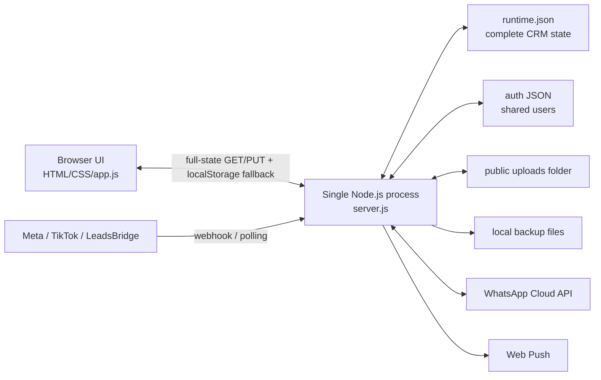

# CRM Salam Fortress — Current-State Product & Technical Audit

**Audit date:** 15 July 2026 (MYT)

**Source baselines:** `crm-full-source-code-safe-20260715-104127.zip` and `crm-complete-project-safe-20260715-104338.zip`

**Decision status:** **HOLD — not safe for production-scale rollout in its current architecture**

**Companion document:** `CRM_PRODUCTION_PRD_V2_2026-07-15.md`

---

## 1. Executive verdict

The code is a useful, feature-rich operational prototype and a credible source for business discovery. It is **not yet a scalable production CRM**.

It already demonstrates substantial domain knowledge:

- three business units in one interface: Salam Land, Bumi Hayat Printing, and Barakah Emas;
- lead capture, pipeline status, orders, payments, campaigns, team views, reporting, integrations, WhatsApp, settings, and a Salam Land lot board;
- Meta and TikTok ingestion guards, source-date handling in Malaysia time, duplicate checks, scoped data responses, Web Push, and WhatsApp opt-out handling;
- atomic replacement of the main JSON state file, corrupt-file quarantine, record-drop protection, backups, smoke tests, and a strict production-package allowlist.

However, the present solution remains a single-process, file-backed browser/server application. Critical production risks include shared default credentials, authentication recovery that can silently recreate those defaults, public sensitive uploads, plaintext integration secrets returned to browsers, an unsigned WhatsApp POST webhook, whole-state race conditions, browser fallback that can expose or diverge data, and deployment configuration drift.

The appropriate strategy is **not a rewrite that discards the existing logic**. Treat the current application as the validated workflow reference, contain its immediate security risks, then migrate it in controlled slices into a modular monolith backed by PostgreSQL, Redis, private object storage, durable jobs, per-person identity, server-enforced rules, and an immutable audit trail.

## 2. What was inspected and verified

### 2.1 Bundle comparison

| Item | Finding |
|---|---|
| Full-source bundle | 65 files, approximately 2.4 MB; best representation of the active source baseline |
| Complete-project bundle | 748 files, approximately 94 MB; contains the same active application files plus historical copies, deployment material, runtime/browser artifacts, exports, and backups |
| Full-source SHA-256 | `cdaa0b8ccbd083aebb903c9e4c08f7a3c8d57fe8f8b3e58aade4343e676e65ba` |
| Complete-project SHA-256 | `5f851472bc65328c336daec49a2f3a39a7f0c188aec67ed540871d57e111c1e4` |
| Active application comparison | The top-level active `server.js`, `app.js`, `index.html`, and `styles.css` are byte-identical between bundles |
| Conclusion | The larger archive adds history and operational evidence, not a newer implementation |

### 2.2 Source shape

| Component | Approximate size | Responsibility |
|---|---:|---|
| `server.js` | 5,172 lines | HTTP server, authentication, API, webhooks, integrations, persistence, uploads, backup, notifications |
| `app.js` | 8,879 lines | Browser state, UI rendering, workflows, validation, reports, mutation logic |
| `styles.css` | 7,398 lines | Full responsive visual system |
| `index.html` | 1,228 lines | Shell, navigation, forms, modals, module containers |

This is effectively a **large modular monolith without module boundaries**, with many business rules enforced only in the browser.

### 2.3 Verification performed

The following checks passed against the extracted full-source baseline:

- Node syntax validation for the main server, app, and smoke scripts;
- lead-ingestion guard smoke suite: **62 assertions passed**;
- production-stabilisation smoke suite: **37 assertions passed**;
- production-package dry run: strict allowlist and exclusion contract passed;
- total observed smoke assertions: **99 passed**.

The positive TikTok HMAC test now exists and passes. The included `crm-current-update-status.md` still describes it as missing, so that document is stale and must not be used as the release truth without reconciling it against the code and test run.

### 2.4 Important evidence limitation

The runtime file in the complete bundle appears to be a small seed/demo snapshot: nine records, five campaigns, three connections, and no meaningful inbound or WhatsApp history. It does **not** prove current live data, live credentials, live provider configuration, or actual production health. Historical notes refer to a live environment, but this audit did not treat those notes as live verification.

## 3. Current product map

Status meanings:

- **Implemented:** functional path is visible in code and locally testable.
- **Partial:** useful implementation exists, but material workflow, controls, or durability are missing.
- **Unverified:** code/config path exists, but live-provider behaviour was not proven from these bundles.
- **Missing:** required production capability is absent.

| Area | Current capability | Status | Production interpretation |
|---|---|---|---|
| Login and access | Admin, boss, company and staff-shaped access rules | Partial | Shared/group identities; no complete account lifecycle, MFA, password change/reset, or durable sessions |
| Multi-company shell | Salam Land, Bumi Hayat, Barakah Emas | Implemented | Companies, fields, stages, staff, inventory, and rules are hard-coded |
| Dashboard | Lead/order/payment/campaign summaries and quick views | Implemented | Metrics are calculated client-side and lack a canonical metric dictionary |
| Leads | Manual creation, source capture, staff assignment, status updates, remarks | Implemented | Contact identity, merge review, SLA/tasks, conversion lineage, and robust server validation are missing |
| Salam Land lots | Lot availability/status board and order entry | Partial | No transactional hold/reservation or unique database constraint against double booking |
| Orders | Manual order capture with business-unit-specific fields | Partial | Important validation is browser-only; non-Salam default-status defect can create closed orders |
| Payments | Schedules, balance display, receipts/IC uploads, cancel/refund path | Partial | Planned and actual payments are conflated; no immutable ledger, approvals, reconciliation, or accounting boundary |
| Campaigns | Spend, CPL, source/campaign views, CSV input/sync paths | Partial | Attribution can double-count; no canonical campaign/ad/form entity graph or reconciliation rules |
| Sales team | Assignment and staff performance views | Partial | Static staff lists and no capacity, availability, territory, SLA, or queue management |
| Reports | Client-rendered operational and financial summaries, PDF/CSV paths | Partial | Full data is downloaded; definitions, snapshots, permissions, and repeatable server queries are absent |
| Google Sheets backup | A script produces local CSV files | Missing as an integration | It does not authenticate to, upload to, schedule, verify, or restore Google Sheets; exported PII needs encryption/access policy |
| Meta Leads | Webhook verification, polling/backfill, external-ID/fingerprint dedupe | Partial / Unverified | Strong local guards; live token/form/page permissions and durable webhook processing are not proven |
| TikTok leads | Static token/HMAC paths, LeadsBridge backfill, dedupe | Partial / Unverified | Positive HMAC passes locally; timestamp freshness, per-company credential model, durable inbox, and replay controls missing |
| WhatsApp Cloud API | Send/register/status/inbound/opt-out/retry paths | Partial / Unverified | Public POST webhook is not signature-verified; template/window/consent governance needs redesign |
| Web Push | Subscription and generic notification paths | Partial / Unverified | File-backed keys/subscriptions, incomplete rotation/governance, no end-to-end device matrix evidence |
| Uploads | Receipt and IC image/document storage | Implemented but unsafe | Public same-origin files, user-controlled type/extension, no malware scanning, encryption policy, or retention controls |
| Settings/integrations | Company-specific UI and token fields | Partial | Secrets are held in runtime state, sent to clients, and stored in browser state |
| Audit/activity | Small activity and error arrays | Partial | Client-mutable, size-capped, not append-only, not tamper-evident, and unsuitable for compliance evidence |
| Backup/recovery | Local backups, atomic runtime replacement, corruption quarantine | Partial | No database PITR, off-site guarantee, restore evidence, concurrency safety, or mature disaster-recovery process |
| Deployment | PM2 and Nginx examples/checklists | Partial | Conflicting process names, paths, and ports make the runbook unsafe as a single source of truth |

### 3.1 Work-progress chronology reconstructed from the archives

This chronology is inferred from dated source, backup, export, deployment and status artifacts. It is useful for understanding direction, but it is not an independent production activity log.

| Period | Evidence-backed progress | Remaining/contradictory state |
|---|---|---|
| April–May 2026 | Lightweight vanilla Node/JavaScript CRM established; multi-company concept and Salam Land priority emerged; Meta lead work advanced | TikTok delivery/platform path and wider rollout were still pending in the accompanying notes |
| 12–13 May | Lead, order, payment, lot-board, reporting and Web Push workflows were documented; a major UI/workflow update was recorded | Full function audit, responsive polish, device setup, external backup automation, and Bumi/Barakah integrations remained pending |
| 18 June | A later deployment artifact describes n8n as live TikTok middleware to the CRM subdomain | An earlier launch note says n8n was intentionally not used; current middleware inventory is therefore unresolved |
| 21–30 June | Artifacts show multi-company expansion, dashboard changes, WhatsApp pilot/inbox/registration work, refund/archive logic and integration-UI revisions | These historical artifacts do not prove which exact revision was deployed or which providers were fully authorised |
| 3–5 July | TikTok/LeadsBridge ingestion, dedupe, source-date corrections, MYT fixes, June exports and a runtime restore package were produced | Snapshots show different totals (including 1,028 and 1,033 records); June counts of 455 versus 534 also use different date/uniqueness bases and remain unreconciled |
| 8–14 July | Auth hardening, Meta incident recovery, ingestion audits, stabilisation and pre-deployment snapshots were added | The July status note says the live code was still older than local webhook hardening; no live verification was performed in this audit |
| 15 July | Documentation/config sanitisation and smoke coverage were updated; current local source passes 99 observed assertions and the positive TikTok HMAC case | The tracking note still says the HMAC positive case is missing, so release status documentation is stale; backup/environment verification and explicit deployment approval remain open |

Progress conclusion: the team has moved from a simple lead tracker toward a broad multi-business CRM and has invested meaningfully in ingestion recovery/hardening. Most progress is still concentrated in the UI and single-process runtime; production identity, transactional data, document security, durable integrations, recovery, and reporting truth remain platform work rather than polish.

## 4. Current architecture and data flow

The server does use temporary-file write, flush, and rename semantics for the main runtime file. That reduces torn-file risk, but it does not solve two callers reading the same version and overwriting one another. It also does not make external side effects, such as messages or push notifications, atomic with the state change.

## 5. Deep logic assessment

### 5.1 Authentication and authorisation

Current logic:

1. Login checks a file-backed auth store.
2. The server creates an in-memory bearer session.
3. The browser stores the bearer token and CRM state locally.
4. Server response filtering gives global users all companies, company users their company, and staff their assigned records.
5. Some write routes permit admin/boss, while other write behaviour is broader through whole-state update logic.

What is good:

- data scoping is explicitly tested and the tested scenarios pass;
- a company/staff concept already exists;
- unauthorised API access is rejected when the server path is functioning.

What breaks at production scale:

- source code contains a known seeded default password; the value must be rotated and removed from code;
- users are mainly shared group identities rather than named humans;
- `mustChangePassword` exists as metadata, but there is no complete change/reset/invite/recovery workflow;
- a general auth-store read/parse failure can recreate seeded accounts, which turns corruption into a credential reset;
- sessions live only in one process memory and disappear on restart;
- bearer tokens and sensitive CRM state live in `localStorage`, increasing XSS and shared-device exposure;
- browser fallback can continue with local CRM data when the server is unavailable instead of failing securely;
- there is no MFA, session/device management, forced logout, account suspension, access review, or separation-of-duties model.

Primary evidence: `server.js:56`, `server.js:163`, `server.js:780-807`, `server.js:913-955`, `server.js:1300-1308`, `app.js:1573-1666`.

### 5.2 State persistence and synchronisation

Current logic:

- the browser periodically downloads a large protected runtime state;
- many changes update the browser object and then send the full state back;
- the server merges or replaces the JSON state and writes it atomically;
- when a save fails, browser state may be retained locally as a fallback;
- records are sometimes merged by `updatedAt` freshness.

Positive controls:

- temporary-file write, sync, and rename;
- corrupt runtime quarantine;
- missing-runtime initialisation;
- a guard against unexpectedly dropping too many records;
- pre-write backups.

Failure modes:

- two users can read version N, make different changes, and each write a complete successor; the last write can erase the first;
- API mutations, webhooks, polling jobs, and notification jobs can race because there is no mutex, database transaction, or compare-and-swap revision;
- a client-controlled future `updatedAt` can win freshness reconciliation;
- if the server legitimately has zero records, conditional hydration can leave demo/local records visible;
- local fallback can make a user believe a save succeeded while the server never received it;
- a later sync can contaminate the production state with stale or demo data;
- arrays are silently truncated, destroying long-term audit evidence;
- every-write backups can grow without bound under some configurations.

Primary evidence: `server.js:867-910`, `server.js:1081-1095`, `server.js:1365-1401`, `server.js:4828-4855`, `app.js:1573-1604`, `app.js:1803-1834`, `app.js:2099-2113`, `app.js:2373-2395`.

### 5.3 Lead ingestion, timestamps, deduplication, and assignment

Current logic:

- Meta requests are signature-checked and TikTok requests can use a static token or HMAC;
- webhook body-size limits are present;
- source timestamps are normalised into Malaysia-date semantics;
- provider IDs and fingerprints are used for duplicate detection;
- Meta duplicate reconciliation preserves important booking, staff, and remark information;
- TikTok/LeadsBridge source-date behaviour and role scoping are smoke-tested;
- leads can be assigned to hard-coded staff.

Gaps and inconsistencies:

- WhatsApp POST events are not signature-verified;
- TikTok HMAC does not enforce timestamp freshness/skew, so a captured valid request can be replayed;
- TikTok secrets may be supplied via query string, which is vulnerable to logging and referrer leakage;
- one global callback-secret shape conflicts with a clean multi-company credential model;
- static-token fallback and company/form routing are too permissive for a multi-tenant system;
- manual lead dedupe uses a time window, while server webhook dedupe can match the same phone across all unarchived history;
- a duplicate phone can represent a repeat enquiry, shared household number, new product interest, or data-entry correction; these cases need a contact/lead separation and merge-review workflow;
- assignment is not an atomic queue operation and has no capacity, leave, shift, language, territory, SLA, or fairness rules;
- there is no durable webhook inbox, processing status, retry schedule, dead-letter queue, or safe replay console;
- external notifications can occur before the corresponding state commit, creating double-send or orphaned-message cases.
- an invalid Meta payload branch is labelled/logged as TikTok, which can misdirect incident triage and provider metrics.

Primary evidence: `server.js:2213-2245`, `server.js:2474-2503`, `server.js:2597-2627`, `server.js:3919-3922`, `server.js:4242-4356`; ingestion smoke scripts.

### 5.4 Lead-to-order lineage

The interface contains leads and orders, but the data model does not provide a strong, server-enforced progression from:

`Contact → Lead/Enquiry → Qualified Opportunity → Quote/Booking → Order → Payment/Delivery`

Orders can be entered manually, and reporting can therefore count a lead and an order without proving that they are the same commercial journey. This weakens conversion reporting, attribution, sales-cycle calculation, and duplicate handling.

The V2 PRD makes Contact, Lead, Opportunity, and Order separate entities with immutable lineage and explicit conversion actions.

### 5.5 Salam Land inventory and booking

Current logic provides a useful lot-status board and lot-related order fields. The critical missing capability is a transactional reservation model.

Current duplicate logic can check the same phone and lot, but it does not prevent two different customers from booking the same lot concurrently. Required production logic is:

1. place a short-lived lot hold in a database transaction;
2. enforce one active hold/reservation/order per lot using a database constraint;
3. expire holds automatically;
4. convert hold to reservation only after required documents/payment/approval;
5. preserve a complete status and ownership history;
6. require authorised override for release, transfer, cancellation, or correction.

Primary evidence: `app.js:2552-2580`; Salam Land inventory and order configuration in `app.js:559-706`.

### 5.6 Bumi Hayat Printing workflow

The configured stages represent a sensible flow—enquiry, quotation, deposit, production, and delivery. The existing UI captures parts of this journey, but it does not yet model:

- quote versions and expiry;
- customer approval and proof/mock-up approval;
- material/specification/quantity changes;
- production job card, owner, due date, and work centre;
- quality control and rework;
- delivery/collection evidence;
- deposit, final payment, and credit terms as ledger events.

A specific defect also exists: for non-Salam orders, the closed-status list can be used as the default new-order status. That can create an order already marked closed and inflate completion metrics.

Primary evidence: Bumi Hayat configuration in `app.js:707-820`; default order status path in `app.js:6347-6351`.

### 5.7 Barakah Emas workflow

The application supports gold-related fields and a reference gold-rate path. For production, a rate is not just a UI value. Each transaction must preserve:

- source rate, currency/FX source, effective time, and retrieval time;
- product purity and weight;
- buy/sell spread, upah, fees, rounding rule, and tax treatment where applicable;
- approved rate snapshot used by the transaction;
- buyback/exchange logic and maker-checker approval for overrides;
- reconciliation to cash, bank, inventory, and receipt.

External price retrieval currently lacks the operational guarantees expected of a pricing dependency, such as timeouts, stale-price policy, circuit breaking, source health, and explicit approval when fallback pricing is used.

Primary evidence: Barakah Emas configuration in `app.js:823-931`; remote JSON fetch path in `server.js:2078-2084`.

### 5.8 Orders, payment schedules, actual payments, cancellation, and refunds

Current logic is visually useful but financially unsafe as a system of record:

- JavaScript floating-point numbers are used for currency;
- planned instalments and actual receipts are represented too closely and future schedule fields may be removed during payment processing;
- a text parser can default a missing payment date to today;
- balances can be clamped instead of rejecting or explicitly allocating an overpayment;
- cancellation/refund mutates an order rather than posting immutable reversals;
- no maker-checker approval, cash/bank reconciliation, settlement state, refund reference, or accounting export boundary exists;
- server whole-state updates can bypass narrower status validation and trust client-generated actors/timestamps/details.

The production design requires integer minor units or fixed-precision decimal, append-only financial transactions, idempotency keys, allocation records, approval policies, and explicit reversals/refunds.

Primary evidence: `server.js:450-458`, `server.js:4828-4855`, `app.js:7896-7933`, `app.js:8013-8238`.

### 5.9 WhatsApp and customer consent

Useful current behaviour includes inbound/outbound message recording, delivery status handling, retries, pilot controls, and `STOP`/opt-out handling.

Critical gaps:

- only the GET verification challenge is verified; POST event signatures are not checked;
- a forged POST can create inbound messages, update delivery states, or opt a customer out;
- business-unit phone-number ownership and credentials are not cleanly isolated;
- consent has no purpose, channel, notice version, evidence source, captured-by, and timestamp history;
- policy for the 24-hour customer-service window and approved templates is not modelled as a server rule;
- retries are not driven by a durable queue and idempotent outbox;
- opt-out must be enforced across all campaigns and users, not only a UI path.

Primary evidence: `server.js:4363-4471`.

### 5.10 Uploads and identity documents

The application collects high-risk artifacts, including IC images and payment evidence. Current files are stored and then served from a public same-origin route. Claimed MIME type and extension can be controlled by the uploader, and there is no content signature validation or malware quarantine.

Consequences include:

- unauthorised access to IC/payment files if a URL is known or leaked;
- stored XSS through active formats such as HTML or SVG;
- malware storage/distribution;
- uncontrolled retention and backup propagation;
- inability to prove who accessed a document.

Immediate release action is to block public access and active file formats. The target is private encrypted object storage, quarantine, magic-byte validation, malware scanning, authorised short-lived downloads, access logs, retention, and secure deletion.

Primary evidence: `server.js:1332-1362`, `server.js:5078-5097`, `server.js:5114-5149`.

### 5.11 Reporting and KPIs

Current reports are useful for day-to-day visibility but cannot yet be treated as controlled management accounts or canonical BI because:

- calculations occur mainly on downloaded browser state;
- metric definitions are not versioned;
- a lead and manually created order can lack lineage;
- campaign spend can be attributed repeatedly across staff views;
- source date, received date, created date, conversion date, payment date, and reporting date are not consistently separated;
- late-arriving provider data can rewrite historical periods;
- no snapshot/reconciliation/close process exists.

The V2 PRD includes a metric dictionary, server-side semantic layer, source-of-truth dates, late-arrival handling, attribution rules, and reconciliation statuses.

### 5.12 Backup, deployment, and operations

Positive controls already exist: local backup routines, corrupt runtime quarantine, atomic state replacement, record-loss guard, production packaging, and runbook material.

The present runbooks conflict:

- PM2 configuration uses process `crm-salamland-my`, path `/var/www/crm.salamland.my`, and port `8877`;
- the Nginx example proxies to port `8876`;
- older documents refer to different process names and `/var/www/crm-salam-fortress`.
- one later document describes n8n as live TikTok middleware, while another says n8n is intentionally not used; its included container example is unpinned and points at older topology defaults.

This drift is a release blocker. There is also no dependency manifest/lockfile for a reproducible application build, no CI/CD evidence, no off-site point-in-time recovery, and no complete restore rehearsal record.

Primary evidence: `ecosystem.config.cjs`, `nginx.crm-salam-fortress.conf.example`, `DEPLOYMENT-CHECKLIST.md`, `HOSTINGER-DOMAIN-LAUNCH.md`.

### 5.13 Frontend security, navigation, mobile, PWA, and accessibility

The current frontend is visually broad, but several presentation choices are also security or workflow defects:

- customer/provider-controlled values are interpolated into generated HTML in important tables and warnings, creating stored-XSS risk;
- company users can reach sensitive modules that are hidden only from the `staff` role, while browser mode can grant management-like UI access;
- individual staff profiles are not provisioned by the normal profile builder, even though staff permission branches exist; a passing staff smoke scenario injects a temporary test profile and therefore does not prove real staff-account operations;
- the application changes sections through global JavaScript state rather than real routes, so refresh, browser history, copy-link, breadcrumbs, notification deep links, and safe return-after-login are incomplete;
- some prototype sections are rendered but unreachable through the active visibility map;
- mobile screenshots show clipped content and collapsed company labels; CSS rules for the fixed sidebar and company cards conflict at small widths;
- the web manifest starts at `/?preview=desktop`, uses unsuitable non-square icon assets, and the service worker implements push handling but no normal install/update/offline lifecycle;
- key accessibility foundations—skip link, `aria-current`, systematic focus treatment, live save/error announcements, accessible chart alternatives, table semantics, reduced motion, and target sizing—are incomplete.

These are not cosmetic backlog items. Stored XSS and UI permission divergence are release blockers; responsive task completion, deep linking, and WCAG 2.2 AA are GA requirements.

Primary evidence: `app.js:935-990`, `app.js:3102-3141`, `app.js:3749-3819`, `app.js:6069-6115`, `app.js:6315-6324`, `app.js:6497-6513`, `app.js:8340-8366`; `manifest.webmanifest`; `sw.js`; responsive and preview rules in `styles.css`.

## 6. Severity-ranked findings

### 6.1 P0 — must be contained before any production deployment or continued live use

| ID | Finding | Business impact | Required containment |
|---|---|---|---|
| P0-01 | Seeded shared default password is present in source; auth corruption can recreate seeded accounts | Account takeover and silent credential reset | Remove defaults, rotate every credential, fail closed on auth corruption, create named accounts |
| P0-02 | Uploaded IC/payment files are publicly served and type is user-controlled | Personal-data breach, stored XSS, malware | Block public route and active formats; migrate files to private access |
| P0-03 | WhatsApp POST webhook has no HMAC verification | Forged messages/status/opt-outs and state mutation | Verify provider signature before parsing/processing; reject replay |
| P0-04 | Integration secrets and full CRM state can reach `localStorage` | Secret/PII disclosure on XSS or shared device | Keep secrets server-side; disable production local-state fallback |
| P0-05 | Whole-state concurrent writes have no transaction/version control | Lost orders, leads, payments, opt-outs, or messages | Serialize emergency writes; migrate to transactional database |
| P0-06 | Both “safe” bundles include a real-environment-named file with a non-empty credential value; the larger archive also contains customer/runtime/browser/export artifacts | Confirmed credential and personal-data exposure risk during support/deployment | Revoke/rotate, quarantine the archives, investigate access, and regenerate a strict source-only artifact with secret scanning |
| P0-07 | Customer/provider values are inserted into generated HTML without a safe output boundary | Stored XSS can steal sessions, PII, and secrets or perform authorised actions | Encode by default, sanitise controlled rich text, deploy CSP, and test malicious fixtures across all inputs/imports/webhooks |

### 6.2 P1 — required for production foundation

| ID | Finding | Target control |
|---|---|---|
| P1-01 | No per-person account lifecycle, MFA, durable session, device/session revocation | OIDC-compatible named identity, MFA for privileged users, PostgreSQL-authoritative CRM sessions, access reviews; Redis only for reconstructable coordination |
| P1-02 | Client is trusted for core order/payment/status/audit logic | Server-side commands, schema validation, policy checks, transactions, immutable audit |
| P1-03 | No durable webhook inbox, queue, outbox, retry, DLQ, or replay control | Persist-before-ack inbox, unique event keys, queue workers, outbox, DLQ and controlled replay |
| P1-04 | TikTok HMAC lacks timestamp freshness and query-string secrets are accepted | Header-only credential, timestamp skew window, nonce/event replay key, per-connection secret |
| P1-05 | Lot booking is not transactionally exclusive | Hold/reservation state machine and database uniqueness |
| P1-06 | Payment/refund model is mutable and float-based | Fixed-precision immutable ledger, allocation, approval, reversal, reconciliation |
| P1-07 | Deployment documentation conflicts on port/path/process | One generated, tested runbook and environment contract |
| P1-08 | Backups are local/file-based with no proven restore objective | Encrypted off-site backups, PITR, restore drills, RPO/RTO evidence |
| P1-09 | Privacy notice/consent/retention/access controls are incomplete | Legal review, data inventory, consent evidence, retention engine, data-subject request workflow |
| P1-10 | Staff roles exist in conditional code but normal production profiles are shared company identities | Provision named staff accounts and test real lifecycle, ownership and offboarding paths |

### 6.3 P2 — required before general availability

| ID | Finding | Target control |
|---|---|---|
| P2-01 | No Contact → Lead → Opportunity → Order lineage | Explicit conversion workflow and stable entity IDs |
| P2-02 | Dedupe policies conflict across manual and webhook paths | Identity resolution, rule versioning, merge queue and reversible merge |
| P2-03 | Static companies, staff, stages, fields, and inventory | Admin-configurable metadata with validation and audit |
| P2-04 | Reporting definitions are ambiguous | Metric dictionary, semantic layer, data freshness and reconciliation status |
| P2-05 | No comprehensive automated test pyramid | Unit, integration, contract, E2E, accessibility, performance, security, migration and restore tests |
| P2-06 | Remote provider calls lack consistent timeout/circuit-breaker behaviour | Time budgets, bounded retries, circuit breakers, rate-limit awareness and provider-health views |
| P2-07 | Activity/message/error arrays are capped and silently truncated | Durable append-only storage, archive/partition strategy and retention jobs |
| P2-08 | Multi-company branding and privacy cues are inconsistent | Tenant-aware identity, notices, sender/channel ownership and support routes |
| P2-09 | SPA sections lack real routes/deep links and mobile/PWA/accessibility behaviour is incomplete | Auth-safe routes, responsive shell, valid PWA assets/lifecycle and WCAG 2.2 AA acceptance matrix |

## 7. Edge-case catalogue

| ID | Scenario | Current likely behaviour | Required V2 behaviour |
|---|---|---|---|
| EC-01 | Two agents update the same lead seconds apart | Last full-state write may erase the other | Row revision; reject stale update with readable conflict and merge path |
| EC-02 | Webhook and user edit same record | Race and side effects may be duplicated | Transactional update, event idempotency, outbox after commit |
| EC-03 | Valid TikTok request is replayed | HMAC can still validate | Reject old timestamp and previously processed event/nonce |
| EC-04 | WhatsApp attacker posts `STOP` | Contact can be falsely opted out | Verify signature before any state change; retain event evidence |
| EC-05 | Runtime auth JSON is corrupt | Seed users can be recreated | Fail closed, alert, recover from protected backup under dual control |
| EC-06 | Server has zero legitimate records | Browser seed/local records may remain | Server truth replaces local cache even when empty; no demo seed in production |
| EC-07 | Save fails during network loss | Browser can continue with divergent state | Explicit failed/queued state; production write does not claim success |
| EC-08 | User sets future `updatedAt` | Client record may win merge | Server owns version and timestamps |
| EC-09 | Same phone enquires months later for another product | Could be rejected/merged inconsistently | Reuse contact; create a new lead with relationship and merge review |
| EC-10 | Husband and wife share one phone | One may overwrite or dedupe the other | Multiple contacts may share an identity point with confidence and review |
| EC-11 | Two customers select the same land lot | Both orders can exist | Atomic hold + unique active reservation constraint |
| EC-12 | Lot hold expires during payment | Ambiguous ownership | Grace policy, payment idempotency, manual exception queue |
| EC-13 | New Bumi/Barakah order has no status chosen | Can default to a closed status | Default to configured initial stage; server rejects closed initial state |
| EC-14 | Payment text has no date | Today may be silently used | Require explicit date or mark `date_unknown`; never invent accounting date |
| EC-15 | Customer overpays | Balance can be clamped to zero | Record unapplied credit and require allocation/refund decision |
| EC-16 | Refund API/provider times out after processing | Retrying may double refund | Stable idempotency key and provider reconciliation |
| EC-17 | Currency calculation involves sen/rounding | Floating-point drift | Fixed-precision minor units/decimal and versioned rounding policy |
| EC-18 | Provider sends same lead with corrected fields | Duplicate may be dropped or merged opaquely | Preserve raw events; deterministic field precedence and change history |
| EC-19 | Provider sends events out of order | Status/data can regress | Provider sequence/event time plus legal state transitions |
| EC-20 | Provider is down or rate-limits polling | Silent staleness or repeated failure | Bounded retries, circuit state, freshness badge and alert |
| EC-21 | Malicious `.html` renamed as image | May be served from same origin | Magic-byte/type allowlist, quarantine, scan, private download disposition |
| EC-22 | Staff leaves company | Shared login remains usable | Individual account disable, revoke sessions/API grants, reassign open work |
| EC-23 | Staff changes company/team | Historical reporting may move incorrectly | Effective-dated membership; retain historical ownership snapshot |
| EC-24 | Customer opts out from one channel/purpose | Broad or narrow suppression is unclear | Purpose/channel/legal-basis preference history and central enforcement |
| EC-25 | Campaign spend is updated after month end | Historic CPL changes silently | Source revision, close status, restatement flag and audit |
| EC-26 | Backup storage fills disk | Writes or service can fail | Capacity alerts, bounded retention, off-site backup, tested cleanup |
| EC-27 | Process restarts | All in-memory sessions disappear | Shared durable session store; safe restart policy |
| EC-28 | Multiple app instances start | JSON writes become unsafe | Database-backed horizontal concurrency; singleton jobs via locks |
| EC-29 | Gold price source is stale | A stale rate may be used without clear control | Expiry threshold, visible source/freshness, approval for fallback |
| EC-30 | Printing specification changes after quote approval | Price/job details diverge | Quote version + signed approval + controlled change order |
| EC-31 | Large report/export is requested | Browser receives excessive PII/state | Asynchronous scoped export, row limits, watermark, expiry and audit |
| EC-32 | Deleted customer has financial/legal records | Hard delete can breach retention needs | Policy-based pseudonymisation, legal hold, restricted retained ledger |

## 8. Security, privacy, and compliance readiness

The system handles names, phone numbers, campaign data, message content, payment evidence, and IC images. It therefore needs a formal Malaysian PDPA workstream, not only a privacy page.

Production readiness should include:

- a personal-data inventory and purpose/legal-basis map;
- notice and choice at each collection channel;
- consent/preference evidence and withdrawal propagation;
- least-privilege access and quarterly review;
- encryption in transit and at rest, with managed key rotation;
- private document access, malware scanning, and access logs;
- data retention by record category, secure deletion, legal holds, and backup expiry;
- data-subject access/correction workflow;
- vendor/subprocessor and cross-border transfer review;
- incident classification, evidence preservation, and breach-notification playbook;
- assessment of DPO applicability and registration/appointment if required;
- privacy and security review before adding new provider fields or exports.

Official reference set for the implementation team:

- JPDP personal-data protection principles: <https://www.pdp.gov.my/ppdpv1/en/principles-of-personal-data-protection/>
- Personal Data Protection Standard 2015: <https://www.pdp.gov.my/ppdpv1/en/personal-data-protection-standard-2015/>
- Personal Data Protection (Amendment) Act 2024: <https://www.pdp.gov.my/ppdpv1/wp-content/uploads/2024/11/Act-A1727.pdf>
- Data Breach Notification guidance: <https://www.pdp.gov.my/ppdpv1/en/guidelines-and-circulars-on-data-breach-notification-dbn/>
- DPO guidance: <https://www.pdp.gov.my/ppdpv1/en/akta/personal-data-protection-guidelines-on-the-appointment-of-data-protection-officer-dpo/>

Legal counsel or a qualified privacy professional must confirm the organisation's exact obligations and thresholds.

## 9. Current progress assessment

This is a product/engineering maturity estimate, not a percentage of source-code completion.

| Dimension | Current maturity | Reason |
|---|---:|---|
| Business workflow discovery | 70% | Real workflows and company differences are visible in code/docs |
| UI/interaction prototype | 75% | Broad usable interface exists across core sections |
| Lead ingestion hardening | 60% | Good local guards; durable processing, replay defence, and live proof incomplete |
| Core CRM domain model | 35% | Records exist, but contact/opportunity/lineage/tasks/configuration are weak |
| Financial correctness | 20% | No ledger, decimal model, reconciliation, or approval boundary |
| Identity/security | 20% | Basic scopes exist; account lifecycle and secret/document protection are inadequate |
| Data platform/scalability | 15% | Single JSON state and local browser fallback |
| Reliability/operations | 30% | Useful guards/backups/docs; config drift and no mature HA/DR/observability |
| Automated quality | 30% | Valuable 99 smoke assertions; no full test pyramid or CI gate |
| Compliance readiness | 15% | Basic privacy page only; sensitive document/retention/DSR controls absent |

Overall interpretation: **strong workflow prototype, early production platform**. A single blended percentage would be misleading.

## 10. Release recommendation

### 10.1 Next 72 hours — containment

1. Keep deployment on HOLD.
2. Rotate every credential that may have existed in source, runtime, environment, browser snapshot, backup, or export bundles.
3. Disable or firewall public upload serving; reject HTML/SVG and other active content immediately.
4. Make production browser mode fail closed if authentication/API is unavailable; do not persist full CRM state or secrets to `localStorage`.
5. Add WhatsApp POST signature verification before parsing or writing anything.
6. Remove seeded passwords and make auth-store corruption a hard failure with an alert.
7. Reconcile Nginx, PM2, path, port, process name, health check, and rollback instructions into one runbook.
8. Produce a fresh encrypted backup and execute a restore rehearsal into an isolated environment.
9. Freeze the exact release candidate by checksum; regenerate a source-only package using the allowlist.

### 10.2 First two weeks — stabilisation bridge

1. Introduce schema validation for every write route and stop accepting whole-state writes from ordinary UI actions.
2. Add a state revision/CAS guard and a single server write queue as a temporary concurrency control.
3. Make server timestamps and actors authoritative.
4. Persist a verified webhook inbox before business processing; add event uniqueness and replay records.
5. Make outbound WhatsApp/push use a durable outbox after state commit.
6. Separate integration credentials from runtime data and mask them in every client response.
7. Create named accounts, forced password rotation, session revocation, and privileged MFA plan.
8. Define database migration mappings and perform a dry-run import with reconciliation totals.
9. Fix non-Salam new-order default status and payment-date invention.
10. Lock the canonical KPI definitions needed for launch reporting.

## 11. Production migration principle

Do not attempt a long big-bang rewrite while continuing to add logic to the JSON application. Use a strangler-style migration:

1. stabilise and freeze current behaviour;
2. introduce production identity and the new database;
3. migrate read models and reporting;
4. move lead ingestion and contacts;
5. move opportunity/order/payment commands;
6. move vertical inventory/production/gold workflows;
7. run reconciled parallel reads for a bounded period;
8. cut writes to the new system, archive legacy state read-only, and retain a signed migration report.

Detailed requirements, architecture, acceptance criteria, roadmap, and release gates are specified in the companion PRD.

## 12. Evidence index

| Topic | Main evidence |
|---|---|
| Workspace sections | `app.js:360-371` |
| Company/workflow configuration | `app.js:559-931` |
| Browser state and session | `app.js:1573-1666`, `app.js:1803-1834`, `app.js:2099-2113` |
| Dedupe and lot checks | `app.js:2535-2580`, `server.js:2597-2627` |
| Order/payment/refund UI logic | `app.js:6347-6351`, `app.js:7896-8238` |
| Auth defaults/recovery/session | `server.js:163`, `server.js:780-955` |
| Runtime scoping | `server.js:1300-1308` |
| Upload and public serving | `server.js:1332-1362`, `server.js:5078-5149` |
| Runtime atomic write | `server.js:1365-1401` |
| TikTok verification/routing | `server.js:2213-2245`, `server.js:2474-2503`, `server.js:4274-4356` |
| WhatsApp webhook | `server.js:4363-4471` |
| Whole-state update | `server.js:4828-4855` |
| Deployment drift | `ecosystem.config.cjs`, `nginx.crm-salam-fortress.conf.example`, deployment Markdown files |
| Local regression evidence | `scripts/smoke-lead-ingestion-guards.mjs`, `scripts/smoke-stabilize-sales-production.mjs`, `scripts/production-package-audit.mjs` |

---

**Audit conclusion:** preserve the discovered workflows and selected defensive logic, but do not make the current JSON/browser architecture the foundation of the production system. The V2 PRD is the new source of truth for product scope; approved architecture decisions, schemas, and runbooks should become version-controlled companion records.
