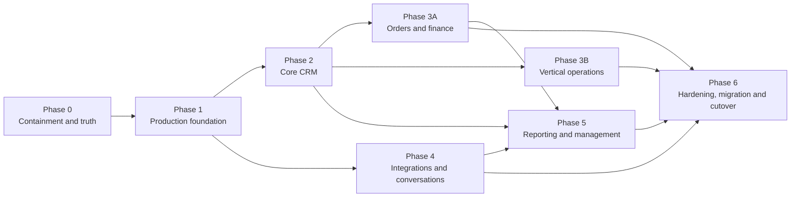

# CRM Salam Fortress V2 — Production Execution Plan

**Document version:** 1.5

**Date:** 15 July 2026 (MYT)

**Status:** Draft for delivery, business, security, privacy, finance, and operations approval

**Target branch:** `codex/production-foundation`

**Product requirements:** `CRM_PRODUCTION_PRD_V2_2026-07-15.md`, version 1.7

**Current-state evidence:** `CRM_CURRENT_STATE_AUDIT_2026-07-15.md`

**Revision 1.5:** records the bounded malformed-prefetch application guard and production-runtime regression, separates it from still-required edge rate limits/timeouts, and refreshes local verification evidence without changing any release gate.

---

## 1. Purpose and execution contract

This plan turns the proposed V2 requirements into an implementable programme. It becomes an approved delivery contract only after the Plan gate records named approvals. It defines phase boundaries, dependencies, evidence, migration and rollback controls, and transparent branch truth.

The plan does not declare a feature complete because UI exists or code compiles. A deliverable is accepted only when its linked PRD requirements, automated evidence, operational controls, and named approvals pass.

Execution rules:

1. P0 requirements are non-waivable for production cutover. Replacing a P0 requires a formally approved PRD revision with an equivalent or stronger control.
2. No uncontrolled dual write is permitted between the JSON application and V2.
3. Production data, credentials, provider routes, or outbound messages are not changed by documentation approval alone.
4. Database and event changes use expand/migrate/verify/contract sequencing; destructive change is never bundled into the first cutover step.
5. Every phase leaves a deployable, supportable and reversible increment, not only partially connected code.
6. Existing source behaviour is a discovery reference. Signed PRD rules control security, finance, privacy, concurrency and migration.
7. Requirement IDs remain stable. New requirements receive new IDs; an old ID is never reused for a different meaning.

## 2. Starting point and branch truth

The audited legacy application is a feature-rich operational prototype, not the V2 platform. It contains useful workflows and 99 passing local smoke assertions, but the audit identified production blockers around identity, files, secrets, webhook verification, concurrency, browser fallback, finance and deployment drift.

This branch now contains a **hardened V2 production foundation**, not a production CRM release: a Next.js/TypeScript application shell; deterministic PostgreSQL migration/readiness/runtime controls; managed-OIDC start/callback and pre-provisioned database-session paths; hardened Lead create/transition command slices; selected database/domain invariants with local tests; and responsive Bahasa Melayu UI screens using demo/static read models where the real query layer is not built. No live identity provider, production environment, remote promotion, or release gate is proven. Section 14 is the exact branch evidence matrix.

Therefore:

- repository/build ownership and CI promotion must be formalised before the branch becomes an authoritative release source;
- the authored PostgreSQL migration and selected invariants pass a local isolated PostgreSQL 16.14 integration suite, but hosted CI, supported-version policy, app-wide integration, migration rollback and production restore evidence remain required;
- legacy containment work must be made in the authoritative legacy source repository, reviewed separately and linked back to this plan;
- no unchecked branch item in Section 14 may be represented as implemented.

## 3. Programme shape and dependencies

The recommended 24–36 week range assumes the named team in the PRD and controlled overlap after the foundation. Calendar estimates are refined after Phase 0 discovery; they do not relax acceptance gates.

| Phase | Planning range | Mandatory predecessor | Primary acceptance |
|---|---:|---|---|
| 0. Containment and truth | 1–2 weeks | None | Gate A |
| 1. Production foundation | 4–6 weeks | Phase 0 truth inventory and architecture decisions | Gate B |
| 2. Core CRM | 6–8 weeks | Foundation APIs, policy, data, audit and file controls | Core-slice gate |
| 3A. Orders and finance | 6–8 weeks | Core party/opportunity model and Finance rules | Finance-slice gate |
| 3B. Vertical operations | 6–8 weeks | Core party/opportunity/order contracts and vertical decisions | Vertical-slice gate |
| 4. Integrations and conversations | 4–6 weeks | Inbox/outbox, secret, policy and worker foundation | Integration-slice gate |
| 5. Reporting and management | 4–6 weeks | Stable domain events plus signed KPI rules | Reporting-slice gate |
| 6. Hardening, migration and cutover | 3–4 weeks | All P0/P1 slices and rehearsal-ready importer | Gates C and D |

Provider sandbox research, UX discovery, schema design, test-fixture preparation and legal/privacy work may run ahead. Production-facing integration, migration and financial behaviour may not bypass their predecessors.

## 4. Phase 0 — containment and source-of-truth discovery

### 4.1 Objectives

- prevent known legacy risks from becoming a new incident;
- identify the actual live environment, data and provider ownership;
- establish immutable source/release checksums and one deploy/restore runbook;
- enter Phase 1 with signed decisions instead of assumptions.

### 4.2 Deliverables

| Work package | Deliverable | PRD trace |
|---|---|---|
| Credential containment | Inventory and rotate seeded, provider, host, backup and browser-exposed credentials; remove source defaults | `IAM-001`, `IAM-002`, `INT-001` |
| Authentication containment | Auth-store corruption fails closed; browser/API outage cannot reveal cached CRM data or claim a successful save | `IAM-004`, `OFF-001` |
| Upload containment | Public attachment serving blocked; active formats rejected; sensitive files inventoried and quarantined | `FILE-002`, `FILE-004`, `PRIV-001` |
| Webhook containment | WhatsApp POST signature verified before parsing; TikTok query-secret and replayable paths disabled or isolated | `COM-002`, `INT-002` |
| Data truth | Signed inventory of all runtime/auth/upload/export/backup snapshots with counts, dates, hashes and custody | `D-03`, migration Section 19 |
| Environment truth | One record of domain, host, process, port, route, scheduler, n8n and provider endpoint ownership | `D-03`, `D-15` |
| Recovery proof | Fresh encrypted backup restored in isolation with counts and sampled reconciliation | PRD Section 16.2 |
| Release truth | Source-only allowlisted artifact, secret scan, checksum and unified rollback runbook | PRD Gate A |

### 4.3 Required decisions

- provisional legal organisation and business-unit structure (`D-01`);
- canonical live environment and dataset (`D-03`);
- immediate retention/quarantine authority for sensitive archives (`D-12`);
- accountable owners for each provider, host and incident channel.

### 4.4 Acceptance evidence and exit

Phase 0 exits only when Gate A passes with:

- signed credential rotation register without secret values;
- source/data/environment inventory with hashes and record counts;
- negative tests for unsigned/replayed webhooks and public file access;
- safe-offline/browser-storage evidence;
- isolated restore report with achieved recovery times;
- one tested deployment/rollback runbook;
- named approval from Product, Security, Privacy, Operations and the data owner.

If containment changes fail, revert only the failed change through the tested legacy rollback, keep the affected capability disabled, and preserve logs/backups. A failed containment release does not authorise restoring a known public-file, default-credential or unsigned-webhook exposure.

## 5. Phase 1 — production foundation

### 5.1 Entry criteria

- Gate A passed;
- `D-01`, `D-02`, `D-12`, `D-13`, `D-14`, `D-16`, `D-18`, `D-19` and `D-20` approved far enough to lock the foundation schema, security boundary, async boundary and capacity harness;
- V2 repository, CI ownership, environments and deployment identities exist;
- approved capacity envelope and SLO measurement profile exist.

### 5.2 Deliverables

| Workstream | Deliverables | PRD trace |
|---|---|---|
| Environments and delivery | Development, test, staging and production definitions; pinned runtime/dependencies; migrations; SBOM; signed artifacts; progressive deploy/rollback | `ADM-002`, PRD Sections 15 and 21 |
| Tenant and party foundation | Organisation, Business Unit, User, Membership, Team, Contact, Business Account, Household, Party Relationship and consent boundary | `CON-001`, `CON-009`, `CON-010`, `D-01`, `D-16` |
| Identity and policy | Managed OIDC federation, named accounts, lifecycle, MFA/step-up, secure sessions, RBAC/ABAC, tenant tests, access review and break glass | `IAM-001`–`IAM-010`, `D-14` |
| Transactional API | OpenAPI envelope, validation, cursor pagination, idempotency, optimistic concurrency and server-owned audit fields | PRD Section 14.1 |
| Audit and privacy base | Append-only audit, sensitive-access event, data inventory hooks, incident case model and retention policy metadata | `AUD-001`–`AUD-003`, `PRIV-001`, `PRIV-006` |
| Files | Private quarantine bucket, direct upload, content signature, scan, authorised download, checksum and access log | `FILE-001`–`FILE-007` |
| Async foundation | Durable inbox/outbox tables, dispatcher, queue, workers, stable event keys, retries, DLQ and replay authorization | `REL-001`, `REL-002`, `INT-003`–`INT-005` |
| Platform operations | Secret manager, PostgreSQL, Redis, object storage, liveness/readiness, telemetry, backups/PITR and isolated restore automation | `INT-001`, PRD Sections 13, 16 and 17 |
| Capacity harness | Reproducible generators and tests for approved data/concurrency/event profiles | `PERF-001`, `PERF-002`, `D-18` |

### 5.3 Foundation acceptance gate

Gate B plus the following evidence must pass:

- cross-business-unit row, cache, search, export, file and object-key tests produce zero leakage;
- organisation-scoped identity matching returns only an opaque possible match until a BU relationship is authorised;
- session revocation, offboarding, role change and step-up tests pass;
- a killed API/dispatcher/queue/worker is recovered from inbox/outbox with zero silent loss or duplicate business effect;
- malicious/renamed file fixtures remain quarantined and inaccessible;
- deployment, backward-compatible migration, rollback and isolated restore are executed from automation;
- minimum SLO telemetry is visible in staging and contains no tested PII/secrets.

## 6. Phase 2 — core CRM

### 6.1 Entry criteria

- foundation acceptance passed;
- lead stages, reasons, SLA and assignment rules approved (`D-04`);
- duplicate/merge policy approved (`D-05`);
- party visibility/consent boundary approved (`D-16`);
- legacy status mapping approved for importer development (`D-17`).

### 6.2 Deliverables

| Workstream | Deliverables | PRD trace |
|---|---|---|
| Party records | Contact, Business Account, Household/joint buyer, multiple identities, protected fields, search and role relationships | `CON-001`–`CON-010` |
| Identity resolution | Provider idempotency separate from person matching; possible-match queue; reversible governed merge | `CON-003`, `CON-005`–`CON-007` |
| Lead lifecycle | Manual/integration/import create, detail, stage transitions, qualify/disqualify/nurture/reopen and exact-once conversion | `LEAD-001`–`LEAD-006` |
| Orthogonal states | Separate lead, outreach, message, opportunity, order, fulfilment and finance dimensions | `STATE-001`–`STATE-003` |
| Opportunity pipeline | Opportunity stages, amounts, expected close, history, quote linkage, won/lost controls and forecast snapshots | PRD Section 10.2 and `ORD-003` |
| Assignment | Atomic rules, simulation, round robin, capacity/leave, owner lock, exception queue and offboarding | `ASG-001`–`ASG-004` |
| Tasks and SLA | Follow-up task, reminders, working-time SLA, escalation and manager queue | `TASK-001`–`TASK-003` |
| Import path | Dry-run, deterministic IDs, mapping, errors, resumability, checksums and result report | `INT-010`, `STATE-002` |
| Mobile/accessibility | Core seller journey on approved mobile, keyboard and screen-reader matrix | PRD Section 12 |

### 6.3 Core-slice acceptance

- one Contact/Business Account can have legitimate repeat Leads without provider replay duplication;
- a possible cross-BU identity match reveals no other BU data before relationship approval;
- every current legacy status fixture is preserved and mapped or quarantined, never guessed;
- message delivery/read or no-answer events cannot regress a lead/opportunity or close an order;
- two assignment workers create one owner/task/outbox effect and advance the cursor once;
- stale edits return a readable `409` conflict without losing either user's change;
- lead conversion retry creates one Opportunity and one audit trail;
- role journeys pass on mobile, keyboard and screen reader.

## 7. Phase 3A — orders and finance

### 7.1 Entry criteria

- core Contact/Opportunity lineage is stable;
- installment, overpayment, cancellation, refund, reconciliation and accounting-boundary rules approved (`D-09`);
- maker-checker permissions and amount thresholds approved (`D-02`).

### 7.2 Deliverables

- server-owned Order and Order Item commands, totals, revisions, approvals and cancellation (`ORD-001`–`ORD-004`);
- separate Installment, Payment Transaction, Allocation, Credit, Refund and Reversal models (`FIN-001`–`FIN-006`);
- fixed-precision calculations and documented rounding;
- payment and refund idempotency under timeout/retry;
- daily reconciliation, aging/collection views and controlled accounting export (`FIN-007`–`FIN-009`);
- immutable lineage from Contact/party and Opportunity or an approved direct-sale reason;
- protected payment evidence through the Files module.

### 7.3 Finance-slice acceptance

- controlled fixtures reconcile order amount, settled payments, allocations, credits, refunds, reversals and displayed balance exactly;
- concurrent allocation/refund attempts cannot exceed eligible amounts;
- an overpayment remains explicit unapplied credit;
- missing payment date is rejected or recorded as unknown under approved policy; the system never invents an accounting date;
- requester cannot approve their own protected refund/adjustment;
- retry after provider timeout produces one logical payment/refund;
- period close/reopen and accounting export retain checksums and restatement evidence.

## 8. Phase 3B — vertical operations

Phase 3B can run in parallel streams after the shared party, opportunity, order, file, audit and policy contracts are stable.

### 8.1 Salam Land

Deliverables:

- Project, Phase, Lot and Lot Unit import/model (`LAND-001`, `LAND-002`);
- separate Lot, Hold and Reservation aggregates (`LAND-009`);
- atomic hold, expiry, extension, release, reservation, sale conversion and reversal (`LAND-003`–`LAND-006`);
- accessible lot board and optional governed availability feed (`LAND-007`, `LAND-008`).

Acceptance:

- one hundred concurrent attempts for one Lot yield at most one active allocation;
- `Available` is derived from Lot operational state and active allocations;
- expiry/payment race follows the approved `D-06` grace/exception policy;
- sale reversal reconciles Order and Finance before availability changes.

### 8.2 Bumi Hayat Printing

Deliverables:

- product/specification model, versioned quote and proof approval;
- production job card, controlled state transitions, QC/rework and delivery evidence;
- change-order version and reapproval.

Trace: `PRINT-001`–`PRINT-008`, decision `D-07`.

Acceptance:

- accepted quote/specification cannot be overwritten;
- post-approval change produces a new version and price impact;
- QC failure/rework remains traceable and order closes only under delivery/payment policy.

### 8.3 Barakah Emas

Deliverables:

- rate/FX sources, freshness, evidence and immutable approved Rate Snapshot;
- fixed-precision purity, weight, spread, upah, fee and rounding calculation;
- stale-rate approval, buyback/exchange, maker-checker override, receipt and reconciliation;
- inventory movement when included in the approved release.

Trace: `GOLD-001`–`GOLD-008`, decision `D-08`.

Acceptance:

- each transaction is exactly reproducible from its Rate Snapshot and rule versions;
- stale/missing rate blocks or requires named approval as configured;
- requester cannot approve own override;
- transaction, payment and included inventory movement reconcile before close.

### 8.4 Vertical-slice exit

Each business owner signs their own fixtures and exception rules. Phase 3B is not complete merely because one of the three verticals passes.

## 9. Phase 4 — integrations, conversations, and notifications

### 9.1 Entry criteria

- Phase 1 async, secret, policy and audit foundation accepted;
- provider accounts, forms, phone numbers, senders and environments inventoried;
- WhatsApp consent/template/service-window policy approved (`D-11`);
- governed n8n/middleware decision approved (`D-15`).

### 9.2 Deliverables

| Workstream | Deliverables | PRD trace |
|---|---|---|
| Webhook gateway | Provider-specific body limit, signature, timestamp where supplied, replay/idempotency and per-connection routing | `INT-002`, `COM-002` |
| Durable pipeline | Inbox, normalize, map, assign, notify, outbox, bounded retry, DLQ and replay console | `INT-003`–`INT-005`, `REL-001`, `REL-002` |
| Provider lifecycle | Cursors, timeout, rate limit, circuit breaker, health, owner, rotation and expiry | `INT-006`–`INT-009` |
| Meta/TikTok/LeadsBridge | Page/account/form mapping, source timestamps, external IDs, spend and provider health | PRD provider-specific minimums |
| WhatsApp | BU sender isolation, message/status uniqueness, agent inbox, consent, templates, 24-hour window, quiet/frequency rules | `COM-001`–`COM-008` |
| Notifications | In-app centre, deep links, device ownership and subscription cleanup | `NOT-001`, `NOT-002` |

### 9.3 Integration-slice acceptance

- invalid signature, oversized body, replay and wrong-BU route create no business mutation;
- delayed provider retry remains accepted when valid and is deduplicated by event/business key rather than an unsafe blanket timestamp rejection;
- accepted event survives API, dispatcher, queue and worker failure with a queryable outcome;
- replay from DLQ cannot duplicate Contact, Lead, assignment, message or notification;
- wrong-BU WhatsApp sender is impossible under direct API manipulation;
- verified opt-out suppresses every applicable queued/future send and retains evidence;
- provider degradation displays freshness/health and does not fabricate spend, rate or lead data.

## 10. Phase 5 — reporting and management

### 10.1 Entry criteria

- domain event timestamps and financial rules are stable;
- attribution and KPI definitions approved (`D-10`);
- late-arrival, period close and restatement owners are named.

### 10.2 Deliverables

- canonical source/campaign/ad/form hierarchy and spend reconciliation (`MKT-001`–`MKT-007`);
- versioned metric dictionary and server aggregates (`REP-001`–`REP-003`);
- executive, team, marketing and finance reports (`REP-004`–`REP-007`);
- PDF/CSV/XLSX exports with formula-injection controls, scope, expiry and access audit (`REP-008`, `INT-011`);
- late-arrival/restatement indication and scheduled delivery (`REP-009`, `REP-010`);
- freshness, timezone, attribution and definition link on every dashboard.

### 10.3 Reporting-slice acceptance

- dashboard, report and export return identical results for the same signed fixture, period, timezone, currency and scope;
- one campaign's spend is not copied in full to multiple staff;
- Lead, Opportunity, Order, Collection and Refund counts use the signed source event and cohort basis;
- closed-period late data creates a versioned restatement, not a silent rewrite;
- large export is asynchronous, permission-rechecked, watermarked, expiring and audited;
- browser never downloads the full tenant state for calculation.

## 11. Phase 6 — hardening, migration, cutover, and hypercare

### 11.1 Entry criteria

- every P0/P1 functional slice is feature-complete in staging;
- all build-lock decisions `D-01`–`D-20` are approved;
- importer, reconciliation report and cutover runbook have passed at least one full-volume rehearsal;
- no unresolved migration quarantine can affect finance, active lots, consent/opt-out, access or provider uniqueness.

### 11.2 Deliverables

- full security, privacy, penetration, accessibility and browser evidence;
- `PERF-001` full-envelope load and `PERF-002` soak/degradation evidence;
- database failover, cache/queue loss, worker death, provider outage and scan-backlog tests;
- full source-to-target migration with signed mappings and reconciliation;
- provider route and outbound-message cutover rehearsal;
- backup/PITR restore and disaster exercise;
- role-based UAT, training, support roster, alert/runbook validation and hypercare dashboard.

### 11.3 Exit

Gate C must pass before production change approval. Gate D is evaluated in the cutover window. No P0 defect can be waived. A P1 exception is permitted only under the narrow Gate D rule and cannot affect tenant isolation, identity, privacy, files, audit, financial integrity, lot exclusivity, consent, event durability, backup/restore or rollback.

## 12. Acceptance gates and required evidence

| Gate | Current status | Decision | Minimum evidence | Approvers |
|---|---|---|---|---|
| Plan gate | **Not passed** | Authorise implementation spend and staffing | Approved PRD 1.7, this plan, owner roster, initial decision schedule, repository/environment decision | Sponsor, Product, Engineering, Operations |
| Gate A | **Not passed** | Legacy containment is adequate to proceed | Credential register, negative security tests, environment/data inventory, restore report, source-only artifact | Security, Privacy, Operations, Data owner |
| Gate B | **Not passed** | Production foundation supports feature work | Tenant/IAM/file/inbox/outbox tests, remotely executed CI artifact, staging deploy/rollback, PITR restore, telemetry | Engineering, Security, Operations, QA |
| Core-slice gate | **Not passed** | Core CRM semantics are correct | Party/duplicate/state/assignment/conversion/concurrency E2E and signed business fixtures | Product, Sales owners, Privacy, QA |
| Finance-slice gate | **Not passed** | Money workflows are safe | Fixed-precision reconciliation, idempotency, maker-checker, refund/overpayment and period evidence | Finance, Product, Security, QA |
| Vertical-slice gate | **Not passed** | Three business workflows are accepted | Lot race/reversal, printing version/QC, gold rate/override/reconciliation fixtures | Each BU owner, Finance, Product, QA |
| Integration-slice gate | **Not passed** | Provider effects are durable and governed | Contract, signature/replay, failure recovery, DLQ replay, consent and sender-isolation evidence | Marketing, Privacy, Engineering, QA |
| Reporting-slice gate | **Not passed** | Management numbers are trusted | Signed KPI dictionary, reconciliation fixtures, restatement and export tests | Finance, Sales, Marketing, Data owner |
| Gate C | **Not passed** | System and migration are release-ready | UAT, capacity/soak, security/privacy/accessibility, migration and DR evidence | Business owners, Product, Security, Privacy, Finance, Operations |
| Gate D | **Not passed** | Execute production cutover | Change approval, current backup, rollback trigger, provider switch plan, green telemetry, staffed hypercare | Named change authority and sponsor |

Every gate decision records date, artifact/build IDs, evidence links, approvers, rejected items, conditions and expiry. A chat message or successful demo is not gate evidence.

## 13. Migration and rollback playbook

### 13.1 Migration work products

1. **Source register:** immutable path/reference, checksum, owner, capture time, record counts and sensitivity for every runtime, export, browser snapshot, upload store and backup.
2. **Canonical-source declaration:** signed precedence and conflict policy; newest/largest is not automatically canonical.
3. **Field catalogue:** source path/type/nullability/examples/sensitivity to target entity/field and transformation version.
4. **Status map:** raw `legacy_status` to independent lead, outreach, message, opportunity, order, fulfilment and finance dimensions (`STATE-002`, `D-17`).
5. **Identity plan:** phone canonicalisation, provider replay key, possible-person match, Business Account/Household/joint-buyer rules and BU relationship handling.
6. **Financial plan:** fixed-precision source parsing, unknown-date quarantine, installment versus actual payment, refunds/credits and signed opening balance.
7. **File manifest:** checksum, category, owner record, scan result, target object key, retention and missing/orphan status.
8. **Repeatable importer:** source checksum lock, dry run, deterministic target IDs, resumable batches, quarantine and immutable result report.
9. **Reconciliation pack:** counts, sums, unique keys, references, status distributions, dates, active lots, opt-outs, users, files and sampled timelines.

### 13.2 Rehearsal sequence

| Rehearsal | Purpose | Pass condition |
|---|---|---|
| R0 — small synthetic | Validate schema and importer mechanics | Deterministic rerun produces the same IDs/results; intentional errors quarantine |
| R1 — complete captured source | Discover real anomalies | 100% rows accounted for as imported, intentionally excluded or quarantined |
| R2 — repaired mapping | Validate signed transformations | Counts/sums/statuses/references match approved rules; no guessed values |
| R3 — production-volume timed | Measure cutover and SLO impact | Import/final delta, checks and smoke fit the approved window |
| R4 — full cutover/rollback | Validate people, provider routes and decisions | Switch, smoke, trigger simulation, rollback/forward recovery and reconciliation pass |

### 13.3 Cutover timeline

**T-14 to T-7 days**

- freeze schema-breaking changes and sign migration mappings;
- complete R4 rehearsal and restore proof;
- verify provider owners, callbacks, tokens, DNS and support rosters;
- train users and publish outage/read-only communication;
- confirm rollback trigger, decision authority and maximum decision time.

**T-24 hours**

- validate backup/PITR, disk/capacity, queues, object scan and credentials;
- run source pre-counts and migration dry run;
- disable nonessential legacy jobs and confirm no duplicate middleware path;
- verify previous compatible V2 artifact and database migration rollback/forward plan.

**T0**

1. Enter approved legacy write quiescence/read-only mode.
2. Pause outbound campaign/message jobs.
3. Capture final immutable source snapshot and checksums.
4. Import final delta and run automated reconciliation.
5. Obtain data/Finance/Operations sign-off.
6. Switch each provider route exactly once and record provider confirmation.
7. Enable V2 users in controlled cohorts.
8. Run scoped auth, lead, lot, order/payment, message, file and report smoke tests.
9. Start hypercare telemetry and decision timer.

**T+1 to T+14 days**

- reconcile provider event counts daily;
- reconcile active lots, orders, payments, refunds, opt-outs and user access;
- review DLQ, failed files, permission denials, latency and support cases;
- keep legacy archive read-only and access-restricted;
- close hypercare only after signed stability criteria pass.

### 13.4 Rollback triggers

Immediate stop/rollback or forward-recovery decision is required for:

- any confirmed or credible cross-business-unit data exposure;
- public or unauthorised sensitive-file access;
- payment/refund balance invariant failure or unreconciled financial delta;
- duplicate active Lot allocation or incorrect sale reversal;
- accepted provider-event loss, duplicate communication, broken opt-out or wrong-BU sender;
- failed/misapplied schema migration;
- reconciliation outside signed tolerance;
- authentication/MFA/session failure that prevents safe operation;
- database/object-store recovery risk exceeding approved objective;
- sustained critical SLO breach with no bounded remediation.

### 13.5 Rollback modes

| Cutover point | Preferred action | Restrictions |
|---|---|---|
| Before first V2 production write | Restore containment-hardened legacy service and original provider route | Only if Gate A controls remain intact and provider routing is verified once |
| After V2 writes, schema remains compatible | Deploy previous signed V2 application against the same authoritative database | Pause outbound sends; do not re-enable legacy writes or create dual write |
| Data/schema corruption with durable inbox available | Restore approved database point/snapshot, apply compatible release, replay inbox/outbox and reconcile | Requires change authority, data-loss analysis and signed reconciliation before reopening |
| Provider or worker failure only | Keep API/system of record online, buffer in durable inbox/outbox, pause affected queue and recover forward | Do not route to an undocumented second consumer |
| Security/privacy incident | Isolate affected capability/tenant, revoke credentials/sessions, preserve evidence and invoke incident/DBN playbook | Availability does not override containment or notification assessment |

After any V2 business write, returning the JSON legacy application to writable authority is not the default rollback. Forward recovery or a prior compatible V2 release preserves one system of record. Any exceptional legacy reversion requires a signed data bridge, explicit loss/duplication analysis and a new change approval.

### 13.6 Rollback verification

Rollback is complete only when:

- exactly one writable system and one provider consumer remain;
- inbound event IDs and outbound message keys reconcile;
- users, lots, orders, payments, refunds, consent/opt-outs and files reconcile;
- smoke, security and telemetry checks pass;
- the incident/change record states lost, replayed, quarantined and manually repaired items;
- stakeholders receive the approved status and next decision time.

## 14. Current branch evidence

This matrix describes the present `codex/production-foundation` working tree. “Authored” means source exists; it is not synonymous with production-ready, remotely verified, approved, or released. All gate states remain **Not passed**.

### 14.1 Evidence matrix

| Area | Authored state | Unit/static evidence | Integration/browser evidence | Gate state |
|---|---|---|---|---|
| PRD, audit, architecture and execution | Full draft set exists with stable requirement IDs, migration/rollback plan and non-waivable P0 rules | Internal traceability is documented | No named document or architecture approval | **Not passed** |
| Toolchain and CI | Runtime is pinned to Node.js `22.22.0`/pnpm `11.9.0`; checkout `34e114…f8d5`, pnpm setup `b906af…f58b1`, Node setup `49933e…0020`, and the PostgreSQL 16.14 image digest are exact; lint/typecheck/two-layer coverage/build/runtime/DB/E2E jobs are authored | Latest local lint and TypeScript pass; **220 tests across 34 unit/component files** pass. The explicit high-confidence scope is 91.22% statements, 83.80% branches, 91.40% functions and 92.32% lines; the separate all-production-source run has **231 tests across 35 files** at 63.74%, 59.14%, 70.18% and 64.07%. `pnpm audit --audit-level moderate` is clean with PostCSS `8.5.16` | Local build and production runtime smoke pass; demo E2E has **7 passes plus 1 intentional desktop skip**. The workflow has not run remotely; there is no signed artifact or promotion evidence, and package audit is not full security review | **Not passed** |
| Managed identity and sessions | OIDC Authorization Code + PKCE start/callback, canonical safe return path, `no-store` success/error responses, encrypted transaction cookie, no-JIT subject lookup, active human User and Membership/tenant selection, hashed opaque PostgreSQL session and current-session logout exist. Anonymous protocol failures create no immutable login-attempt row; resolved CRM access decisions remain transactionally recorded. Viewer resolution is memoized only within one React server-render request. An exhaustive module map binds all ten CRM module routes to nested server capability boundaries; the root dashboard is auth-only and navigation uses the same explicit capabilities | Encoded return-path rejection, request-scope deduplication/fresh-next-request behavior, module-map/layout exhaustiveness, parent-layout ordering, access-policy, redacted error logging and configuration cases are unit-tested | PostgreSQL/API integration covers no-JIT denial, live membership mutation between direct reads, inactive Membership, non-human session denial, stored session hash, deterministic BU-membership preference with organization-wide fallback, OIDC redirect no-store boundaries, transaction-cookie deletion, and repeated missing-cookie zero-write behavior. Production runtime smoke proves unauthenticated `/finance` retains `/finance` and an authenticated viewer without `finance.read` receives `403`; edge rate limiting/telemetry, real provider, MFA/assurance, recovery and outage contracts remain absent | **Not passed** |
| PostgreSQL foundation | The only registered migration is `0001_foundation.sql` at checksum `169f78…a0de`; discovery is strict/zero-padded, execution uses advisory locking plus 10s lock/5min statement timeouts, and readiness requires the exact ledger. Source declares 46 tables, 66 explicit indexes, 50 triggers and 8 `crm_*` functions | Domain rules cover identity normalization, Lead lifecycle, refund maker-checker, lot allocation and fixed-precision finance primitives; the runner test proves first apply, exact replay no-op and tampered-ledger failure | Fresh PostgreSQL 16.14 evidence has 47 public base tables including `schema_migrations`, 182 catalog indexes, 50 non-internal triggers, 8 `crm_*` functions and one matching ledger row. **57 tests across 5 files** pass on disposable database `crm_salam_codex_final_test_20260715`; no rollback, RLS, restore, hosted matrix or production support-version approval | **Not passed** |
| Lead create command | Capability/BU checks, server-owned `receivedAt`, canonical provider key, 32 KiB stream-counted body limit, bounded JSON-only attribution, effective active-`HUMAN` owner validation, deterministic assigner provenance, configured initial stage and one Lead/audit/outbox transaction exist. Lead owns no amount; Opportunity owns expected amount | Declared/actual/UTF-8 size, malformed JSON and attribution depth/key/string/array/node limits are tested. Replay persists only server IDs/stage/version/timestamps; request HMAC gates PII/input reconstruction; a timing-safe 32-byte response MAC binds the full decision envelope. Acquisition is immutable, expiry monotonic, terminal decisions immutable, unexpired delete blocked and expired purge allowed; `TRUNCATE` is blocked | PostgreSQL integration covers first/repeated/concurrent create, corrupt/tampered replay failure, server time, provider normalization, owner/assignment provenance, shared-phone repeat Lead, Contact-BU restriction race fail-closed, and safe direct/wrapped mapping only for `leads_provider_external_unique`. The 24-hour retention plus unversioned `AUTH_HASH_KEY` still needs a production rotation runbook | **Not passed** |
| Lead transition command | Row-locked Lead read, explicit fail-closed `OWN`/`BUSINESS_UNIT` record scope, expected-version check, configured stage-edge/capability/reason checks, effective active-`HUMAN` owner validation, assignment provenance, history, audit and outbox transaction exist. PATCH requires a stable idempotency key and signs a minimal transition result | Policy checks reject absent/malformed/unsupported record constraints; lifecycle coverage includes configured rules, terminal reopen permission/reason, assignment permission and signed request/response replay validation | PostgreSQL integration covers same-BU horizontal denial, legal stage history, same-key committed replay without duplicate effects, changed-input mismatch, stale different-key conflict, reassignment/unassignment reason, unchanged-owner provenance preservation and distinct PII-free stage/assignment evidence | **Not passed** |
| CRM shell and Lead UI | Responsive routes exist for dashboard, Lead, Pipeline, Tasks, Orders, Inventory, Finance, Marketing, Reports, Team and Settings. Lead UI removes monetary value, hides create without `lead.create`, uses canonical provider labels plus neutral fallback, preserves one idempotency key across ambiguous retries, and applies focus trap/Escape/opener restoration | Component/domain checks cover concise Malay labels, empty states, dialog keyboard behavior, retry stability and fixture isolation but do not prove server query behavior | Demo E2E proves Lead has no value and preserves demo lineage. Non-demo viewers receive no seeded Lead/dashboard data; no Lead GET/query exists | **Not passed** |
| Pipeline and remaining modules | Pipeline totals derive dynamically from current Opportunity-card state; inactive controls are removed; remaining routes render presentation tables/cards only when the explicit non-production demo runtime is active | Route/workspace checks prove seeded fixtures are absent for non-demo viewers | Pipeline movement and recalculation are client-local; there is no Opportunity write/query API, and Tasks/Orders/Inventory/Finance/Marketing/Reports/Team/Settings remain non-production presentation slices | **Not passed** |
| Platform runtime | Process-singleton pool, close lifecycle, liveness, migration-aware readiness, production HTTPS/OIDC coherence, per-request CSP nonce, dynamic nonce-bearing 404, fail-closed static CSP for skipped RSC prefetches, and a `beforeFiles` malformed-prefetch contract guard are authored | Environment/pool/CSP cases have local checks; the malformed request regression was observed timing out before the guard and returning bounded `400`/`no-store` after it | Production runtime smoke passes login `200`, unknown route `404`, purpose/unexpected-prefetch HTML nonce policy, exact RSC prefetch fallback CSP, malformed contract rejection, authorization boundaries and readiness. Independent edge rate limiting/origin timeouts remain deployment requirements; this is local runtime evidence, not a deployed environment | **Not passed** |
| Platform operations | PostgreSQL-only local composition uses the exact pinned 16.14 image digest; `DATABASE_POOL_MAX` is validated | Configuration/pool behaviour has local tests | Redis is neither configured nor consumed; no staging/prod infrastructure, queue worker, object storage, production telemetry, backup/PITR or restore automation | **Not passed** |

Exact authored pins are checkout `34e114876b0b11c390a56381ad16ebd13914f8d5`, pnpm setup `b906affcce14559ad1aafd4ab0e942779e9f58b1`, Node setup `49933ea5288caeca8642d1e84afbd3f7d6820020`, and `postgres:16.14-alpine@sha256:57c72fd2a128e416c7fcc499958864df5301e940bca0a56f58fddf30ffc07777`. Exact pins reduce drift; they do not establish a hosted CI run or promoted artifact.

### 14.2 Remaining production blockers

- Legacy credential, upload, webhook and browser-fallback containment has not been executed in the authoritative legacy release source.
- Managed-identity provider/tenant approval, real-provider callback tests, privileged MFA/step-up, recovery/offboarding, access review, break glass, device/logout-all and full role-policy coverage remain absent.
- Database integration covers selected foundation invariants only; RLS/application roles, full migration compatibility, rollback, replication/failover, restore and capacity evidence remain absent.
- Lead-create and Lead-transition idempotency request/response evidence currently shares one unversioned `AUTH_HASH_KEY`; the 24-hour live retention window requires an approved dual/versioned-key or drain-window rotation and purge runbook.
- Redis/queue dispatch, inbox/outbox workers, scheduler, retry/DLQ and replay operations are not implemented; Lead commands only commit outbox intent.
- Private object storage, file quarantine/scanning, authorised download and retention operations are not implemented.
- Contact/Account/Household administration, possible-match/merge, Opportunity query/service, Task/SLA and assignment services are not implemented beyond Contact reuse inside Lead creation.
- Orders, ledger, payment/refund/reconciliation, all three vertical modules, provider connectors, conversations, server KPI/report/export, importer and cutover tooling are not implemented.
- The CI workflow exists only as source; no remotely executed run, signed artifact, deployment promotion, infrastructure-as-code, production monitoring or recovery automation is evidenced.
- Explicit module `403` handling uses pinned Next.js `experimental.authInterrupts`; promotion requires a framework-risk decision or migration to a stable equivalent, even though local build/runtime coverage passes.
- Demo/static UI screens are isolated from non-demo viewers but remain no evidence of database-backed feature completion or business acceptance.
- No full-envelope capacity/soak, business UAT, penetration/security, privacy/legal, accessibility, backup/PITR restore, or disaster-recovery exercise has passed.
- No Product, business, Finance, legal/privacy, Security, Operations or production change authority has approved a release.

The 99 smoke assertions in the current-state audit belong to the extracted legacy baseline. The V2 local unit, PostgreSQL integration and demo-browser suites are separate evidence classes and do not pass a release gate by themselves.

## 15. PRD-to-delivery traceability

| PRD requirements/decision | Phase | Delivery evidence |
|---|---|---|
| `IAM-001`–`IAM-010`, `ADM-001`–`ADM-003`, `D-02`, `D-14`, `D-19` | 0 containment; 1 full foundation | Real-provider OIDC/PKCE/assurance, lifecycle/MFA/session/policy tests; role/RLS evidence; access review; configuration audit |
| `CON-001`–`CON-010`, `D-01`, `D-05`, `D-16` | 1 schema; 2 workflows | Party schema; opaque cross-BU match tests; merge/repeat enquiry/joint-buyer E2E |
| `LEAD-001`–`LEAD-006`, `D-04` | 2 | Manual/integration/import, configured lifecycle and exact-once conversion tests |
| `STATE-001`–`STATE-003`, `D-17` | 2 and migration | Signed mapping; raw-status preservation; state-boundary and quarantine tests |
| `ASG-001`–`ASG-004`, `TASK-001`–`TASK-003` | 2 | Assignment race/fairness/lock tests; SLA calendar and escalation E2E |
| `LAND-001`–`LAND-009`, `D-06` | 3B | Full lot import; hold race; expiry/payment; reservation/sale reversal evidence |
| `PRINT-001`–`PRINT-008`, `D-07` | 3B | Quote/proof/change versioning, production/QC/rework/delivery E2E |
| `GOLD-001`–`GOLD-008`, `D-08` | 3B | Rate freshness/snapshot reproduction, override, buyback and reconciliation E2E |
| `ORD-001`–`ORD-004`, `FIN-001`–`FIN-009`, `D-09` | 3A | Fixed-precision ledger, idempotency, allocation/refund races and reconciliation |
| `MKT-001`–`MKT-007`, `D-10` | 5 | Source/spend/attribution mapping and reconciliation fixtures |
| `COM-001`–`COM-008`, `NOT-001`–`NOT-003`, `D-11` | 4 | Sender isolation, signature/replay, inbox, consent/template/window and delivery E2E |
| `INT-001`–`INT-011`, `API-001`–`API-003`, `D-15`, `D-20` | 0, 1 and 4 | Vault/service-account metadata, provider and external API contracts, signed outbound webhooks, approved queue boundary, inbox/outbox, DLQ replay, import/export evidence |
| `FILE-001`–`FILE-007` | 0 containment; 1 target | Public-access negative test; type/scan/quarantine/download/access-log tests |
| `REP-001`–`REP-010` | 5 | Signed metric definitions; dashboard/report/export and restatement reconciliation |
| `CFG-001`–`CFG-002`, `AUTO-001`–`AUTO-005` | 1 configuration; 2 and 4 execution | Typed-field/view policy tests; rule dry-run/version/permission/idempotency, loop/rate guard and exception-history evidence |
| `AUD-001`–`AUD-003`, `PRIV-001`–`PRIV-009`, `D-12` | 1 through 6 | Audit integrity, consent, retention/DSR, DPIA, portability, vendor and incident exercise evidence |
| `D-03` | 0 and migration | Signed live-source declaration, checksummed captures, repeatable import and reconciliation evidence |
| `OFF-001` | 0 and 1 | API outage/logout/offboard tests show no cached CRM data or secret |
| `REL-001`, `REL-002` | 1 and 4 | Kill-point, queue-loss, replay and zero-silent-loss reconciliation tests |
| `PERF-001`, `PERF-002`, `D-13`, `D-18` | 1 harness; 6 release proof | Approved-envelope load, soak, degradation and SLO report |

## 16. Delivery ownership and operating rhythm

### 16.1 Accountabilities

| Role | Accountable for |
|---|---|
| Executive sponsor | Funding, priority, risk authority below P0, organisation decisions |
| Product Manager/Owner | PRD, backlog, scope, business decisions, acceptance coordination |
| Engineering lead | Architecture, code quality, migration safety, technical evidence |
| Security lead | IAM, secrets, threat model, security gates and incident controls |
| Privacy/legal lead | Controller/BU boundaries, notice/consent, retention, DSR, DBN/DPO assessment |
| Finance owner | Money rules, reconciliation, maker-checker and accounting boundary |
| BU owner — Salam Land | Lot/booking rules and UAT |
| BU owner — Bumi Hayat | Quote/production/QC/delivery rules and UAT |
| BU owner — Barakah Emas | Rate/transaction/buyback rules and UAT |
| QA lead | Test strategy, fixtures, regression, gate evidence and defect quality |
| Operations/SRE | Environments, observability, backup/restore, deployment, cutover and incidents |
| Data/BI owner | KPI dictionary, migration reconciliation and reporting truth |

### 16.2 Rhythm

- two-week delivery increments with a production-shaped vertical demonstration;
- weekly decision/risk review until `D-01`–`D-20` close;
- daily engineering/QA triage during migration rehearsal and hypercare;
- fortnightly security/privacy review for new data, provider, file, export and permission scope;
- gate reviews use pre-circulated evidence, not live-demo improvisation;
- risk/defect records include owner, severity, requirement ID, due date, evidence and acceptance authority.

## 17. Definition of ready and done

### 17.1 Ready for implementation

A backlog item is ready only when:

- PRD ID and priority are known;
- business rule, actor, permission and scope are stated;
- happy path, failure, empty, conflict, retry and recovery behaviour are defined;
- data classification, retention and audit effect are reviewed;
- acceptance fixture and test level are identified;
- dependency/decision is closed or explicitly blocks start;
- rollout, telemetry and rollback effect are understood.

### 17.2 Done for a phase

A work package is done only when:

- code, schema and contracts are reviewed and versioned;
- server validation/policy, audit and telemetry exist;
- unit, database, API, E2E, permission, concurrency/idempotency and relevant accessibility/security tests pass;
- operational runbook, alert, support owner and rollback path exist;
- migration/backward compatibility is proven;
- no P0 defect is open; P1 follows Gate D policy only at final release;
- named Product and business owner accept production-like synthetic fixtures;
- branch evidence matrix and traceability evidence are updated.

## 18. Immediate next ten business days

1. Approve document owners and schedule the Plan gate.
2. Assign accountable owners and due dates for `D-01`–`D-20`.
3. Register the authoritative legacy repository and formally designate this repository—or an approved successor—as the V2 release source with owners and protected CI promotion.
4. Execute Phase 0 credential, upload, webhook and browser-fallback containment in the legacy repository.
5. Produce the canonical live environment/data/provider register with checksums.
6. Run an isolated backup restore and record achieved RPO/RTO.
7. Approve or reject the proposed managed-OIDC provider/tenant controls in ADR-002 and choose the hosting, secret, database, queue and object-storage operating model.
8. Execute the authored CI workflow on the protected remote repository, then establish the signed build path and environment promotion contract.
9. Draft the party/BU/consent architecture decision for `D-01` and `D-16`.
10. Build the first signed legacy field/status mapping workshop pack for `D-17`.

No production deployment is authorised by completing this list. Gate A and the normal change-approval process remain mandatory.
