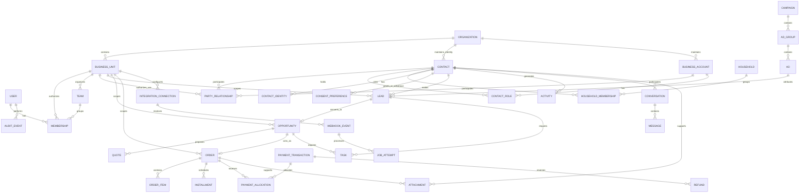
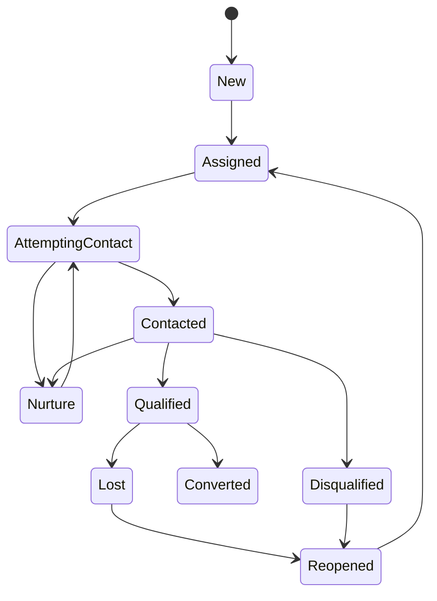
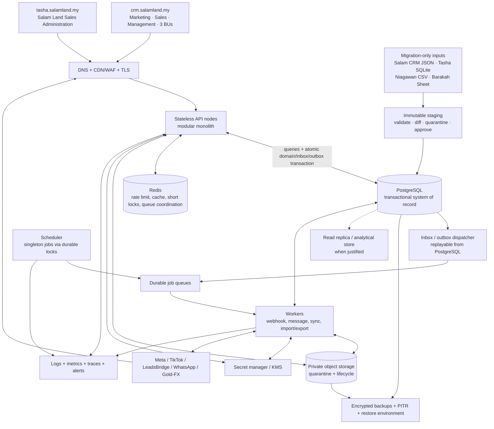

# CRM Salam Fortress V2 — Production Product Requirements Document

**Document version:** 1.8

**Date:** 16 July 2026 (MYT)

**Status:** Product direction approved on 16 July 2026; business-rule, legal/privacy, security, operations, migration, UAT, and every release/acceptance gate remain **Not passed**

**Product type:** Multi-business-unit CRM and revenue operations platform

**Initial business units:** Salam Land, Bumi Hayat Printing, Barakah Emas

**Current-state reference:** `CRM_CURRENT_STATE_AUDIT_2026-07-15.md`

**Execution reference:** `CRM_EXECUTION_PLAN_V2_2026-07-15.md`

**Approved design reference:** `plans/2026-07-16-unified-crm-production-design.md`

**Revision 1.8:** locks the approved product direction: one canonical production PostgreSQL, one shared modular API, two purpose-built UI applications, source-specific migration contracts for Salam CRM/Tasha/Niagawan/Barakah Sheet, an isolated production stack, the concise visual/copy system, and simultaneous go-live for all three business units. It does not promote the current foundation or mark any release gate passed.

---

## 1. Executive summary

CRM Salam Fortress V2 will be the trusted operational system from first customer enquiry through sales, fulfilment, payment, communication, and management reporting across Salam Land, Bumi Hayat Printing, and Barakah Emas.

V2 preserves the valuable workflow knowledge demonstrated in the existing application, while replacing its file-backed state, shared accounts, browser-owned business rules, exposed attachments/secrets, and synchronous provider processing.

The recommended product is a **modular monolith with asynchronous workers**, not an immediate microservice estate. This gives one consistent domain model and transaction boundary while still allowing web/API nodes and workers to scale horizontally. PostgreSQL is the system of record and stores authoritative CRM session metadata/token hashes; Redis is planned only for reconstructable rate-limit, cache, short-lock and queue-coordination state. Sensitive files use private object storage; provider events are durably accepted before asynchronous processing; all consequential actions are server-authoritative and auditable.

The production outcome must be:

- safe for named users and sensitive Malaysian customer data;
- correct under concurrent sales, payment, booking, and webhook activity;
- configurable per business unit without code changes;
- measurable through one canonical KPI dictionary;
- recoverable, observable, testable, and deployable through controlled releases;
- usable on mobile and desktop, including keyboard and assistive technology;
- able to grow from the current three business units to future units without data leakage or architectural rewrite.

### 1.1 Approved operating design baseline — 16 July 2026

The product owner approved the following direction:

- one canonical production PostgreSQL is the sole operational system of record across Salam Land, Bumi Hayat Printing, and Barakah Emas;
- one shared, versioned modular API owns authorization, validation, domain commands, audit, and integration behavior;
- `crm.salamland.my` serves marketing, sales, management, shared CRM work, and all three business-unit verticals;
- `tasha.salamland.my` serves the focused Salam Land sales-administration workflow;
- Salam CRM JSON and Tasha SQLite, Niagawan CSV, and the approved Barakah Sheet snapshot enter through controlled staging/import paths and do not become parallel write authorities after cutover;
- the existing multipurpose Hostinger VPS may temporarily host separately isolated legacy and sanitised staging roles; production requires a dedicated isolated stack and legacy becomes read-only after cutover;
- internal delivery and UAT may be phased, but both UIs and all three business units enter production in one coordinated go-live window.

These are product-direction approvals, not legal, security, operations, finance, migration, UAT, or release approval. Exact field mappings, extraction checksums/cutoffs, business rules, RPO/RTO evidence, rollback thresholds, and named sign-offs remain mandatory evidence.

### 1.2 Current implementation classification

The present V2 branch is a **hardened production foundation**, not a production release. Local implementation now supplies meaningful database, Lead-command, identity-session, migration, CSP/runtime and demo-UI evidence, but it does not satisfy any gate. Hosted CI/promotion, a real managed IdP and MFA policy, production infrastructure, workers/queue dispatch, private object storage, telemetry, backup/PITR and restore rehearsal, capacity/soak proof, migration/UAT evidence, and named business, security, privacy, finance and operations approvals are still absent.

## 2. Document authority and decision order

When requirements conflict, the team will resolve them in this order:

1. applicable law, regulator guidance, contractual and provider requirements;
2. approved architecture/security/privacy decision records;
3. this PRD and its approved amendments;
4. signed business-rule catalogue and KPI dictionary;
5. existing code behaviour;
6. historical notes, screenshots, and informal runbooks.

The existing application is evidence of intended workflow, not the final authority for financial, security, privacy, or concurrency rules.

## 3. Problem statement

The organisation has useful but fragmented operational systems and no single production-grade system of record. Salam Land acquisition and sales are held in the legacy CRM JSON runtime, while sales administration is held in Tasha SQLite without a durable CRM Lead link. Bumi Hayat Printing uses Niagawan and can export CSV but has no approved API. Barakah Emas operates from a Google Sheet whose exact link/schema is still required. The current CRM also combines browser state, shared logins, client-side rules, integrations, reports, uploads, and backups in one Node process.

This creates six business problems:

1. **Trust:** concurrent edits and provider events can silently overwrite one another; dashboards cannot always prove their source or date basis.
2. **Security and privacy:** customer and identity-document data, access credentials, and integration secrets are not protected to production standard.
3. **Operational control:** lead ownership, tasks, lot reservations, printing jobs, gold-rate approvals, payments, refunds, and opt-outs lack durable state machines and approval trails.
4. **Scale:** each client loads a broad state object and each write can replace the entire state, preventing safe horizontal growth.
5. **Change safety:** deployment paths, ports, process names, data snapshots, and historical documents conflict; tests do not yet cover the full product.
6. **Reconciliation:** customer identity, lifecycle, lot, order, finance, and source lineage do not yet reconcile deterministically across the four legacy inputs.

## 4. Product vision

> Every enquiry has a trusted identity, owner, next action, commercial journey, communication history, and auditable outcome—without exposing one business unit's customers or controls to another.

### 4.1 Product principles

1. **One customer, many journeys.** A Contact may have multiple legitimate Leads and Orders; deduplication never destroys legitimate repeat business.
2. **Server owns truth.** Browser validation improves usability, but the server enforces every status, money, permission, inventory, and integration rule.
3. **Fail closed for access; fail visibly for operations.** An outage never reveals cached PII or silently claims that a write succeeded.
4. **Durable before asynchronous.** Provider events are verified and persisted before acknowledgement; outbound work is committed to an outbox before delivery.
5. **Configuration over hard-coding.** Business units can configure stages, products, teams, rules, and channels inside governed boundaries.
6. **Financial history is immutable.** Corrections are reversals or adjustment entries, not overwritten facts.
7. **Metrics have definitions.** Every KPI declares its source entities, timestamps, filters, currency, attribution, freshness, and owner.
8. **Privacy by default.** Collect the minimum data, limit access, retain only as long as approved, and record every sensitive-file view/export.
9. **Accessible and mobile-first.** Sales users can complete core work on a small screen and without a mouse.
10. **Operationally boring.** Releases, backups, restores, retries, alerts, and rollbacks are repeatable and evidenced.
11. **One operational truth, two purpose-built surfaces.** Both UIs use the same identity, permissions, domain commands, API, and canonical records; neither owns a shadow database or copied business rules.
12. **Legacy is an input, not an authority after cutover.** Every source is checksummed, staged, reconciled, archived read-only, and prevented from uncontrolled post-cutover writes.
13. **Reference-locked, concise UI.** The approved palette, density, navigation language, and action-first copy are captured as dated acceptance criteria rather than inheriting silently from a changing website.

## 5. Goals, outcomes, and non-goals

### 5.1 Goals

| Goal | Target outcome |
|---|---|
| Trusted customer record | Contact identity is reusable across leads, opportunities, orders, and conversations without cross-company leakage |
| Faster response | New verified leads are visible and assigned within the defined SLA |
| Controlled conversion | Lead-to-opportunity/order conversion preserves attribution and stage history exactly once |
| Vertical operations | Land reservation, printing production, and gold transaction rules are first-class workflows |
| Financial correctness | Due amounts, actual payments, allocations, credits, refunds, and balances reconcile through an immutable ledger |
| Reliable integrations | Meta, TikTok, LeadsBridge and WhatsApp events are verified, idempotent, retryable, observable, and isolated per business unit |
| Reliable reporting | Dashboard, report and export agree for the same metric, period, timezone, currency, and scope |
| Safe operations | Named identity, least privilege, private files, audit, retention, backup, restore, monitoring, and controlled deployment |
| Scale without rewrite | Both stateless UIs, shared API nodes, and independent workers scale while one transactional database remains authoritative across every business unit |
| Controlled migration | Salam CRM/Tasha, Niagawan CSV, and Barakah Sheet imports reconcile by signed batch, mapping version, checksum, and quarantine outcome |
| Coordinated launch | Both UIs and the three approved business-unit slices pass one go/no-go and simultaneous production cutover |

### 5.2 Success measures for first general-availability quarter

Baselines must be captured during discovery. Proposed initial targets:

- 100% of verified provider events accepted by the endpoint have a durable, queryable outcome—processed, retrying, quarantined, or dead-lettered—with zero silent loss;
- at least 99.5% of valid accepted lead events complete automatic processing within the approved integration SLA, excluding provider-declared outage windows;
- at least 95% of new leads assigned within 60 seconds;
- fewer than 0.5% unresolved possible duplicates older than two business days;
- 100% of won orders linked to a contact and originating lead/opportunity or an explicit approved `direct sale` reason;
- 100% of payment/refund changes represented by ledger entries and named actors;
- dashboard/report/export reconciliation difference of zero for controlled fixtures and less than 0.1% for provider rounding differences;
- zero unauthorised cross-business-unit reads in automated policy tests;
- zero public IC/payment attachments;
- 99.9% monthly production availability after GA;
- quarterly restore drill meets approved RPO/RTO.

### 5.3 Non-goals for initial GA

- replacing a full accounting/ERP system;
- payroll, HR, or commission payout processing;
- a public self-service customer portal;
- full land-title/conveyancing case management;
- manufacturing resource planning beyond the agreed printing job workflow;
- algorithmic gold trading or treasury management;
- building independent microservices for every module;
- offline mutation of customer, booking, order, or payment data;
- custom BI warehouse on day one unless volume testing proves it necessary.

## 6. Scope and assumptions

### 6.1 Proposed capacity envelope

These are design assumptions to validate in discovery, not claims about current volume:

| Dimension | Initial design envelope |
|---|---:|
| Business units | 20 |
| Named users | 500 |
| Contacts/leads | 2 million |
| Activities/messages | 20 million |
| Concurrent sessions | 500 |
| Webhook traffic | 20 events/sec sustained, 100 events/sec burst |
| Attachment storage | 5 TB with lifecycle tiers |
| Common list size | Cursor-paginated; never download whole tenant state |

Capacity evidence must measure each UI independently and their combined traffic against the same API, worker, PostgreSQL connection, cache, queue, and object-storage budgets. A passing test for only one UI is insufficient.

### 6.2 Product-approved service targets pending operational acceptance

| Objective | Proposed target |
|---|---|
| Monthly availability | 99.9%, excluding pre-announced maintenance |
| Normal API read latency | p95 under 500 ms |
| Normal API write latency | p95 under 750 ms |
| Verified webhook durable acknowledgement | p95 under 2 seconds |
| Lead visible after provider receipt | p95 under 60 seconds |
| Standard dashboard load | p95 under 3 seconds |
| Standard report generation | under 30 seconds; larger exports asynchronous |
| Recovery point objective | 15 minutes or better |
| Recovery time objective | 4 hours or better |

Product has approved these as initial targets, not measured achievements. The architecture should be able to tighten RPO/RTO later without redesign. Operations and Management must formally approve topology/capacity/cost and demonstrate the objectives. Decision `D-18` locks the workload skew, client/network profile, SLO measurement method and error-budget contract used by `PERF-001` and `PERF-002`; D-13 retains infrastructure acceptance.

## 7. Users and access model

### 7.1 Personas

| Persona | Core jobs |
|---|---|
| Platform administrator | Manage organisations, business units, platform policy, emergency access, environments |
| Business-unit administrator | Configure own unit, teams, stages, products, channels, and authorised exports |
| Sales manager | Manage pipeline, assignment, SLA, coaching, approvals, and team performance |
| Salesperson | Work assigned leads/opportunities, tasks, conversations, quotes, and permitted orders |
| Marketing manager | Manage campaign/source mapping, spend sync, attribution quality, and lead-delivery health |
| Finance/collection officer | Manage invoices/installments, payment evidence, allocation, reconciliation, credits, and refunds |
| Inventory/operations officer | Manage land lots or printing production states and operational exceptions |
| Gold operations approver | Approve rates, overrides, high-value transactions, and reconciliations |
| Management viewer | Read scoped executive dashboards and approved exports; no operational writes by default |
| Auditor/privacy officer | Read immutable audit, access logs, retention jobs, incidents, and data-subject requests |
| Integration service account | Narrow machine-to-machine actions with rotation, expiry, and no interactive login |

### 7.2 Authorisation model

V2 uses RBAC plus contextual rules:

- **RBAC:** stable singular-resource capability keys such as `lead.read`, `lead.assign`, `order.approve`, `payment.refund`, `integration.manage`, `user.manage`, `export.run`.
- **Scope:** organisation, business unit, branch, team, own records, assigned queue, or explicitly shared record.
- **Attributes:** amount thresholds, record state, document sensitivity, legal hold, working group, and maker-checker separation.
- **Database guard:** every tenant-owned row carries `organization_id`. Business-unit-scoped aggregates such as Lead, Opportunity, Order, Lot, Conversation and Integration Connection also carry `business_unit_id`. Organisation-scoped party/identity rows are exposed to a business unit only through an authorised relationship and central policy. RLS is mandatory defence-in-depth for production tenant-owned tables, subject to D-19 approval of roles, transaction-local context, bypass/break-glass and policy-test design; application authorization remains mandatory and cannot rely on RLS alone.

### 7.3 Capability baseline

| Action | Platform admin | BU admin | Sales manager | Salesperson | Marketing | Finance | Operations | Management | Auditor |
|---|---:|---:|---:|---:|---:|---:|---:|---:|---:|
| Read scoped contacts/leads | Yes | Yes | Team/BU | Own/team policy | Scoped | Limited | Limited | Read | Case-based |
| Assign/reassign lead | Policy | Yes | Yes | No | No | No | No | No | No |
| Change pipeline stage | Policy | Yes | Yes | Assigned | No | No | Limited | No | No |
| Manage campaigns/mapping | Policy | Optional | Read | Read | Yes | Read | No | Read | Read |
| Create order/booking | Policy | Yes | Yes | Allowed | No | No | Operational | No | No |
| Post payment | Policy | Optional | No | No | No | Yes | No | No | Read |
| Approve refund/rate/override | Emergency only | Threshold | Sales exception | No | No | Finance threshold | Operational threshold | No | Read |
| Manage credentials | Emergency only | Explicit permission | No | No | Optional narrow | No | No | No | Read metadata only |
| View sensitive attachment | Explicit | Policy | Need-to-know | Assigned/need | No | Finance docs | Operational docs | Usually no | Case-based |
| Export PII | Explicit | Approved | Restricted | No/default | Restricted | Restricted | Restricted | Aggregate/default | Case-based |
| Manage users/roles | Yes | Own BU | No | No | No | No | No | No | Read |

The final matrix must be signed by business owners. “Boss” or “management” is never automatically equivalent to administrator.

## 8. Information architecture and navigation

V2 has two independently deployable, permission-protected UI applications over the same API and canonical records.

**`crm.salamland.my` — marketing, sales, and management workspace**

1. Home and work queue
2. Contacts
3. Leads and Pipeline
4. Tasks and Follow-ups
5. Orders
6. Salam Land, Bumi Printing, and Barakah Emas vertical workspaces
7. Conversations
8. Marketing and attribution
9. Reports
10. Team, Integrations, and Administration

**`tasha.salamland.my` — Salam Land sales-administration workspace**

1. Home and exception queue
2. Clients/Contacts
3. Projects, phases, and lots
4. Holds and reservations
5. Orders and agreements
6. Installments, payments, credits, and refunds
7. Documents and operational tasks
8. Reconciliation and authorised reports

Requirements:

- both applications use the same named identity, Membership, Contact master, server capability policy, versioned API, audit model, and canonical PostgreSQL; neither UI owns separate business rules or direct database writes;
- the business-unit switcher always exposes an explicit `Semua | Salam Land | Bumi Hayat | Barakah Emas` menu/combobox where the user is authorised; `Semua` is read-only across authorised rows, every row identifies its unit, and create/write requires an explicit business unit;
- the selected scope is carried in an auth-safe URL/deep link and is revalidated by the server, never trusted from the client;
- cross-UI deep links identify the intended surface and exact authorised record without leaking data in the URL;
- Tasha presents Salam Land administration only; shared Contact or Finance records remain canonical and do not fork when opened from Tasha;
- the menu only shows capabilities the server authorises, but hidden navigation is never the security boundary;
- every record has an auth-safe URL and breadcrumb;
- login returns the user to the originally authorised target;
- cross-business-unit switching is explicit and visibly changes context;
- opening a notification lands on the exact authorised record/action;
- browser history, refresh, copy-link, and back/forward behaviour work normally;
- destructive and financial actions do not live behind generic browser prompts;
- mobile uses a drawer or bottom navigation and a single-column task-first layout.

## 9. Canonical domain model

### 9.1 Core entity relationships

### 9.2 Entity rules

- A natural-person Contact is mastered at organisation scope so the same person can have multiple legitimate journeys, but ordinary business-unit users gain access only through an explicit, effective-dated `PartyRelationship`. Cross-business-unit matching does not automatically reveal the other unit's record or activity.
- Business customers are represented by `BusinessAccount`; households/joint buyers and named contact roles support printing-company buyers, land co-buyers, guardians/representatives, billing contacts and authorised recipients. Leads, opportunities, orders and files identify each party's role instead of forcing every customer into one individual Contact.
- Identity matching may use protected organisation-level canonical values or keyed hashes. Match results expose only a possible-match workflow until access purpose, controller/brand relationship and permission are validated.
- A Contact–Business Unit relationship is an authorization boundary, not a dedupe side effect. Lead create must serialize identity reuse, lock/recheck the active relationship inside its transaction, and fail closed if concurrent restriction wins; it must never reactivate or attach a Lead to a relationship that is no longer active.
- Consent and preferences declare controller/organisation, business unit or brand where applicable, channel, purpose and legal basis. An organisation-wide suppression is applied only when the notice, channel ownership or law requires it; narrower consent is never silently broadened across business units.
- IDs are globally unique, non-sequential public identifiers; internal database keys may differ.
- Every mutable business record has a server-owned `version` for optimistic concurrency.
- All timestamps are stored in UTC with explicit source, received, ingested, created, updated, state-transition, and deletion times as applicable.
- MYT is the initial display/reporting timezone, configurable per business unit.
- Phone identities are stored canonically in E.164 plus original input and verification state.
- Money uses integer minor units or fixed-precision decimals with an ISO currency code; never binary floating point. Lead has no monetary-value field: expected commercial amount begins on Opportunity, and actual obligations/cash belong to Order/Finance entities.
- Human-readable numbers use unique sequences per business unit and document type.
- Soft deletion is not a substitute for retention. Records have lifecycle state, retention policy, and legal-hold handling.
- Integration credentials are references to encrypted secret storage, never general entity fields.
- Raw provider events are immutable, access-restricted, encrypted, and retained under a separate policy.
- Every migrated object retains `source_system`, stable `source_record_id` where available, immutable extraction batch/checksum, raw legacy state, mapping/transform version, destination ID, reconciliation outcome, and archive location through `ImportBatch`, `ImportRow`, `LegacyObjectLink`, and `ReconciliationResult` records.
- An importer row is never silently dropped or guessed: it reaches imported, no-op/replayed, rejected, quarantined, or explicitly approved partial-batch outcome with operator evidence.

## 10. Global workflow states

### 10.1 Lead lifecycle

Rules:

- each stage change records `from`, `to`, actor, reason, time, source, and required fields;
- terminal loss/disqualification requires a controlled reason;
- `Converted` requires one linked opportunity and preserves original attribution;
- a repeat enquiry creates a new Lead under the same Contact rather than reopening by default;
- automated transitions cannot overwrite a manual ownership lock or regress the stage.

### 10.2 Opportunity lifecycle

`Open → Discovery → Proposal/Quote → Negotiation/Booking → Won | Lost | On Hold`

- stage probabilities are configurable but historical forecasts retain the value used at the time;
- expected amount and ISO currency belong to Opportunity, never Lead; forecast history retains the amount/probability basis used at the time;
- Won requires approved commercial fields and creates/links the relevant order/booking exactly once;
- reopen requires permission and reason;
- expected close date is a date, while actual `won_at`/`lost_at` are immutable event timestamps.

### 10.3 Payment lifecycle

- Installment: `Scheduled → Due → Partially Paid → Paid | Waived | Cancelled`.
- Payment transaction: `Pending → Settled | Failed | Reversed`.
- Refund: `Requested → Approved → Processing → Settled | Failed | Rejected`.
- No state is achieved by overwriting the original amount; allocations, adjustments, credits, reversals, and refunds are separate entries.

### 10.4 Orthogonal state dimensions and legacy-status contract

V2 does not use one catch-all status field. The current application mixes pipeline, outreach, provider delivery, fulfilment and payment meanings in values such as `WS Sent`, `Bluetick`, `Reply`, `Tak Jawab`, `Quotation`, `Production`, `Payment` and `Closed`. Those meanings become independent, server-owned dimensions:

| Dimension | Examples | Owner and rule |
|---|---|---|
| Lead lifecycle | New, Assigned, Attempting Contact, Contacted, Qualified, Converted, Lost | Lead module; only approved lead-transition commands may change it |
| Contact-attempt outcome | No Answer, Connected, Callback Requested, Invalid Number | Activity module; a new attempt appends an event and never overwrites commercial stage |
| Message delivery/engagement | Queued, Sent, Delivered, Read, Failed, Customer Replied | Conversation module; provider events advance only legal message transitions |
| Opportunity stage | Discovery, Proposal, Negotiation, Won, Lost, On Hold | Opportunity module; commercial evidence and permissions govern transition |
| Order state | Draft, Submitted, Approved, Active, Completed, Cancelled | Order module; fulfilment or a message receipt cannot close an order by itself |
| Fulfilment state | Lot hold/reservation, printing production/QC/delivery, gold transaction state | Respective vertical module; transitions follow vertical invariants |
| Finance state | Installment, payment, allocation, refund and reconciliation lifecycles | Finance module; immutable ledger events drive balances |

Migration preserves the exact raw source value as `legacy_status`, applies a versioned and signed mapping to one or more dimensions, and quarantines ambiguous values. A provider callback or automation may update only the dimension it owns; it cannot regress a commercial stage or overwrite a manual ownership lock.

## 11. Functional requirements

Priority meanings: **P0** required before any production cutover and non-waivable, **P1** required for initial GA, **P2** subsequent controlled release. A P0 may be changed only through a new approved PRD revision that replaces the requirement with an equivalent or stronger control; it cannot be waived in a release decision. A narrowly scoped P1 exception follows Gate D.

### 11.1 Identity, tenant isolation, and administration

| ID | Pri | Requirement | Acceptance summary |
|---|---|---|---|
| IAM-001 | P0 | Every human uses a unique named account | No shared operational account; actor can be traced for every consequential action |
| IAM-002 | P0 | Identity-provider and CRM access lifecycle | The approved IdP owns credential reset, unlock and MFA enrollment; CRM owns pre-provisioning, Membership activation/suspension, authorization, session revocation, offboarding, work reassignment and audit. Either side disabling access prevents CRM use within the approved propagation objective |
| IAM-003 | P0 | Privileged MFA and step-up authentication | Admin, credential, export, sensitive-file, refund, and policy-defined actions require appropriate assurance |
| IAM-004 | P0 | Secure revocable sessions | No bearer token in `localStorage`; session rotation, idle/absolute expiry, device list, logout-all, CSRF protection |
| IAM-005 | P0 | Server-authoritative RBAC + scope | Direct API and manipulated UI attempts return 403; all role × scope × action cases are policy-tested |
| IAM-006 | P0 | Tenant/business-unit isolation | Automated tests prove no cross-scope row, cache, search, export, file, webhook, or report leakage |
| IAM-007 | P1 | Effective-dated membership and team history | Moving staff does not rewrite historical ownership/reporting |
| IAM-008 | P1 | Maker-checker and amount thresholds | Requester cannot approve own protected action; policy and exception are audited |
| IAM-009 | P1 | Emergency access | Time-limited, reasoned, approved, alerted, and reviewed break-glass access |
| IAM-010 | P0 | Managed OIDC federation boundary | Authorization Code + PKCE validates exact issuer/audience/redirect, state and nonce; only a pre-provisioned active User with active Membership enters; unknown subjects, replay, assurance failure, provider/JWKS failure and key rotation fail closed with redacted audit/telemetry |
| ADM-001 | P1 | Configure business units, branches, teams, products, stages, reasons, SLAs, working hours | Validated changes are versioned, previewable, and auditable; unsafe deletion is blocked |
| ADM-002 | P1 | Feature flags and controlled exposure | Flag has owner, environment, scope, expiry/review date, audit, and safe default; flags may support testing/safety but cannot create a phased initial production authority switch by business unit |
| ADM-003 | P1 | User access review | Quarterly export/review and attest/revoke workflow for privileged permissions |

### 11.2 Contacts and identity resolution

| ID | Pri | Requirement | Acceptance summary |
|---|---|---|---|
| CON-001 | P0 | Canonical Contact separate from Lead and Order | One contact can have multiple enquiries and purchases without data duplication |
| CON-002 | P1 | Multiple phones, emails, addresses, identity references and preferences | Each value has type, verification, primary flag, source, and history |
| CON-003 | P0 | Malaysian phone parsing and E.164 normalisation | `01…`, `601…`, and formatted equivalents match consistently while original input is retained |
| CON-004 | P1 | Search with permission-aware exact/fuzzy matches | Search returns only authorised fields/records and remains performant at target volume |
| CON-005 | P1 | Possible-duplicate review | Operator can compare, link, merge, or dismiss with reason; merge is reversible by authorised support |
| CON-006 | P0 | Deterministic provider idempotency is separate from person matching | Replayed event creates no new Lead; legitimate repeat enquiry can create one |
| CON-007 | P1 | Contact merge preserves all child records and consent history | No opportunity, order, payment, file, source, activity, or opt-out is orphaned |
| CON-008 | P1 | Sensitive identity fields are field-level protected | Masking, reveal reason, access log, export restriction, and policy-based retention |
| CON-009 | P1 | Business accounts, households/joint buyers and party roles | A printing company, joint land buyers and billing/authorised contacts are modelled without copying or misclassifying people |
| CON-010 | P0 | Organisation identity master with explicit BU relationship boundary | Cross-BU match can be detected without revealing data; access begins only after an authorised relationship/purpose is recorded |

### 11.3 Leads, pipeline, tasks, and assignment

| ID | Pri | Requirement | Acceptance summary |
|---|---|---|---|
| LEAD-001 | P0 | Create lead manually, by verified integration, or controlled import | Required fields and provenance are server-validated; create is idempotent; source system/record, extraction batch, raw legacy status, mapping version and reconciliation outcome are retained; no Lead monetary value is accepted or returned |
| LEAD-002 | P1 | Editable lead detail with notes, activities, tags, next action and files | Every update has actor/time/version and respects field permissions |
| LEAD-003 | P0 | Controlled configurable stage transitions | A versioned active `pipeline_stage_transitions` edge defines allowed source/target, required capability and reason; missing, disabled, cross-pipeline or stale-version transitions are rejected on the server and successful transitions append history |
| LEAD-004 | P1 | Qualify/disqualify/nurture/reopen workflows | Required reason and next action; service metrics use transition timestamps |
| LEAD-005 | P0 | Convert lead exactly once | Creates/links one opportunity, preserves source/campaign/owner, and prevents metric double count |
| LEAD-006 | P1 | Bulk actions with preview and limits | Scope/validation errors shown before commit; one batch ID and audit evidence |
| STATE-001 | P0 | Separate lead, outreach, message, opportunity, order, fulfilment and finance states | Updating one dimension cannot silently change another; each transition uses its owning server command and audit event |
| STATE-002 | P0 | Versioned legacy-status mapping | Every imported status is preserved raw, deterministically mapped under a signed rule version, or quarantined; no ambiguous status is guessed |
| STATE-003 | P1 | Automation transition boundary | Provider/message events cannot regress commercial stage, replace a manual owner lock or close an order without the required domain command |
| ASG-001 | P0 | Transactional assignment | Lead creation, selected owner, cursor/capacity update, task and outbox commit together |
| ASG-002 | P1 | Rules for company, source/form, product, territory, language, team, shift, leave and capacity | Simulation explains which rule won; invalid/unmapped lead enters visible exception queue |
| ASG-003 | P1 | Fair round robin and manual lock | Duplicate events do not advance cursor; manual owner is never silently replaced |
| ASG-004 | P1 | Reassignment and offboarding | Reason/history preserved; pending tasks and conversations transfer according to policy |
| TASK-001 | P1 | First-class task/follow-up | Owner, due datetime, timezone, status, reminder, snooze, recurrence, completion and linked entity |
| TASK-002 | P1 | SLA and escalation | Working-hours clock, pause rules, breach warning, escalation target and manager dashboard |
| TASK-003 | P2 | Personal/team work queue | Priority combines due time, SLA risk, value and manager override with explainable ordering |

### 11.4 Salam Land property workflow

| ID | Pri | Requirement | Acceptance summary |
|---|---|---|---|
| LAND-001 | P1 | First-class project, phase, lot, lot-unit and attributes | Ranges are expanded into individual validated units; import has duplicate/error report |
| LAND-002 | P0 | Authoritative lot availability | Lot state is stored, not inferred from arbitrary lead/order status |
| LAND-003 | P0 | Atomic timed hold | Two concurrent holds allow one success; loser receives 409 and refreshed availability |
| LAND-004 | P1 | Hold expiry, extension and release | Scheduler expires safely; extension/release requires reason and permission; all events audited |
| LAND-005 | P0 | Reservation/booking state machine | Required customer, opportunity, documents, deposit and approval rules are server-enforced |
| LAND-006 | P1 | Transfer, cancellation, reopening and exception approval | No silent lot release; financial and document dependencies are checked |
| LAND-007 | P1 | Visual lot board | Filters, legend, last-updated, accessibility alternative, drill-down and real-time conflict refresh |
| LAND-008 | P2 | Availability publishing feed | Only approved non-sensitive lot state is exposed; cache freshness and withdrawal are controlled |
| LAND-009 | P0 | Separate Lot, Hold and Reservation aggregates with one active-allocation invariant | Concurrent Hold/Reservation commands for one Lot produce at most one active allocation; derived availability and every losing conflict are deterministic |

Lot, Hold and Reservation are separate aggregates:

- Lot operational state: `Active | Blocked | Withdrawn | Sold`.
- Hold lifecycle: `Active → Expired | Released | Converted`.
- Reservation lifecycle: `Pending → Confirmed → ConvertedToSale`, with a controlled `Cancelled` path.
- `Available` is a derived view: the Lot is Active and has no Active Hold or Pending/Confirmed Reservation.

One database-enforced active allocation may exist per Lot across the Hold and Reservation tables. A Sold Lot can return to an operational state only through an authorised sale-reversal workflow that also reconciles the Order and Finance modules.

### 11.5 Bumi Hayat Printing workflow

| ID | Pri | Requirement | Acceptance summary |
|---|---|---|---|
| PRINT-001 | P1 | Configurable printing product/specification model | Quantity, dimensions, material, finishing, artwork, delivery and pricing inputs are validated |
| PRINT-002 | P1 | Versioned quote with expiry | Each revision preserves price/specification; accepted version is immutable |
| PRINT-003 | P1 | Artwork/proof approval | Customer/authorised internal approval, file version, comments, timestamp and evidence are linked |
| PRINT-004 | P1 | Production job card | Owner, work centre, due date, priority, material, status and blocker reason |
| PRINT-005 | P1 | Production state machine | `Queued → Prepress → Production → QC → Ready → Delivered/Collected`; invalid skips require approval |
| PRINT-006 | P1 | QC and rework | Checklist, failure reason, photos/files, rework count, cost and sign-off are retained |
| PRINT-007 | P1 | Delivery/collection proof | Recipient, date/time, method, tracking/reference and evidence; order closes only when policy is met |
| PRINT-008 | P2 | Controlled change order | Post-approval spec/quantity/date change creates a priced version and reapproval, not silent overwrite |
| PRINT-009 | P0 | Versioned Niagawan CSV intake | Approved export/template, original file/hash/operator, row provenance, schema drift, encoding, amount, formula-injection, duplicate and partial-row outcomes are validated in dry run before an authorised batch can affect canonical records |

### 11.6 Barakah Emas workflow

| ID | Pri | Requirement | Acceptance summary |
|---|---|---|---|
| GOLD-001 | P1 | Multi-source gold and FX rate ingestion | Source, effective/retrieved time, freshness, status and raw evidence are retained |
| GOLD-002 | P0 | Immutable approved rate snapshot per transaction | Transaction total can always be reproduced from its exact rate/rule version |
| GOLD-003 | P1 | Product purity, gross/net weight, spread, upah, fees and rounding rules | Server calculates with fixed precision and shows a full breakdown |
| GOLD-004 | P1 | Stale/missing-rate policy | Sale is blocked or requires named approval according to configured threshold |
| GOLD-005 | P1 | Buyback/exchange workflow | Source item, assessed purity/weight, deductions, payout/credit and approval are audited |
| GOLD-006 | P1 | Rate/price override maker-checker | Reason, previous/new value, threshold and approver recorded; requester cannot self-approve |
| GOLD-007 | P1 | Receipt and reconciliation | Cash/bank/reference, inventory movement and transaction value reconcile before close |
| GOLD-008 | P2 | Inventory movement | Stock acquisition, sale, adjustment and count use immutable movements and discrepancy approval |
| GOLD-009 | P0 | Versioned Barakah Sheet intake and cutover | Exact document/tab/range/schema snapshot is immutable and checksummed; missing/renamed columns fail closed; approved rows are reconciled before canonical writes and uncontrolled bidirectional sync is prohibited |

### 11.7 Orders, installments, payments, credits, and refunds

| ID | Pri | Requirement | Acceptance summary |
|---|---|---|---|
| ORD-001 | P0 | Server-owned order schema and totals | Client cannot forge totals, status, owner, timestamps, discount, balance, or audit actor |
| ORD-002 | P1 | Order items, tax/fee/discount policy and versions | Total is reproducible; changes after approval create revision/change event |
| ORD-003 | P0 | Link to contact and commercial origin | Order requires opportunity or approved direct-sale reason; attribution snapshot preserved |
| ORD-004 | P1 | Order state transition and cancellation policy | Required reason/approval; dependencies and downstream reversals are enforced |
| FIN-001 | P0 | Separate installment schedule from payment transaction | Future due item never counts as collected; partial/overdue states are correct |
| FIN-002 | P0 | Fixed-precision append-only ledger | Sum of settled payments, allocations, credits, refunds and reversals reconciles to displayed balance |
| FIN-003 | P0 | Idempotent payment posting | Retry/time-out with same idempotency key creates one payment only |
| FIN-004 | P1 | Payment allocation | One payment can allocate to valid installments/orders; unapplied credit remains explicit |
| FIN-005 | P1 | Receipt/evidence | Number, payer, method, provider/bank reference, paid-at, recorded-at, actor, file, and status |
| FIN-006 | P0 | Refund and reversal workflow | Cannot exceed eligible unrefunded settled value; permission, reason and maker-checker as configured |
| FIN-007 | P1 | Daily reconciliation | Cash/bank/provider totals, discrepancies, owner, close/reopen and evidence |
| FIN-008 | P1 | Aging and collections | Due/overdue buckets use installment due date and timezone, not order creation date |
| FIN-009 | P2 | Accounting export boundary | Versioned, approved export with mapping, checksum, period lock and re-export/restatement evidence |

### 11.8 Marketing, campaign attribution, and spend

| ID | Pri | Requirement | Acceptance summary |
|---|---|---|---|
| MKT-001 | P1 | Canonical source hierarchy | Provider account → campaign → ad group → ad → form/landing source mapping with effective dates |
| MKT-002 | P1 | Raw and reconciled daily spend | Provider currency, FX if required, retrieved time, revision and reconciliation status retained |
| MKT-003 | P1 | First-touch, last-touch and operational source | Model is explicit; conversion snapshot is immutable; reports name the selected model |
| MKT-004 | P0 | No silent metric fallback | Missing/stale spend or lead source displays `Unavailable/Stale`, never substitutes another period/denominator |
| MKT-005 | P1 | Unmapped attribution queue | Marketing can map with preview; reprocessing is idempotent and audited |
| MKT-006 | P1 | Campaign ownership allocation | Company spend is not copied in full to multiple staff; allocation rule totals reconcile to 100% |
| MKT-007 | P2 | Budget and pacing alerts | Threshold, owner, timezone, provider freshness and notification policy are configurable |

### 11.9 Conversations, WhatsApp, and notifications

| ID | Pri | Requirement | Acceptance summary |
|---|---|---|---|
| COM-001 | P0 | Per-business-unit WhatsApp connection and sender ownership | Credential/channel is isolated; wrong-unit send is impossible |
| COM-002 | P0 | Verify every webhook before parsing/state change | Invalid signature, stale timestamp, replay and oversize request create no business mutation |
| COM-003 | P0 | Durable conversation/message store and provider-event uniqueness | Repeated concurrent delivery results in one logical message/status transition |
| COM-004 | P1 | Operable agent inbox | Queue, assignment, unread, search, reply, attachment, delivery state, handoff and customer context |
| COM-005 | P0 | Consent/opt-out enforcement | Channel/purpose preference is checked server-side before send; verified opt-out suppresses all applicable work |
| COM-006 | P1 | Template and service-window policy | Server selects permitted content; variables validated; 24-hour-window status visible and enforced |
| COM-007 | P1 | Quiet hours, frequency limits and rate limits | Timezone-aware; emergency/transactional exception has policy and audit |
| COM-008 | P0 | Transactional outbox with retry/backoff/DLQ | Business commit succeeds once; delivery retries do not duplicate logical message |
| NOT-001 | P1 | In-app notification centre | Read/unread, entity deep link, preference, priority, expiry and audit |
| NOT-002 | P1 | Push notification subscription ownership | User can manage only own devices; revoked/expired endpoints are pruned safely |
| NOT-003 | P2 | Email/SMS channels | Added through the same consent, template, outbox, provider-health and audit model |

### 11.10 Integration platform

| ID | Pri | Requirement | Acceptance summary |
|---|---|---|---|
| INT-001 | P0 | Credentials live only in secret manager/KMS-backed storage | API/browser/export/log displays masked metadata only; rotation is auditable |
| INT-002 | P0 | Webhook gateway: size limit, signature, timestamp, replay and rate limit | Fails closed before domain processing; provider-specific contract tests pass |
| INT-003 | P0 | Durable inbox before acknowledgement | Event is persisted immutably, assigned unique key and acknowledged within target |
| INT-004 | P0 | Asynchronous normalize/map/assign/notify pipeline | Each step is idempotent, observable, retryable, and separately failed |
| INT-005 | P1 | Dead-letter and replay console | Authorised operator sees redacted error, repairs mapping and replays without duplicate business action |
| INT-006 | P1 | Provider checkpoint/cursor | Polling fetches incrementally; restarts resume safely; no repeated full-history scans |
| INT-007 | P1 | Timeouts, bounded exponential retry, jitter, circuit breaker and rate-limit handling | Provider outage does not exhaust web workers; stale/degraded state is visible |
| INT-008 | P1 | Connection lifecycle and truthful health | Screen shows provider, BU, environment, external account/page/form/phone IDs, owner, scopes, last verified, expiry/rotation due, webhook freshness and last failure; raw token is never revealed/copied; without a live check status is `Tidak diketahui`, not `Tersambung` |
| INT-009 | P1 | Raw-event retention and redaction | Access is restricted; search/debug metadata is separated from sensitive payload |
| INT-010 | P0 | Source-specific migration framework | Salam CRM/Tasha reconciliation, Niagawan CSV, and Barakah Sheet use immutable checksum/cutoff, versioned mapping, staging, dry run/diff, row validation, dedupe plan, quarantine, approval, resumability, idempotent replay, reconciliation report, and no post-cutover dual write |
| INT-011 | P1 | Export framework | Scope/fields/reason/watermark/expiry/download audit; large exports asynchronous and encrypted |
| INT-012 | P0 | Canonical authority switch | Final source delta and write freeze are signed; both UIs write only through the shared API after cutover; legacy jobs, webhooks and write credentials are disabled and the sources retained read-only under approved retention |

Provider-specific minimums:

- **Meta:** page/form mapping, `X-Hub-Signature-256`, incremental retrieval, test-lead controls, token permission/expiry health, spend reconciliation.
- **TikTok/LeadsBridge:** per-connection header-only secret, signed timestamp freshness, advertiser/form mapping, stable source timestamps, provider ID, approved connector inventory.
- **WhatsApp:** signature verification, phone-number/business-unit mapping, message/status idempotency, template and service-window controls.
- **n8n or other middleware:** register as a governed integration component with version, owner, health, credentials, data path, retry semantics, and decommission plan; no undocumented duplicate route.

### 11.11 Files and documents

| ID | Pri | Requirement | Acceptance summary |
|---|---|---|---|
| FILE-001 | P0 | Direct-to-private-object-storage upload with generated key | No public predictable path and no file body through general state API |
| FILE-002 | P0 | Type allowlist based on content signature, size/count limit and active-content rejection | Renamed HTML/SVG/executable is rejected regardless of claimed MIME/extension |
| FILE-003 | P0 | Quarantine and malware scan | File is unavailable until clean; malicious result alerts and preserves incident metadata |
| FILE-004 | P0 | Authorised short-lived download or streaming | Business-unit, record and field policy checked; access is logged; correct download disposition/CSP |
| FILE-005 | P1 | Encryption, key rotation, checksum and integrity state | Corruption/tampering is detectable; key changes do not lose access |
| FILE-006 | P1 | Retention by document category | IC, receipt, artwork, quote and delivery proof follow approved schedules and legal holds |
| FILE-007 | P1 | Sensitive-document UX | Masked thumbnail, reveal warning/reason, no browser cache where inappropriate, no exposure in notifications |

### 11.12 Reporting, dashboards, and exports

| ID | Pri | Requirement | Acceptance summary |
|---|---|---|---|
| REP-001 | P0 | Versioned metric dictionary | Every KPI has formula, grain, scope, source, event timestamp, timezone, currency, exclusions and owner |
| REP-002 | P1 | One global period/timezone filter with explicit local exceptions | Dashboard cards label period and freshness; no mixed all-time/today/month ambiguity |
| REP-003 | P1 | Server-side aggregate endpoints | Browser does not receive whole CRM state to calculate KPIs |
| REP-004 | P1 | Executive sales report | Leads, qualification, pipeline, won/lost, net sales, collections, refunds and aging reconcile |
| REP-005 | P1 | Team performance report | Assignment, response SLA, stage conversion, tasks, value and quality without campaign spend duplication |
| REP-006 | P1 | Marketing report | Spend, delivered leads, valid leads, CPL, qualified rate, opportunity/order value, attribution and freshness |
| REP-007 | P1 | Finance report | Due, collected, unapplied, overdue, refunds, net collection and reconciliation status |
| REP-008 | P1 | Repeatable PDF/CSV/XLSX export | Preview, selected template, filters and output match; pagination and totals are tested |
| REP-009 | P1 | Late-arriving/restated data indication | Closed period changes are versioned and visibly restated, not silently rewritten |
| REP-010 | P2 | Scheduled report delivery | Recipient, permission recheck, secure link, expiry, failure alert and delivery audit |

### 11.13 Audit, privacy, retention, and data-subject operations

| ID | Pri | Requirement | Acceptance summary |
|---|---|---|---|
| AUD-001 | P0 | Append-only server audit event | Actor/service, action, target, before/after reference, reason, request ID, IP/device context and timestamp |
| AUD-002 | P0 | Audit cannot be edited by ordinary application roles | Tamper/retention access restricted; integrity and export are testable |
| AUD-003 | P1 | Sensitive read/export/file-access events | Who viewed/revealed/downloaded/exported which scope and why |
| PRIV-001 | P0 | Personal-data inventory and purpose mapping | Each field/provider/file has purpose, owner, sensitivity, legal basis/consent need and retention |
| PRIV-002 | P0 | Versioned notice and consent/preference ledger | Source, purpose, channel, notice version, evidence, captured by/at, withdrawal and propagation |
| PRIV-003 | P1 | Data-subject access/correction workflow | Identity verification, case owner, search, redaction, approval, deadline and response evidence |
| PRIV-004 | P1 | Retention/anonymisation/deletion jobs | Dry run, policy version, legal-hold exclusion, counts, errors and signed completion report |
| PRIV-005 | P1 | Legal holds | Authorised scope, reason, start/review/end, protected categories and audit |
| PRIV-006 | P0 | Data-breach incident workflow | Detect, triage, contain, assess, preserve evidence, approvals, notifications and post-incident actions |
| PRIV-007 | P1 | Vendor/subprocessor register | Data shared, purpose, location, contract, controls, owner, review and termination/deletion evidence |
| PRIV-008 | P1 | Data Protection Impact Assessment workflow | High-risk/new processing is screened, assessed, mitigated, approved and periodically reviewed before launch |
| PRIV-009 | P1 | Data portability readiness | Applicable verified requests can produce/transmit a documented interoperable dataset without exposing another person or protected internal data |

Legal/privacy counsel must approve exact policies and thresholds. The implementation should align with official JPDP principles, applicable standards, the Amendment Act, and current breach/DPO guidance.

### 11.14 Automation, configuration, and controlled extensibility

| ID | Pri | Requirement | Acceptance summary |
|---|---|---|---|
| CFG-001 | P1 | Typed custom fields by business unit/entity | Type, validation, option set, sensitivity, permission, search/index, retention and reporting behaviour are defined; schema changes are versioned |
| CFG-002 | P1 | Configurable saved views and segments | Permission-aware filters, owner, sharing scope and refresh semantics; segments never bypass row/field access |
| AUTO-001 | P1 | Governed trigger-condition-action rules | Trigger, scope, effective version, owner, test fixture, dry run, enable/pause and rollback are visible and audited |
| AUTO-002 | P0 | Automation is asynchronous and idempotent | Retry/replay causes one business effect; action uses outbox/queue and stable execution key |
| AUTO-003 | P1 | Loop, rate, volume and privilege guardrails | Recursive triggers are stopped; bulk impact requires preview/approval; automation cannot exceed creator/service-account permission |
| AUTO-004 | P1 | Execution history and exception queue | Each run shows trigger, evaluated conditions, actions, skipped reason, duration, retry and redacted error |
| AUTO-005 | P2 | Explainable lead scoring | Versioned factors, score history and reason are visible; sensitive/protected data use requires privacy/legal approval |
| API-001 | P1 | Narrow service accounts and client-credential access | Owner, scopes, environment, expiry, IP/network policy where needed, rotation, revocation and audit |
| API-002 | P1 | Signed outbound webhooks | Event subscription, secret rotation, timestamp, retry/backoff, delivery log, DLQ and consumer replay safety |
| API-003 | P2 | Supported external API | Versioned contract, quotas, pagination, idempotency, sandbox, documentation and deprecation policy |

Automation cannot directly mutate financial ledger, refund approval, lot reservation, gold-rate approval, consent, identity access, or retention/legal-hold state outside the same authorised domain command and approval policy used by a human.

## 12. UX, forms, mobile, PWA, and accessibility

### 12.1 UX requirements

The shared design system is a compact, light, data-dense operational interface inspired provisionally by the reachable `tasha.salamland.my` surface. The requested `tasya.salamdev.my` reference was unavailable because of a redirect loop. Tasha (the Salam administration source/product) and Tasya (the requested visual-reference hostname) are treated as different names and are not assumed to be aliases. Before UI acceptance, desktop/mobile reference captures, computed tokens, capture date, and SHA-256 must be stored as an immutable reference pack; a changing live URL is not acceptance evidence.

| ID | Pri | Locked UI/metadata requirement | Acceptance summary |
|---|---|---|---|
| UX-001 | P1 | Versioned visual reference | Dated desktop/mobile captures, extracted tokens and SHA-256 are reviewed; unavailable `tasya.salamdev.my` is recorded and the live URL cannot silently redefine acceptance |
| UX-002 | P1 | Exact semantic theme tokens | Canvas `#F8FAFC`, surface `#FFFFFF`, sidebar `#0B172A`, raised sidebar `#1E293B`, text `#1E293B`, muted `#64748B`, divider `#E2E8F0`, action `#2563EB`, hover `#1D4ED8`, Salam gold `#F59E0B`; components consume named semantic tokens rather than scattered hex values |
| UX-003 | P1 | Colour-role discipline | Blue is action/selection; gold is logo/brand/attention and uses dark text where needed, never primary CTA/generic status; no violet/purple theme, decorative gradient, or emoji icon |
| UX-004 | P1 | Compact operational layout | 4/8px spacing rhythm; 36–40px desktop controls and at least 44px for coarse pointers; 8–12px radii; shadow only for overlays/real elevation |
| UX-005 | P1 | Card discipline | Cards are reserved for self-contained interactive units such as KPIs/dialogs/record tiles; no card-within-card or generic wrapper per section; desktop tabular work remains a table/surface with dividers |
| UX-006 | P1 | Concise Malay copy | Page titles ≤3 words, navigation ≤2, action labels normally verb + object ≤3; no eyebrow, motivational copy, redundant subtitle, or decorative note |
| UX-007 | P1 | Necessary-copy exceptions | Error states provide cause/next step in ≤2 sentences; empty state is one line with ≤1 CTA; financial, destructive, consent, privacy, and security confirmations retain target, consequence, and required reason |
| UX-008 | P0 | Explicit business-unit switcher | `Semua`, `Salam Land`, `Bumi Hayat`, `Barakah Emas` appear in a real menu/combobox; `Semua` is authorised read-only; write requires an explicit server-validated unit; scope persists in URL/deep link |
| UX-009 | P1 | Complete state vocabulary | Applicable regions implement loading, empty, filtered-empty, stale, syncing/queued, partial, success, failed, conflict, offline, forbidden, and unknown with text/icon, never colour alone |
| UX-010 | P1 | Icon and type system | Lucide only with consistent size/stroke; icon-only controls have accessible names; self-hosted Inter 400/500/600/700 or approved system fallback; no runtime Google Fonts; money/count uses tabular numerals |
| UX-011 | P1 | Visual acceptance evidence | Screenshot regression at 320, 390, 768, 1024, 1440 for login, dashboard, leads, pipeline, switcher, integrations, and production states; computed-token, axe, keyboard, screen-reader, zoom, and reflow evidence passes |
| META-001 | P0 | Private-app metadata | Every response uses `noindex, nofollow, noarchive` and production `X-Robots-Tag`; title, metadata, URL, share preview, and telemetry contain no customer PII or commercial amount |
| META-002 | P1 | Route metadata | `<html lang="ms">`, light color scheme, route-specific title using `{Modul} · Salam CRM` or the Tasha host equivalent; generic metadata description is not rendered as visible page copy |
| PWA-001 | P1 | Host-specific manifests | Each host has its own `lang: ms`, normal `/` start URL/scope, standalone display, background `#F8FAFC`, theme `#0B172A`, favicon/apple icon and square 192/512/maskable assets |
| PWA-002 | P0 | No sensitive offline cache | Service worker/app cache contains no CRM record, API response, PII, document or secret; outage displays the safe unavailable state required by `OFF-001` |

Accessibility-derived tokens must supplement, not change, the approved palette: gold on white is not body text; the light divider is not the sole input/control boundary; sidebar foreground/muted values and a control-border token must pass the relevant WCAG 2.2 AA contrast requirement.

- common list views support server pagination, filters, saved views, sorting, permission-aware search, bulk selection, and clear empty/error/loading/stale states;
- form errors appear beside the relevant field, receive focus, and are also enforced by the server;
- Malaysia phone numbers use mobile-friendly input and show canonical interpretation;
- long forms support deliberate draft where permitted, unsaved-change guard, single-flight submission, and idempotency;
- no form silently drops excess attachments or invents a date/value;
- conflicts return a readable diff and refresh/merge option; last-writer-wins is prohibited for ordinary edits;
- destructive, financial, security, consent, and inventory actions use purpose-built confirmation with consequences and required reason;
- every asynchronous action shows queued/running/succeeded/failed/partially completed state;
- integration “ready” state must come from a real checked health signal with timestamp, not static UI copy; otherwise it reads `Tidak diketahui`;
- Lead screens never request or display a monetary value; provider/source and stage labels come from canonical keys, while unknown but valid keys render a neutral, safe fallback instead of crashing or exposing untrusted markup;
- Pipeline totals are derived from the authoritative Opportunity result set/aggregate, not hard-coded counters or Lead values; client-only card movement is demo behaviour and cannot represent a saved production transition;
- Bahasa Melayu is the initial default UI language; user-facing copy, dates, numbers, currency, names, phone/address formats and generated documents use a localisation framework so English or future languages can be added without changing business logic.

### 12.2 Responsive requirements

- no horizontal page overflow at 320, 375, 390, 768, 1024, 1280 and 1440 CSS pixels;
- tables transform only where necessary into compact labelled stacked rows or controlled horizontal regions without losing labels/actions; mobile adaptation must not create card excess;
- touch targets meet WCAG 2.2 target-size requirements or documented exceptions;
- mobile users can complete login → lead review → call/message → note/task → conversion/order;
- installed app opens the normal responsive route, never a forced desktop preview/zoom mode;
- PWA icons are valid square 192/512/maskable assets with multi-business-unit branding;
- initial GA displays only a safe offline/unavailable screen and caches no customer or operational record for offline viewing. Any future offline data mode requires a separate approved threat/privacy design covering device encryption, sensitivity allowlist, minimum TTL, revalidation, remote logout/offboarding purge, shared-device controls and auditable synchronisation.

### 12.3 Accessibility requirements

Target: **WCAG 2.2 AA**.

- semantic headings, landmarks, accessible names/descriptions and table captions/scope; removing decorative visible descriptions must never remove assistive labels or critical instructions;
- skip link, visible `:focus-visible`, logical focus order and focus restoration after dialogs;
- keyboard completion of every core workflow;
- `aria-current`, live regions for save/job/error state, and accessible validation summary;
- charts have text/table alternatives and do not depend only on colour/title hover;
- 200% zoom and 320px reflow remain usable;
- reduced-motion preference is honoured;
- colour contrast and status icons/text pass automated and manual review;
- automated axe checks have no critical/serious issues; manual screen-reader and keyboard test passes agreed journeys.

### 12.4 Performance requirements

- first usable authenticated view p75 under 2.5 seconds on the agreed mid-range mobile/network profile;
- common local interactions p75 under 200 ms;
- list endpoints default to a bounded page, e.g. 50 items, with cursor pagination;
- no full-state payload, global hidden-module rerender, or blanket 30-second state replacement;
- large tables use incremental rendering/virtualisation only when necessary;
- media has dimensions and appropriate responsive delivery;
- frontend error reporting redacts PII and correlates with server request ID.

### 12.5 Cross-cutting offline, durability, and capacity requirements

| ID | Pri | Requirement | Acceptance summary |
|---|---|---|---|
| OFF-001 | P0 | Initial GA has no offline customer/operational data cache | With API unavailable, after logout, and after remote session revocation, the client shows a safe unavailable screen and exposes no cached CRM record or integration secret |
| REL-001 | P0 | Every accepted verified provider event has a durable terminal or recoverable state | Forced API/dispatcher/queue/worker restarts leave each accepted event queryable as processed, retrying, quarantined or dead-lettered; reconciliation reports zero silent loss |
| REL-002 | P0 | Domain write and outbound work use an atomic database outbox; inbound events use a durable inbox | Killing the process at every commit/publish boundary produces neither an orphaned business action nor an untraceable send; queue loss is replayed from PostgreSQL with stable keys |
| PERF-001 | P0 | Capacity proof uses the approved design envelope and realistic data skew | Load report covers approved contacts/leads, activities/messages, concurrent sessions, sustained/burst webhooks, common dashboards, imports/exports and queue recovery while meeting approved SLOs |
| PERF-002 | P1 | Soak and degradation tests prove stable operation | Sustained workload has bounded memory, connections, queue age and error rate; provider/cache/worker degradation is visible and recovers without duplicate business effects |

## 13. Reference production architecture

### 13.1 Logical architecture

Both UIs consume the same versioned API/commands. Neither has direct database access, UI-specific domain-rule copies, or a shadow system of record.

The production boundary is a dedicated isolated Hostinger stack. Legacy and staging may temporarily share the existing transition VPS only as isolated environments: staging uses synthetic/formally sanitised data, legacy becomes read-only after cutover, and neither shares production databases, buckets, OIDC clients, routes, secrets, service users, writable volumes, or backup credentials. D-13 still controls provider/region/account ownership, sizing, network zones, PostgreSQL placement/HA, connection budget, cost, and failure-domain acceptance.

### 13.2 Deployment units

- **Web/API:** stateless and horizontally scalable; no background polling or file state.
- **Inbox/outbox dispatcher:** claims committed PostgreSQL rows, publishes with stable event keys, and marks delivery; undelivered rows are replayed after dispatcher, Redis, or queue loss.
- **Worker:** queues separated by latency/risk, e.g. webhooks, messages, sync, export, files.
- **Scheduler:** enqueues work only; singleton guaranteed by database/Redis lock.
- **Migration job:** one controlled, versioned database migration process.
- **Observability agent:** structured log/metric/trace export with redaction.

The runtime artifact pins Node.js `22.22.0`/`<23` and an immutable base image, runs under non-root UID/GID with dropped capabilities and bounded resources, and is promoted unchanged from staging to production. The edge must prevent direct-origin bypass and document Tunnel/proxied-DNS choice, trusted proxies, origin authentication, route limits, 429 handling, and connect/read/send timeouts.

### 13.3 Module boundaries inside the monolith

1. Identity & Access
2. Organisation & Configuration
3. Contacts & Consent
4. Leads, Pipeline & Tasks
5. Assignment
6. Salam Land Inventory
7. Printing Operations
8. Gold Transactions
9. Orders & Finance
10. Marketing & Attribution
11. Conversations & Notifications
12. Integration Gateway
13. Files
14. Reporting
15. Audit & Privacy Operations

Modules interact through defined service interfaces and domain events, not cross-module table mutation. A module becomes a separate service only after measured scaling/team-isolation need and an approved architecture decision.

### 13.4 Current hardened-foundation evidence boundary

The current migration runner admits only strictly zero-padded registered filenames, validates the exact manifest/source/ledger checksum, uses a PostgreSQL advisory lock with bounded lock/statement timeouts, applies first-run changes transactionally, treats an exact replay as a no-op, and fails on ledger tampering. Readiness requires the expected migration ledger rather than database connectivity alone. Production environment parsing requires coherent HTTPS `APP_URL`, OIDC issuer and exact callback origin/path. Per-request CSP nonces are enforced on normal pages, dynamic 404 responses, purpose-prefetch HTML and unexpected prefetch-header values. Exact framework RSC prefetches intentionally skip nonce rendering but retain a non-executable `default-src 'none'` fallback CSP and `no-store`. A `beforeFiles` contract guard rewrites `next-router-prefetch=1` without exact `rsc=1` to a bounded non-cacheable `400`, preventing the malformed request from occupying the Next renderer; production ingress must still enforce independent rate limits and origin request timeouts.

These are local foundation controls, not proof of the target topology. No production environment, worker, queue dispatcher, object store, telemetry pipeline, backup/PITR automation, restore rehearsal, or remotely promoted release is evidenced.

## 14. API, events, and concurrency contract

### 14.1 API principles

- resource/command APIs replace `PUT /api/state`;
- OpenAPI contract with generated validation and client types;
- consistent authentication, authorisation, pagination, filtering, sorting, field selection and error envelope;
- optimistic concurrency with `version`/ETag; stale update returns `409 Conflict` and current representation/diff metadata;
- `Idempotency-Key` required for create, payment, refund, send, conversion and other retry-sensitive commands;
- server owns actor, timestamps, totals, derived statuses and audit;
- request body limits are endpoint-specific; the implemented Lead-create route rejects invalid declared length, stream-counts actual UTF-8 bytes, and caps the body at 32,768 bytes before JSON/schema processing;
- exports and expensive reports return job IDs;
- API versioning and deprecation policy are documented.

Representative endpoints:

- `/contacts`, `/contacts/{id}/identities`, `/contacts/{id}/merge`
- `/leads`, `/leads/{id}`, `/leads/{id}/assign`, `/leads/{id}/transition`, `/leads/{id}/convert`
- `/opportunities`, `/quotes`, `/orders`, `/orders/{id}/transition`
- `/lots/{id}/hold`, `/holds/{id}/reserve`, `/holds/{id}/release`
- `/installments`, `/payments`, `/payments/{id}/allocate`, `/refunds`
- `/tasks`, `/conversations`, `/messages`
- `/campaigns`, `/campaign-metrics`, `/attribution-mappings`
- `/integrations`, `/integrations/{id}/test`, `/webhook-events`, `/dead-letters/{id}/replay`
- `/attachments`, `/exports`, `/reports`, `/audit-events`, `/privacy-requests`.

### 14.2 Event contract

Every domain/integration event includes:

- event ID and version;
- event type;
- organisation/business unit;
- aggregate type, ID, and version;
- occurred time and recorded time;
- correlation/request ID and causation event ID;
- actor/service identity;
- schema version;
- non-secret payload or protected payload reference.

Key events include `LeadReceived`, `LeadAssigned`, `LeadStageChanged`, `LeadConverted`, `LotHeld`, `LotReserved`, `OrderApproved`, `PaymentSettled`, `RefundSettled`, `ConsentWithdrawn`, `MessageQueued`, `MessageDelivered`, and `AttachmentScanCompleted`.

Delivery is at-least-once; consumers must be idempotent. “Exactly once” is achieved at business effect through unique constraints and idempotency records, not assumed transport behaviour.

### 14.3 Required database constraints

- unique `(business_unit_id, provider, external_lead_id)` when provider ID exists;
- unique provider webhook event ID or approved deterministic event key;
- unique idempotency key within actor/command scope;
- unique active lot reservation/hold according to the approved state predicate;
- payment allocation total cannot exceed settled payment amount;
- refund eligible amount enforced inside transaction;
- order/business document number unique within configured sequence scope;
- valid foreign-key business-unit consistency across every relationship;
- stage transition performed through commands, with database check/trigger only where it safely reinforces invariant;
- audit and financial events cannot be updated/deleted through application roles.

### 14.4 Idempotency decision and replay contract

For Lead create—and as the minimum pattern for other retry-sensitive commands—the idempotency row is a protected decision record, not a cache of the caller's response body. Lead attribution accepts only JSON scalars/plain objects/arrays within depth 3, 32 keys per object, 64 total keys, 64-code-point keys, 1,024-code-point strings, 20 items per array and 128 total nodes:

- the request HMAC covers canonical input; key reuse with different input fails before replay hydration, and comparison is timing-safe;
- the replay snapshot contains only server-owned IDs, stage, version and timestamps; PII/input fields are reconstructed from the matched request only after HMAC verification;
- a 32-byte HMAC-SHA256 response MAC keyed by `AUTH_HASH_KEY` binds the full canonical decision envelope: tenant/business unit, actor scope/User, command/key, request hash, status, result type/ID, response code and snapshot;
- response-MAC verification is timing-safe and precedes snapshot parsing/hydration;
- the acquisition envelope is immutable, expiry cannot decrease, and completed/failed terminal decisions cannot change;
- unexpired deletion and all `TRUNCATE` operations are blocked; expired-row purge is allowed through the governed retention path; and
- duplicate-provider handling maps only PostgreSQL `23505` for the named Lead provider/external-ID constraint, including safely traversed wrapped errors; every unrelated database failure remains sanitized and generic.

The current 24-hour idempotency retention and single unversioned `AUTH_HASH_KEY` create an operational rotation boundary: replacing the key can invalidate still-live request/response MAC evidence. Before production, the key design/runbook must support versioned or dual-key verification, or deliberately drain the retention window, with monitoring, rollback and approved purge evidence.

## 15. Security requirements

### 15.1 Application and infrastructure

- TLS 1.2+ with managed renewal, HSTS after safe rollout, secure headers and environment-specific CSP; production application/OIDC/callback URLs are HTTPS and origin/path coherent;
- output encoding by default; sanitisation only for explicitly supported rich text;
- CSRF protection for cookie-authenticated mutations;
- rate limits by IP, account, tenant, endpoint and integration key, with trusted-proxy configuration;
- parameterised database access, schema validation, SSRF controls, safe redirects and restricted outbound network destinations where practical;
- secrets in managed vault/KMS with rotation, version, owner and access audit;
- dedicated production isolation with least-privilege service identities and separate databases, buckets, OIDC clients, provider routes, queues, secrets, service users, writable volumes, observability and backup credentials from staging/demo/legacy;
- dependency pinning, automated vulnerability/license scanning, SBOM and signed release artifacts;
- SAST, secret scanning, dependency/container/IaC scanning, DAST and penetration test before GA;
- no PII/secrets in URLs, logs, traces, analytics, notifications or error messages;
- admin endpoints isolated and protected by stronger authentication/authorisation;
- security headers and per-request nonce CSP tested on success, error and dynamic 404 responses, plus stored-XSS fixtures from every customer/provider field;
- backup encryption with separate key access and tested restore.

### 15.2 Privacy and Malaysian PDPA workstream

The implementation team must complete a legal/privacy assessment against:

- JPDP personal-data protection principles: <https://www.pdp.gov.my/ppdpv1/en/principles-of-personal-data-protection/>
- Personal Data Protection Standard 2015: <https://www.pdp.gov.my/ppdpv1/en/personal-data-protection-standard-2015/>
- Personal Data Protection (Amendment) Act 2024: <https://www.pdp.gov.my/ppdpv1/wp-content/uploads/2024/11/Act-A1727.pdf>
- Data Breach Notification guidance: <https://www.pdp.gov.my/ppdpv1/en/guidelines-and-circulars-on-data-breach-notification-dbn/>
- DPO guidance: <https://www.pdp.gov.my/ppdpv1/en/akta/personal-data-protection-guidelines-on-the-appointment-of-data-protection-officer-dpo/>
- Data Protection Impact Assessment guidance: <https://www.pdp.gov.my/ppdpv1/en/akta/data-protection-impact-assessment-guideline-dpia/>

Under the current official DBN guideline, when the notification criteria are met, the playbook must support notification to the Commissioner as soon as practicable and no later than **72 hours from occurrence**, plus affected-person communication where the significant-harm test applies. Counsel must confirm the assessment and timing for each incident.

The official DPO guidance currently requires appointment where processing involves more than 20,000 data subjects, sensitive personal data including financial information for more than 10,000 data subjects, **or** regular and systematic monitoring. The organisation must measure itself against all three tests, then appoint and register a DPO if any condition applies; Product/Engineering must not guess the answer from current archive size.

### 15.3 Threat scenarios required in security testing

- cached browser PII during API outage or after logout;
- stored XSS from form, import, provider webhook, filename, SVG/HTML and message content;
- cross-business-unit ID enumeration, search, cache, export, file and webhook routing;
- shared/replayed provider signatures and leaked query-string tokens;
- concurrent lead/order/payment/refund/reservation commands;
- payment/refund idempotency after timeout;
- session theft, fixation, CSRF, MFA bypass and offboarded user;
- malicious/oversized/compressed attachment and malware race;
- CSV formula injection and spreadsheet export exfiltration;
- SSRF through provider/file URLs;
- queue poisoning, retry storm, dead-letter replay and outbox duplication;
- log/trace/backup/analytics PII exposure;
- compromised integration credential and emergency rotation.

## 16. Reliability, backup, and disaster recovery

### 16.1 Reliability controls

- database transactions and optimistic concurrency;
- dedicated production is mandatory; exact managed/self-hosted PostgreSQL, multi-AZ/HA and failover topology require D-13 evidence and explicit single-failure-domain risk acceptance where applicable;
- connection pooling and bounded timeouts;
- durable queues with retry limits, jitter, poison-message isolation and DLQ;
- transactional outbox and idempotent consumers;
- health endpoints split into liveness, readiness and dependency health; readiness validates production-safe configuration, database access and the exact expected migration manifest/ledger before admitting traffic, plus role-specific dependencies once workers/object storage/queues exist;
- graceful shutdown stops intake, drains bounded work and releases leases;
- web/API nodes hold no unique state;
- worker concurrency and provider rate budgets configurable per queue/business unit;
- circuit breakers expose degraded state without fabricating data;
- capacity alerting for database, object storage, queues, cache, disk and provider quotas.

### 16.2 Backup and restore

- PostgreSQL PITR plus encrypted daily retained backups outside the Hostinger production account and primary failure domain;
- object-storage versioning/lifecycle or equivalent protected backup;
- configuration, schema, secret references, audit, and required metadata included;
- backups stored off the primary failure domain with least-privilege access, separate key authority, object/version immutability or delete protection, and actionable WAL/archive-lag monitoring;
- checksum and backup-job evidence; failure alerts are actionable;
- monthly automated restore validation and quarterly business-level restore drill initially;
- restore into isolated environment; no overwrite of production during proof;
- identity-provider tenant/client configuration, subject-mapping rules, secret references and break-glass dependencies are included in configuration recovery evidence;
- a restored database cannot silently resurrect revoked/offboarded access: recovery either invalidates all restored sessions or replays post-backup revocations and IdP/offboarding deltas before users are admitted;
- consent withdrawal, suppression, retention/anonymisation/deletion and legal-hold deltas after the restore point are replayed before reopening; a restore cannot republish erased or suppressed data into ordinary service;
- restore report includes backup ID, time range, schema version, counts, checksums, referential checks, sampled business reconciliation, achieved RPO/RTO and approvals;
- disaster declaration, communication, failover/failback and post-incident review are documented.

The initial RPO of 15 minutes or better and RTO of 4 hours or better are product-approved targets. Operations/Management capacity, cost, topology and measured acceptance remain pending under D-13/D-18; the target alone is not restore evidence.

## 17. Observability and operations

### 17.1 Required telemetry

**Logs:** structured JSON, request/correlation ID, deployment version, tenant/business-unit ID where safe, actor/service ID, route/event/job, outcome and duration; PII redacted.

**Metrics:**

- HTTP rate/error/latency by route and status;
- OIDC start/callback success/failure, unknown subject, state/nonce/issuer/assurance rejection, provider/JWKS health, MFA/step-up and permission denials;
- webhook verified/rejected/duplicate/unmapped/processed/failed and ingest latency;
- queue depth, age, retries, DLQ and worker saturation;
- leads assigned/unassigned and SLA breach;
- message queued/sent/delivered/read/failed/opt-out;
- provider request rate, latency, error, rate-limit and credential expiry;
- database latency/connections/locks/replication/backup age;
- object scan result and file-processing delay;
- report freshness and reconciliation status;
- deployment, migration and feature-flag changes.

**Traces:** edge/API → database/queue → worker → provider, with protected payload excluded.

### 17.2 Alerts and runbooks

Each alert has owner, severity, symptom, impact, triage, safe remediation, escalation and validation. Initial paging conditions include:

- verified lead ingestion failure/lag above threshold;
- DLQ growth or oldest job age;
- WhatsApp/Meta/TikTok credential expiry or sustained provider error;
- database unavailable, high lock contention or backup/PITR failure;
- object-scan outage with quarantine backlog;
- cross-tenant policy anomaly or suspicious export/file access;
- disk/storage/queue capacity risk;
- deployment health regression or migration failure;
- RPO/backup age breach.

## 18. KPI dictionary — initial canonical set

Each metric is implemented only after Product, business owner, and Data/Finance sign the exact definition.

| KPI | Initial definition |
|---|---|
| Leads received | Count of non-test Lead entities by `source_created_at` or clearly selected received-date basis; provider replay excluded |
| Valid leads | Leads not marked test/spam/invalid under a versioned rule |
| Assigned within SLA | Valid leads whose first assignment event is within configured working-time SLA |
| Contact rate | Leads reaching Contacted or later ÷ assigned valid leads in the selected cohort |
| Qualification rate | Leads reaching Qualified ÷ contacted leads in the selected cohort |
| Conversion rate | Leads converted exactly once ÷ eligible valid leads, with cohort basis labelled |
| Won sales | Opportunities with `won_at` in period; not order creation date |
| Gross order value | Approved order total before refunds/cancellations under signed inclusion rules |
| Net sales | Approved sales minus approved cancellations/refunds according to Finance definition |
| Collections | Settled payment transactions allocated in period; scheduled amounts excluded |
| Outstanding | Approved amount due minus valid settled allocations/credits at as-of time |
| CPL | Reconciled provider spend ÷ valid attributed leads under named date/attribution basis |
| Cost per qualified lead | Reconciled spend ÷ attributed qualified leads under same cohort/model |
| First response time | First qualifying human response/contact event minus assignment/receipt according to SLA policy |
| Lot availability | Count by authoritative current lot state, not inferred sales-record status |
| Printing on-time delivery | Delivered/collected jobs on or before committed date ÷ eligible completed jobs |
| Refund rate | Settled refund value ÷ eligible settled collected value for the selected definition |

All dashboards display:

- date basis and timezone;
- filters/scope;
- last refreshed/data freshness;
- attribution model where relevant;
- stale, incomplete, or restated status;
- link to metric definition.

## 19. Migration and cutover plan

### 19.1 Approved-source registration and verification

Product direction has selected the sources; importer lock still requires their exact extract, mapping, cutoff, checksum, owner, reconciliation and archive evidence.

| Business/domain | Registered pre-cutover source | Target authority | Required source evidence |
|---|---|---|---|
| Salam Land acquisition/sales | Legacy CRM JSON | Canonical Marketing/Sales | Final snapshot, schema, source IDs/times, owner/status/campaign mappings, file manifest, checksum/cutoff |
| Salam Land administration | Tasha SQLite | Canonical Land/Orders/Finance/Legal/Files | Database copy/checksum, SQLite integrity/FK report, dependency map, client/CRM identity review, lot/finance reconciliation |
| Bumi Hayat Printing | Niagawan CSV | Canonical CRM/Printing; Niagawan financial snapshots remain read-only authority temporarily | Approved export/template/version, sample and final files, encoding/formula/amount rules, batch checksum/cutoff, cadence/owner |
| Barakah Emas | Approved Google Sheet snapshot | Canonical Gold/Orders/Inventory/Finance at cutover | Exact document/tab/range, owner, immutable snapshot, schema/version watermark, checksum/cutoff, formula/value rules |

Read-only audit baseline on 16 July 2026 found 1,161 CRM records, 47 campaigns and 358 daily insights, all Salam Land in the inspected CRM source. Tasha contained 81 clients, 88 bookings, 432 lots, 201 payments, 12 refunds and related administration data; its SQLite integrity/FK checks passed. No Tasha client carried a CRM Lead ID. Aggregate phone matching yielded 10 candidates—8 unique and 2 ambiguous—so automatic joining is prohibited without the review rules. These figures are audit evidence, not a final signed migration cutoff.

Before importing anything, inventory and sign off:

- every domain, server, PM2 process, port, Nginx route and n8n/middleware instance;
- current runtime, auth, uploads, environment and backup locations;
- provider app/account/form/phone-number ownership;
- record counts by kind, business unit, source month, status and owner;
- conflicts between demo/historical archives and the registered live extracts, including source-specific exceptions and missing lineage;
- secrets requiring rotation and sensitive archives requiring quarantine.

No archive is declared canonical solely because it is newest or largest.

### 19.2 Migration stages

1. **Register and freeze extracts/mappings:** exact source, owner, period/cutoff, immutable checksum, field inventory, state mapping, identity rules, dates, amounts, file references, provider IDs and known anomalies.
2. **Build repeatable importer:** immutable source checksum, dry run, schema validation, quarantine, deterministic IDs, no direct ad-hoc database editing.
3. **Trial migration:** isolated environment; counts, sums, uniqueness, references, timeline and sampled record reconciliation.
4. **Repair through versioned transformations:** each rule has rationale, affected IDs, before/after counts and reversible evidence. A signed status map preserves raw `legacy_status` while independently mapping lead stage, contact-attempt outcome, message delivery status, opportunity stage, order state, fulfilment state and payment state. Unmapped or ambiguous values are quarantined, never guessed.
5. **Dual-read verification:** compare legacy/new views and canonical reports; no uncontrolled dual write.
6. **Cutover rehearsal:** timed backup, write quiescence, final delta, smoke, rollback and communication.
7. **Production cutover:** one approved window switches production authority for both UIs and Salam Land, Bumi Hayat, and Barakah Emas together; named change owner, go/no-go, immutable release, health gates and final reconciliation apply to every UI × BU path.
8. **Legacy archive:** read-only, encrypted, access-restricted, retention-approved; disable legacy credentials/webhooks/jobs.

### 19.3 Migration reconciliation gates

- source and target checksum/report signed;
- record counts by entity/business unit/status/source month match approved mapping;
- unique provider IDs and contact identity conflicts resolved or quarantined;
- order totals, settled payments, refunds, credits and balances reconcile exactly by fixed precision;
- active lots have no duplicate reservation;
- files have checksum, owner, scan state and private access;
- all users are named, scoped and required to activate securely;
- webhook endpoints point once to the new environment;
- legacy and new jobs cannot both ingest/send;
- rollback backup restored successfully before the production window.
- both UIs read the same sampled canonical records and every UI × BU smoke path shows the signed post-import state;
- no business unit is production-live early and no legacy/canonical mixed writable authority remains after the switch.

## 20. Quality strategy

### 20.1 Automated test pyramid

- **Unit:** validators, state transitions, money/rounding, phone parsing, dedupe, assignment, KPI formulas, consent policy.
- **Database/integration:** constraints, transactions, row scope/RLS, optimistic concurrency, outbox, migrations, retention.
- **Provider contracts:** signed Meta/TikTok/WhatsApp fixtures, malformed/oversize/replay/out-of-order/duplicate/rate-limit/error cases.
- **API:** both UIs consume the same contracts; authentication, all permission combinations, idempotency, pagination, schema, error envelope, exports and cross-UI record consistency pass.
- **Import contracts:** source-specific CRM JSON/Tasha SQLite/Niagawan CSV/Barakah Sheet fixtures cover checksum replay, schema drift, ambiguous identity, quarantine, partial approval, final cutoff and post-cutover no-dual-write controls.
- **E2E:** named role journeys for both UIs and all three business units, cross-UI consistency, payment/refund, lot race, printing change/QC, gold stale rate, opt-out.
- **Accessibility:** axe plus manual keyboard/screen-reader/zoom/reflow checks.
- **Visual/responsive:** immutable reference/token assertions and regression snapshots for both UIs across the agreed viewport/device matrix.
- **Performance/capacity:** each UI alone and combined against the shared API/PostgreSQL/worker/queue budget; representative full-envelope data of 2 million contacts/leads and 20 million activities/messages; 500 concurrent authenticated sessions; 20 webhook events/sec sustained plus 100/sec bursts; large import/export, queue-loss recovery and soak tests while measuring every declared latency/availability objective.
- **Resilience:** provider timeout, worker death, duplicate delivery, database failover, cache loss, object-scan delay.
- **Security/privacy:** SAST/DAST/dependency/secret/IaC, stored XSS, access control, file handling, export/retention and penetration test.
- **Operations:** deployment rollback, database migration rollback strategy, backup restore, disaster exercise.

### 20.2 Required fixtures

- same phone in local and E.164 formats;
- shared household phone and legitimate repeat purchase;
- duplicate provider event arriving concurrently and out of order;
- corrected provider lead after initial ingest;
- two users editing one lead/order;
- two customers holding one lot;
- future/partial/overdue/overpaid/refunded payment cases;
- printing quote change after approval and QC rework;
- stale/missing gold rate and override thresholds;
- opt-in, opt-out, opt-back-in and wrong-business-unit WhatsApp sender;
- malicious customer text/CSV formula/HTML/SVG/renamed executable;
- zero-record tenant, high-volume tenant and user moved between teams;
- late campaign spend and closed-period restatement.
- CRM/Tasha same-phone unique, ambiguous, missing-phone and repeat-customer reconciliation;
- identical/changed Niagawan checksum, unknown template, encoding drift, formula injection, partial/invalid amount row;
- missing/renamed/deleted Barakah Sheet/tab/range and post-snapshot row change;
- both UIs reading/updating one canonical record and simultaneous-cutover smoke/rollback-forward rehearsal.

### 20.3 Latest settled local evidence

| Evidence | Settled result | Boundary |
|---|---|---|
| Lint, TypeScript, build, runtime | Pass | Local build/runtime smoke is not hosted promotion or production deployment evidence |
| High-confidence unit/component coverage | 34 files, 220 tests pass | Explicit unit scope: statements 91.22%, branches 83.80%, functions 91.40%, lines 92.32%; gates remain 85% statements/lines/functions and 80% branches. Request/DB-bound Viewer resolution is excluded only from this scope and exercised by PostgreSQL plus production-runtime suites |
| All-production-source coverage | 231 tests across 35 files: the 220 unit/component cases plus 11 auth-route boundary cases, measured against every production `src/**/*.{ts,tsx}` file including Viewer and currently unexercised boundaries | Statements 63.74%, branches 59.14%, functions 70.18%, lines 64.07%; independent anti-regression floors are 62% statements/lines, 69% functions and 58% branches. Zero-covered files remain visible debt rather than disappearing from the denominator |
| PostgreSQL 16.14 | 5 files, 57 tests pass on disposable database `crm_salam_codex_final_test_20260715` | Includes OIDC redirect no-store and anonymous-callback write-containment assertions, Lead record-scope and idempotent-transition replay, refund maker-checker, selected concurrent invariants, and first/no-op/tamper migration-runner coverage; this is not HA, PITR, restore, RLS or capacity evidence |
| Demo browser | 7 pass, 1 intentional desktop skip | Proves responsive demo journeys, no Lead value, dynamic client totals, modal interaction and mobile-drawer containment; unit/route evidence separately proves seeded read models and synthetic counts are absent for non-demo viewers. Lead reads and Opportunity writes remain unimplemented |
| Dependency audit | `pnpm audit --audit-level moderate` is clean with one resolved PostCSS `8.5.16` version | A package audit is not a full application, container, IaC, DAST or penetration review |

Reproducibility is authored around Node.js `22.22.0`, pnpm `11.9.0`, Next.js `16.2.10`, React `19.2.7`, TypeScript `6.0.3`; commit-pinned checkout `34e114876b0b11c390a56381ad16ebd13914f8d5`, pnpm setup `b906affcce14559ad1aafd4ab0e942779e9f58b1`, and Node setup `49933ea5288caeca8642d1e84afbd3f7d6820020`; and PostgreSQL image `postgres:16.14-alpine@sha256:57c72fd2a128e416c7fcc499958864df5301e940bca0a56f58fddf30ffc07777`. The pinned GitHub Actions workflow is authored but has not run remotely.

The explicit module `403` boundary currently relies on pinned Next.js `experimental.authInterrupts`. Local production build/runtime coverage reduces regression risk but does not replace a release-time framework-risk decision or migration to a stable equivalent.

## 21. Release gates

Every gate is currently **Not passed**. That includes the Plan, A, B, Core-slice, Finance-slice, Vertical-slice, Integration-slice, Reporting-slice, C and D gates defined across this PRD and the execution plan. Local tests and demos cannot change a gate state without the named evidence and approvals.

### 21.1 Gate A — containment complete

- all exposed/default/provider credentials rotated;
- sensitive “safe” archives quarantined and source-only artifact regenerated;
- public attachments blocked/migrated;
- unsigned WhatsApp and replayable/query-secret webhook paths blocked;
- browser fail-open/local PII mode disabled;
- registered Salam CRM/Tasha/Niagawan/Barakah sources, canonical target, exact owners, final extract method and live environment/data inventory verified and signed.

### 21.2 Gate B — production foundation

- ADR-002/`D-14` approval plus named pre-provisioned accounts, real-provider Authorization Code + PKCE callback tests, privileged MFA/assurance/step-up, secure-session rotation/revocation/logout-all, recovery/offboarding and server policy tests;
- PostgreSQL/resource APIs/concurrency/idempotency/audit deployed in staging;
- private object storage and scan workflow;
- durable inbox/outbox/queue/DLQ;
- CI, signed artifact, pinned runtime, staging, automated rollback;
- encrypted off-site backup and successful isolated restore;
- dedicated production boundary proves separate database, storage, OIDC clients, routes, credentials, queues, service users, observability and backup access from legacy/staging/demo;
- edge/origin isolation, non-root immutable Node.js `22.22.0` artifact, resource/health limits, database-role/RLS design and approved queue failure boundary are evidenced.

### 21.3 Gate C — business UAT

- all P0/P1 journeys in both UIs accepted by named business owners for Salam Land, Bumi Hayat, and Barakah Emas;
- Salam lot race, printing production, gold rate/transaction, finance reconciliation and opt-out tests pass;
- dashboard/report/export reconcile using signed fixtures;
- every registered source migration reconciles by signed checksum/cutoff/mapping and both-UI consistency; simultaneous cutover/rollback-forward rehearsal passes;
- `PERF-001`, `PERF-002`, `REL-001` and `REL-002` evidence passes against the approved capacity envelope and failure matrix;
- privacy/legal/security reviews close all launch blockers;
- WCAG/mobile/browser matrix meets acceptance.

### 21.4 Gate D — go-live

- change approval, owner roster, rollback trigger and communication approved;
- production secrets/config validated without printing values;
- final delta/write freeze is signed and provider routing switches exactly once;
- canonical production authority for both UIs and all three business units switches in the same approved window; no early BU go-live or mixed writable legacy authority;
- live smoke and telemetry are green for every UI × business-unit path;
- no P0 defect open or waived; only a narrowly scoped P1 defect may receive time-limited written risk acceptance naming accountable owner, expiry, compensating control and rollback trigger;
- hypercare and incident channels staffed.

## 22. Delivery roadmap

Estimates are planning ranges and must be refined after discovery and staffing.

| Phase | Duration | Outcomes |
|---|---:|---|
| 0. Containment and truth | 1–2 weeks | Rotate/quarantine, fail closed, private uploads, WhatsApp signature, canonical environment/data inventory, unified runbook, verified backup/restore |
| 1. Platform foundation | 4–6 weeks | PostgreSQL, schema/migrations, named identity/RBAC/MFA, secure sessions, audit, object storage, CI/CD, observability baseline |
| 2. Core CRM | 6–8 weeks | Contacts, leads, opportunity pipeline, tasks/SLA, dedupe review, conversion, transactional assignment, imports |
| 3. Orders/finance and vertical modules | 6–8 weeks | Ledger, refunds/reconciliation; Salam inventory; printing quote/job/QC; Barakah rate/transaction controls |
| 4. Integration and conversations | 4–6 weeks | Durable Meta/TikTok/LeadsBridge/WhatsApp platform, consent, inbox, outbox, retries, DLQ, provider health |
| 5. Reporting and management | 4–6 weeks | Metric dictionary, reconciled dashboards/reports, controlled exports, scheduled outputs |
| 6. Hardening, migration and simultaneous cutover | 3–4 weeks | Both-UI load/security/privacy/accessibility/DR tests, phased internal UAT, source reconciliation, timed rehearsal, one three-BU production authority switch and hypercare |

Expected programme range: **24–36 weeks**, with overlap possible after the foundation. Cutting scope should reduce business modules, not remove P0 controls.

Engineering slices, internal testing, training and UAT may be phased. Initial production adoption is not phased by business unit: Salam Land, Bumi Hayat and Barakah Emas switch within one approved window so no parallel writable authority is created.

### 22.1 Suggested delivery team

- 1 Product Manager / Product Owner;
- 1 Product Designer with research/accessibility capability;
- 2 frontend engineers;
- 2–3 backend/platform engineers;
- 1 QA automation engineer;
- fractional DevOps/SRE and security engineer initially, increasing around cutover;
- fractional data/BI engineer for metric definitions and reporting;
- named business SME from each unit;
- Finance and privacy/legal approvers.

### 22.2 Delivery governance

- two-week increments with demonstrable vertical slices;
- architecture decisions recorded as ADRs;
- business rules and KPI definitions versioned and signed;
- demo uses synthetic data unless controlled production-like data is formally approved;
- defect/risk register has owner, severity, due date and acceptance authority;
- no direct production file or database edits; emergency change is recorded and converted to migration/automation;
- release status comes from machine-readable build/test/deploy evidence plus named approvals, not a manually stale status note.

## 23. Risks and mitigations

| Risk | Probability / impact | Mitigation |
|---|---|---|
| Approved source extraction is incomplete, drifts, or does not reconcile | High / Critical | Register exact Salam CRM/Tasha/Niagawan/Barakah extracts; checksum, stage, quarantine and sign IDs/counts/sums before write cutover |
| Sensitive archives/credentials have circulated | High / Critical | Incident handling, rotation, quarantine, access review, secret scan and strict artifact generation |
| Simultaneous launch increases cutover coordination risk | Medium / Critical | Phased build/UAT, source-specific rehearsals, one timed go/no-go, full UI × BU smoke, rollback-forward and staffed hypercare; never use mixed writable authorities |
| Legacy rules are undocumented or contradictory | High / High | Rule workshops, executable acceptance fixtures, signed decision ledger |
| Financial history is inconsistent | Medium / Critical | Finance-led reconciliation, quarantine unresolved rows, never invent dates/amounts |
| Provider permissions or API changes block integration | Medium / High | Sandbox/staging contract tests, provider owner, expiry alerts, queue and manual exception path |
| Cross-business-unit data leakage | Medium / Critical | Tenant key on every row, central policy, mandatory production RLS defence-in-depth subject to D-19 design, and automated isolation tests |
| Staff adoption is weak | Medium / High | Role-based work queues, mobile UX, pilot champions, phased training/UAT, feedback telemetry and floor support during simultaneous launch |
| Scope expansion across three businesses | High / High | P0/P1 scope control, configuration boundaries, separate vertical backlogs and change approval |
| Reporting loses trust during migration | Medium / High | KPI dictionary, dual calculation, signed fixtures and visible freshness/restatement |
| Queue/retry causes duplicate communications | Medium / High | Outbox, unique business keys, idempotent consumers and replay tests |
| Backup exists but cannot restore | Medium / Critical | Automated restore validation and scheduled business-level drills |

## 24. Decision ledger and approvals required before build lock

Product-direction decisions identified below were approved on 16 July 2026 by the Product Owner in this task. The approver's full name must be added to the formal record before build lock; the repository owner is not assumed to be that person. `Direction approved` is not permission to deploy and does not close exact extraction evidence, business-rule, legal/privacy, Security, Engineering, Operations or Management approval. `Open` and `Proposed` remain unapproved. No approval in this table passes an implementation or release gate.

| ID | Status | Decision required | Current proposal/evidence | Owner | Needed by | Approval record |
|---|---|---|---|---|---|---|
| D-01 | Open | Confirm legal organisation/tenant structure and whether future external tenants are in scope | PRD Sections 7 and 9 describe one Organization with explicit BU relationships | Management/Product | End discovery | None |
| D-02 | Open | Approve per-role capability matrix and maker-checker thresholds | PRD Section 7.3 is a baseline only | Business owners/Finance/Security | Foundation design | None |
| D-03 | Direction approved; extract evidence pending | Declare canonical production authority and registered source datasets | One production PostgreSQL/shared API is the sole target; Salam uses CRM JSON + Tasha SQLite, Bumi uses Niagawan CSV snapshots, Barakah uses the approved Sheet snapshot; exact files/link/tab/cutoff/checksum/mapping still require Data/Operations sign-off | Operations/Data owner/Product | Before migration build | Product Owner (this task), 16 Jul 2026; named record pending |
| D-04 | Open | Approve Lead pipelines, configurable stage edges, lost reasons, SLA and assignment rules by BU | `pipeline_stage_transitions` is the proposed server-owned edge model | Sales owners/Product | Core CRM design | None |
| D-05 | Open | Approve Contact versus repeat-Lead dedupe/merge policy | Organisation party master plus BU relationship boundary is proposed | Sales/Marketing/Privacy | Core CRM design | None |
| D-06 | Open | Approve lot hold duration, extension, deposit, reservation and release policies | `LAND-001`–`LAND-009` define the proposed invariant boundary | Salam Land owner/Finance | Land design | None |
| D-07 | Open | Approve printing quote/approval/production/QC/change-order rules | `PRINT-001`–`PRINT-008` are proposed | Bumi Hayat owner | Printing design | None |
| D-08 | Open | Approve gold sources, freshness, spread/upah, override and buyback rules | `GOLD-001`–`GOLD-008` are proposed | Barakah/Finance | Gold design | None |
| D-09 | Open | Approve installment, overpayment, refund, cancellation and reconciliation policy | Finance requirements and ledger model are proposed | Finance | Finance design | None |
| D-10 | Open | Approve attribution models and canonical KPI dictionary | Section 18 is an unsigned initial dictionary | Marketing/Sales/Finance | Reporting build | None |
| D-11 | Open | Confirm WhatsApp senders, consent purposes, templates, service window and opt-in/out policy | Communication requirements are proposed; provider ownership is unverified | Marketing/Privacy | Integration build | None |
| D-12 | Open | Approve data categories, retention, legal holds, DSR, breach and DPO assessment | Section 15.2 and `PRIV-001`–`PRIV-009` require legal validation | Privacy/legal/Management | Before staging data | None |
| D-13 | Direction approved; topology evidence open | Approve isolated production requirement plus hosting region/account, PostgreSQL placement/version, network/HA/failover, RPO/RTO evidence, availability, connection budget, cost and failure-domain risk | Dedicated isolated Hostinger production is mandatory; product targets RPO ≤15m/RTO ≤4h; every remaining technical/cost/Operations/Management item is open | Management/Operations/Security | Architecture sign-off | Product Owner (this task), 16 Jul 2026 for isolation/targets only; named record pending |
| D-14 | Proposed | Approve managed IdP provider/tenant/region, client and callback configuration, provisioning/bootstrap, MFA/recovery, assurance mapping, logout/session policy, subject migration, data residency and break glass | ADR-002 proposes managed OIDC; local code/tests are not provider approval | Security/Engineering/Management/Privacy | Foundation design | None |
| D-15 | Open | Decide whether n8n remains governed middleware or is decommissioned | No authoritative middleware inventory exists | Engineering/Operations | Integration architecture | None |
| D-16 | Open | Approve organisation-level party matching, BU visibility, controller/brand boundaries and consent/opt-out propagation | PRD Sections 7 and 9 propose explicit BU relationships | Privacy/legal/Business owners/Product | Before party schema lock | None |
| D-17 | Open | Sign legacy-status mapping into separate lead, outreach, message, opportunity, order, fulfilment and finance dimensions | `STATE-001`–`STATE-003` define the target dimensions | Business owners/Product/Data/Finance | Before importer lock | None |
| D-18 | Open | Approve capacity envelope, workload/data skew, client/network profile and measurable SLO/error-budget contract | Section 6 values are design assumptions only | Product/Engineering/Operations/Finance | Before performance harness lock | None |
| D-19 | Open | Approve database roles, RLS rollout, transaction-local tenant context and support/break-glass bypass controls | ADR-001 and `DATA_MODEL.md` describe an unimplemented defence-in-depth direction | Engineering/Security/Operations | Before staging authorization proof | None |
| D-20 | Open | Approve queue/dispatcher technology, durability boundary, retry/DLQ/replay operations and ownership | PostgreSQL inbox/outbox is authoritative; Redis/queue implementation is undecided | Engineering/Operations/Security | Before integration foundation | None |
| D-21 | Direction approved | Approve exactly two product surfaces and shared authority | `crm.salamland.my` serves marketing/sales/management/all BUs; `tasha.salamland.my` serves Salam Land administration; both use one identity/policy/API/PostgreSQL and no UI-specific domain rules/direct DB writes | Product/Business owners/Engineering | Before UI/API lock | Product Owner (this task), 16 Jul 2026; named record pending |
| D-22 | Direction approved; immutable reference pack pending | Approve the shared UI reference, exact tokens, concise-copy contract, accessibility and metadata/PWA baseline | Section 12 is binding; `tasya.salamdev.my` redirect-loop caveat and provisional `tasha.salamland.my` reference must be replaced/supplemented by dated captures/token extract/checksum before visual acceptance | Product/Design/Accessibility | Before UI implementation acceptance | Product Owner (this task), 16 Jul 2026; named record pending |
| D-23 | Direction approved; runbook evidence pending | Approve simultaneous initial production authority switch | Internal engineering/UAT/training may phase; both UIs and Salam/Bumi/Barakah switch production authority in one window with no early BU launch or mixed writable authorities | Product/Business owners/Operations | Before cutover-plan lock | Product Owner (this task), 16 Jul 2026; named record pending |

## 25. Definition of done

A feature is done only when:

- approved requirement and UX acceptance criteria pass;
- server-side policy and validation exist;
- tenant isolation and permission tests pass;
- concurrency, retry and idempotency behaviour are tested where applicable;
- audit event and telemetry exist with PII-safe content;
- loading, empty, stale, conflict, partial, failure and recovery states work;
- mobile, keyboard, screen reader and relevant browser coverage pass;
- migration/backward-compatibility impact is handled;
- source-specific importer fixtures, checksum replay, mapping lineage, quarantine and reconciliation evidence pass where the feature consumes legacy data;
- both UIs show the same canonical result for shared records and no direct database/UI-specific domain-rule path exists;
- exact theme/copy/state/metadata/PWA acceptance and immutable visual reference evidence pass where UI is affected;
- operations runbook, alerts and support path exist;
- privacy/security review is completed for new data, file, export, provider or permission use;
- documentation and OpenAPI/event schema are current;
- no high/critical vulnerability or unresolved P0 defect remains; any P1 exception must satisfy the narrow, time-limited Gate D risk-acceptance rule;
- Product and named business owner accept the behaviour using production-like synthetic fixtures.

The programme is ready for GA only when all release gates pass, dedicated-production isolation is evidenced, a production restore has been rehearsed, every registered source and financial reconciliation is signed, both UIs/all three business units pass the simultaneous-cutover matrix, provider routes are uniquely controlled, and rollback-forward can be executed inside the approved objective.

## 26. Traceability from current system to V2

| Current asset/logic to preserve | V2 destination | Change required |
|---|---|---|
| Three-company workspace and company-specific fields | Business-unit configuration and vertical modules | Move hard-coded values to validated metadata |
| MYT source-date handling | Integration normalization/date model | Store source/received/ingested times separately in UTC; test MYT reporting |
| Meta/TikTok HMAC and body limits | Webhook gateway | Add timestamp/replay, durable inbox, per-connection secrets and async processing |
| External-ID/fingerprint dedupe | Idempotency + identity-resolution modules | Separate replay prevention from possible-person matching |
| Scoped runtime response logic | Central RBAC/ABAC and tenant query layer | Provision named staff; test every API/file/export/cache path |
| Shared phone/contact fields across records | Organisation party master plus explicit BU relationships | Detect possible matches without revealing another BU; support business accounts, households and joint buyers |
| Mixed statuses such as WS Sent/Bluetick/Production/Payment | `STATE-001`–`STATE-003` orthogonal state dimensions | Preserve raw legacy value; map by signed version; never let message state become commercial stage |
| Lot board | Salam Land inventory module | Authoritative units, transactional holds/reservations and accessible board |
| Payment schedule UI | Installment and ledger modules | Separate plans from actual immutable transactions/allocations/refunds |
| Campaign spend and CPL views | Marketing semantic/reporting layer | Canonical date/attribution/reconciliation; prevent staff double attribution |
| WhatsApp messages/opt-out | Conversation/consent/outbox platform | Verify signatures, isolate senders, durable state, policy enforcement |
| Atomic JSON write and corruption quarantine | Database transactions, backups, migrations | Preserve safety intent; remove full-state file architecture |
| Browser local-state fallback | `OFF-001` safe online-only initial GA | Remove cached CRM/secret state and show an explicit unavailable screen |
| Synchronous/file-backed background work | `REL-001`–`REL-002` inbox, outbox, dispatcher and durable queue | Commit durable intent in PostgreSQL and replay after queue/worker loss |
| Smoke test fixtures | Provider contract and regression suites | Keep useful cases; expand to concurrency/live-like/role/UI/security tests |
| Production-package allowlist | CI signed release artifact | Add secret scan, SBOM, checksum, version and archive-content verification |
| Live Salam CRM JSON | Marketing/Sales plus migration lineage | Preserve source IDs/raw statuses/campaign evidence; stage, map, dedupe/quarantine, reconcile and archive read-only |
| Tasha SQLite sales administration | Land, Orders, Finance, Legal, Files plus `LegacyObjectLink` | Preserve dependency chain and audit; review CRM identity candidates; reconcile lots/bookings/payments/refunds before disabling writes |
| Niagawan CSV | Printing/Finance import snapshots | Detect signed template, checksum original export, prevent formula/schema/encoding/amount hazards, diff/approve and retain Niagawan authority boundary until separately changed |
| Barakah Emas Google Sheet | Gold, Orders, Inventory and Finance migration/transition import | Freeze exact document/tab/range/schema, checksum snapshot, fail closed on drift and prohibit uncontrolled bidirectional sync |
| Existing `crm.salamland.my` UI | Marketing/sales/management application | Rebuild over the shared API/canonical database with explicit three-BU/`Semua` scope and locked concise design system |
| Existing `tasha.salamland.my` workflow | Salam Land administration application | Preserve high-value admin journeys but replace SQLite/runtime business authority with shared API/canonical records |
| Requested `tasya.salamdev.my` visual reference | Versioned UI reference pack | Record redirect-loop unavailability; bind acceptance to dated captures/token extraction/checksum, not a mutable URL |

---

## 27. Final product decision

Build CRM Salam Fortress V2 as one governed operational platform with:

- one canonical production PostgreSQL and one shared modular API/domain policy for all three business units;
- two purpose-built UIs: `crm.salamland.my` for marketing/sales/management/all BUs and `tasha.salamland.my` for Salam Land sales administration;
- controlled migration adapters for Salam CRM JSON, Tasha SQLite, Niagawan CSV, and the approved Barakah Sheet snapshot, followed by read-only/disabled legacy authorities;
- dedicated isolated Hostinger production infrastructure, with exact topology and operational evidence governed by D-13/D-19/D-20;
- the locked compact blue/navy/gold UI system, concise Malay copy, complete production states, WCAG 2.2 AA, and private-app metadata/PWA controls as GA requirements—not optional decoration;
- phased engineering/UAT but one coordinated production authority switch for both UIs and Salam Land, Bumi Hayat, and Barakah Emas.

Do not continue scaling the current JSON/full-browser-state or SQLite authority, create shadow databases/business rules per UI, guess ambiguous migration facts, or treat UI polish/local tests as production readiness. The first release prioritises identity, privacy, concurrency, canonical entities, source lineage, financial integrity, durable integrations, recovery, accessible operations, and one metric truth.
