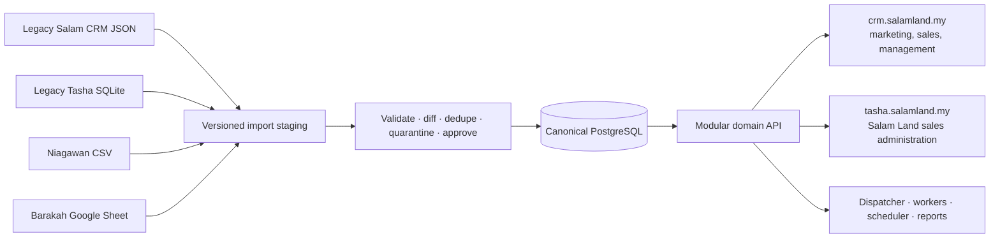
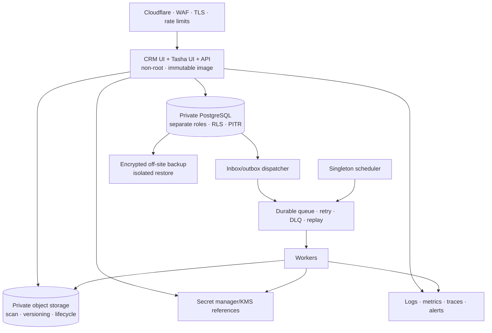

# CRM Salam Fortress V2 — Unified Production Design

**Date:** 16 July 2026 (MYT)

**Status:** Product direction approved on 16 July 2026 by the Product Owner; Security, Engineering, Operations, Management, Privacy/legal, implementation, and every production release gate remain pending/not passed

**Applies to:** Salam Land, Bumi Hayat Printing, Barakah Emas
**Product surfaces:** `crm.salamland.my`, `tasha.salamland.my`

## 1. Approval boundary

The product owner approved the six design sections in sequence on 16 July 2026:

1. canonical architecture and source ownership;
2. canonical data model and business invariants;
3. workflows, imports, edge cases, and cutover behavior;
4. isolated production infrastructure, security, backup, and disaster recovery;
5. concise UI/UX reference lock and accessibility requirements;
6. test-driven delivery and simultaneous three-business-unit go-live gates.

This approval locks product direction. It does not waive legal/privacy validation, Security, Engineering, Operations or Management approval, business-rule sign-off, migration reconciliation, provider authorization, restore evidence, UAT, or any release gate. ADR-003 records this boundary; ADR-001/ADR-002 and PRD decisions D-13, D-14, D-19 and D-20 retain their technical approval conditions.

## 2. Evidence and operating context

### 2.1 Salam Land acquisition CRM

The live `crm.salamland.my` JSON snapshot was inspected read-only. It is an active source for marketers and sales and contained:

- 1,161 records: 1,150 Leads and 11 order/booking-shaped records;
- 47 campaigns and 358 daily campaign-insight rows;
- 834 Meta Ads Leads, 313 TikTok Ads Leads, 3 TikTok Live Leads, and 11 manual orders;
- only Salam Land business-unit data in the inspected live snapshot.

The source is useful but not canonical enough to lift unchanged. Confirmed issues include mixed lifecycle/communication statuses, incomplete attribution, orphan campaign references, duplicate identity candidates, weak owner-to-user lineage, missing or invalid timestamps, unverified WhatsApp evidence, missing attachments, order-to-Lead lineage gaps, and potential conflicting bookings. Raw source values must be preserved while ambiguous transformations are quarantined.

### 2.2 Salam Land sales-administration system

The active `tasha.salamland.my` SQLite database was inspected read-only. It is the current source for sales administration and contained:

- 81 clients, 88 bookings, 432 lots, and 97 booking-lot links;
- 201 payments, 73 payment schedules, 12 refunds, and 73 agreements;
- 33 tasks, 93 audit issues, 52 audit-log rows, and 1,395 sync events.

SQLite integrity and foreign-key checks passed, but migration reconciliation is still required. No Tasha client had an explicit CRM Lead ID. Aggregate matching found only 10 phone-based CRM candidates: 8 unique and 2 ambiguous. Additional exceptions include unlinked legacy lot/booking states and finance totals/refund semantics requiring business-owner adjudication.

### 2.3 Other business units

- **Bumi Hayat Printing:** Niagawan remains the current operational source. It has no approved API path; repeatable CSV download/import is available.
- **Barakah Emas:** a Google Sheet is the current source. The link and field structure remain a controlled input required before importer lock.

No inspected live CRM/Tasha source contained authoritative Bumi Hayat or Barakah Emas production data. The platform must not invent those histories.

## 3. Chosen architecture

Use one canonical PostgreSQL system of record, one modular domain API, asynchronous workers, and two purpose-specific web experiences.

### 3.1 Product surfaces

- `crm.salamland.my` is the organisation workspace for marketers, sales, management, shared CRM capabilities, and the three business-unit verticals.
- `tasha.salamland.my` remains the focused Salam Land sales-administration console for lots, reservations, orders, agreements, collections, and documents.
- Both surfaces use the same identity, Contact master, authorization service, API, and canonical database.
- Frontends and BFFs never mutate database tables directly.
- Host-only secure sessions are used; no broad bearer cookie is shared across `.salamland.my`.

### 3.2 Source ownership

| Business/domain | Pre-cutover authority | Canonical ownership after cutover |
|---|---|---|
| Salam Land acquisition/sales | Legacy CRM JSON | Canonical Marketing and Sales modules |
| Salam Land sales administration | Tasha SQLite | Canonical Land, Orders, Finance, Legal, and Files modules |
| Bumi Hayat CRM/printing operations | New CRM plus approved business rules | Canonical Sales and Printing modules |
| Bumi Hayat invoice/payment snapshots | Niagawan CSV | Niagawan remains financial source temporarily; versioned read-only snapshots are imported until a separate ownership change is approved |
| Barakah Emas | Google Sheet | Sheet is a migration/transition source; canonical Gold, Orders, Inventory, and Finance modules become authoritative at cutover |
| Reporting | Legacy views/sheets | Read-only canonical projections; never an independent write authority |

### 3.3 Alternatives considered

1. **Keep separate databases and synchronize:** rejected as the target because current evidence already demonstrates identity and status drift. A bounded federated bridge may exist only during migration and must have an end date.
2. **One canonical database/API with two UIs:** selected because it provides one Contact identity, transactional lot/payment invariants, simpler operations, and consistent audit/reporting.
3. **Database/service per domain:** deferred. It adds distributed transactions and reconciliation cost without measured scale/team need. Modules may be extracted later through an ADR.

## 4. Canonical modules and records

1. **Identity and Organisation:** Organization, Business Unit, User, Membership, Team, Role, Capability, Session.
2. **Party and Consent:** Contact, Business Account, Identity, Contact–Business Unit Relationship, Household, Party Role/Waris, Consent, Preference.
3. **Marketing and Attribution:** Provider Connection, Campaign, Ad Group, Ad, Form/Source Mapping, Spend Snapshot, Attribution Snapshot.
4. **Sales Execution:** Lead, Assignment, Pipeline, Stage, Disposition, Opportunity, Task, Activity.
5. **Salam Land Operations:** Project, Lot, Hold, Allocation, Reservation, Agreement.
6. **Bumi Hayat Printing:** Product Specification, Quote/Revision, Artwork/Proof Version, Approval, Print Job, Production Stage, QC/Rework, Delivery, Change Order.
7. **Barakah Emas:** Product, Purity/Weight, Rate Snapshot, Trade, Override Approval, Inventory Movement, Reconciliation.
8. **Orders and Finance:** Order, Order Item, Invoice, Installment, Payment, Allocation, Credit, Refund, Reversal, Ledger Entry.
9. **Conversations:** Conversation, Message, Template, Delivery Event, Opt-out, Notification.
10. **Integration Gateway:** Inbox Event, Outbox Event, Job Attempt, Dead Letter, Replay, Idempotency Decision.
11. **Files and Legal:** File Object, Scan Result, Record Attachment, Agreement/SPA Workflow, Download Access Event.
12. **Reporting:** governed projections and metric definitions, never source tables for business writes.
13. **Audit and Privacy:** append-only Audit Event, access evidence, retention/legal-hold/DSR workflow.
14. **Migration:** Import Batch, Import Row, Transform Version, Legacy Object Link, Reconciliation Result, Quarantine Item.

## 5. Locked business invariants

### 5.1 Party, identity, and tenancy

- One Organization initially contains Salam Land, Bumi Hayat Printing, and Barakah Emas as explicit Business Units; controller/legal validation remains a release prerequisite.
- Operational rows carry Organization and Business Unit keys. Application policy and PostgreSQL RLS enforce scope using restricted production roles.
- A Contact is not a Lead. One Contact may have multiple legitimate Leads, Opportunities, Reservations, and Orders.
- Phone/email are normalized matching signals, not global unique keys and never sufficient for automatic merge.
- Possible, shared, or ambiguous identity matches enter a review queue. Repeat enquiry and provider replay are separate decisions.
- A Business Unit may use a Contact only through an effective, authorized Contact–Business Unit relationship.

### 5.2 Sales and integration

- Provider delivery dedupe uses Business Unit, provider, and stable external event/Lead keys.
- Lead lifecycle, contact-attempt disposition, message delivery, Opportunity stage, Order state, fulfilment state, and finance state remain independent dimensions.
- Lead-to-sale lineage is explicit: Lead → Opportunity → Reservation/Quote → Order → Invoice/Payment, or an approved direct-sale reason.
- Every accepted provider event is durably stored before acknowledgement and reaches a processed, retrying, quarantined, or dead-letter state.
- Domain writes and outbound intent commit atomically through an outbox; retries cannot duplicate logical effects.

### 5.3 Salam Land

- At most one active allocation exists per Lot across Hold and Reservation.
- A concurrent losing command receives a deterministic conflict and refreshed availability.
- Hold expiry and release are scheduler-driven, idempotent, and audited.
- Cancellation/refund/reversal changes allocation and commercial state inside one controlled transaction.

### 5.4 Bumi Hayat Printing

- Quote and artwork/proof are versioned; an accepted revision cannot be overwritten.
- Post-approval specification, quantity, price, or due-date changes create a change order and reapproval.
- Production transitions follow Queued → Prepress → Production → QC → Ready → Delivered/Collected; invalid skips require authority and reason.
- QC failure retains evidence, rework count/cost, and sign-off.
- Niagawan CSV values retain source batch/checksum and are read-only snapshots while Niagawan remains their authority.

### 5.5 Barakah Emas

- Every transaction retains the exact rate, source, effective/retrieved time, weight, purity, spread/upah, fee, rounding, and rule version used.
- Missing/stale rates block the transaction or require a named maker-checker override according to approved thresholds.
- Sale, buyback/exchange, payment, receipt, and immutable inventory movement reconcile before close.

### 5.6 Finance and audit

- Money uses integer minor units or fixed-precision decimal with ISO currency; never binary floating point.
- Installment plans and actual payments are separate. Payments allocate explicitly to invoices/installments.
- Settled payments are not edited/deleted. Corrections use reversal, adjustment, credit, or refund entries.
- Refund cannot exceed eligible unrefunded settled value and may require maker-checker; requester cannot self-approve.
- Consequential success and denial record actor, reason, time, correlation, outcome, and minimized before/after evidence.
- Mutable records use server-owned optimistic versions; commands with retry risk use scoped idempotency keys.

## 6. Import, reconciliation, and edge behavior

### 6.1 Common import contract

`Source snapshot → immutable batch/checksum → versioned mapping → staging → validation → preview/diff → approval → canonical transaction → reconciliation`

- Reimporting the same source checksum is a no-op.
- A changed row produces a reviewable diff and never silently overwrites canonical facts.
- Ambiguous identity, invalid state, missing finance lineage, duplicate lot, unresolved file, or unknown enum is quarantined.
- Raw source identifiers and values are retained through `legacy_object_links` and protected source evidence.
- Importers are repeatable and deterministic; direct ad-hoc production SQL/file edits are prohibited.

### 6.2 Source-specific behavior

- **Salam CRM JSON:** preserve raw mixed statuses and source timestamps, split them through a signed mapping, and quarantine unsupported or contradictory rows.
- **Tasha SQLite:** migrate dependency order from clients/parties to lots/reservations, orders/agreements, then invoices/payments/refunds/files; reconcile lot and finance totals before release.
- **Niagawan CSV:** detect approved template/version, reject schema drift safely, validate formulas/encoding/amounts, show diff and approval, and retain the original file/hash/operator. Partial valid-row processing is allowed only after explicit batch approval with all rejected rows visible.
- **Barakah Sheet:** take immutable snapshots with schema/version watermark, stage before write, fail closed on missing/renamed columns, and prevent uncontrolled bidirectional sync. The Sheet becomes an export/archive after canonical cutover.

### 6.3 Edge cases required in design and tests

- shared household/business phone, changed phone, and legitimate repeat purchase;
- duplicate/out-of-order provider retries and corrected provider records;
- concurrent Lead/Order edit and staff offboarding/reassignment;
- simultaneous Lot Hold/Reservation, expiry, cancellation, and sale reversal;
- duplicate or changed Niagawan batch, malformed CSV, partial row, formula injection, and encoding drift;
- unavailable/deleted/changed Barakah Sheet;
- partial, overpaid, reversed, refunded, and restored finance history;
- provider outage, worker crash, queue loss, and application rollback after database migration;
- timezone boundaries stored in UTC and displayed/reported in the Business Unit timezone, initially MYT.

## 7. Migration and cutover

1. Inventory and sign the field-level source-of-truth matrix.
2. Create encrypted source backups, checksum manifests, and prove isolated restore.
3. Deploy canonical IAM, database, API, import staging, and observability in shadow mode.
4. Import dependency order: configuration/IAM → parties → Leads/Opportunities/Tasks → Lots/Holds/Reservations → Orders/Agreements → Invoices/Payments/Refunds/Ledger → Messages/Files/Audit.
5. Reconcile counts, keys, totals, status maps, source periods, files, lot uniqueness, and finance ledger.
6. Resolve or explicitly quarantine ambiguous rows; do not fabricate missing history.
7. Use dual-read comparison, not uncontrolled dual write.
8. Conduct timed cutover rehearsal with backup, write quiescence, final delta, provider routing, smoke, and recovery.
9. During the final window, freeze legacy writes, run the final delta import, sign reconciliation, switch routes once, and monitor.
10. After canonical writes begin, application rollback may use a compatible release, but JSON/SQLite/Sheet do not become writable authorities again.
11. Disable legacy jobs, webhooks, and credentials; retain encrypted read-only archives under approved retention.

Internal UAT may be phased. Production go-live is simultaneous for all three approved business-unit slices; no unit is declared production-live early.

**Engineering checkpoint — 19 July 2026:** The generic synthetic migration control plane and its seven checksum-frozen migrations are implemented and independently reviewed. This checkpoint does not register or approve the four real adapters, source mappings, final extracts/cutoffs, business reconciliation, authority switch or production cutover.

## 8. Production infrastructure and security

### 8.1 Isolation decision

The current Hostinger VPS remains a transition host for separately isolated legacy and staging environments. It is a multipurpose root-operated host with an incompatible host Node runtime, maintenance debt, shared blast radius, local-only recovery risk, and many unrelated processes. Staging uses synthetic or formally approved sanitized data only. Legacy becomes read-only after cutover. Neither environment shares production databases, buckets, OIDC clients, provider routes, secrets, service users, writable volumes, or backup credentials. The target production CRM uses a dedicated isolated Hostinger stack.

- CI produces an identifiable immutable image/SBOM from a reviewed commit and promotes the same artifact through staging to production.
- Runtime acceptance pins Node.js `22.22.0`/`<23` and an immutable base-image digest, runs as a non-root UID/GID with dropped capabilities and bounded resources, and proves health checks before traffic.
- App/API, dispatcher, worker, scheduler, migration, reporting, backup, monitoring, support, and break-glass use distinct least-privilege database/OS identities as applicable.
- RLS is mandatory defence-in-depth for production tenant-owned tables, subject to D-19 approval of role design, transaction-local tenant context, pool reset, bypass/break-glass controls, `FORCE ROW LEVEL SECURITY` applicability, and read/write/join/export/prepared-statement policy tests. Application authorization remains mandatory.
- PostgreSQL, queue, object storage, and administrative endpoints are private; Tailscale or equivalent controls administration.
- OIDC Authorization Code + PKCE, named pre-provisioned accounts, MFA/step-up, recovery, offboarding, session/device revocation, and break-glass controls replace group credentials.
- Meta, TikTok, WhatsApp, IdP, Sheet, and other credentials live in secret storage. Metadata records Business Unit, owner, scope, expiry, key version, rotation history, and health without exposing the secret.
- Edge design must choose Tunnel or proxied DNS, prevent direct-origin bypass, trust only approved proxy CIDRs, authenticate origin TLS, and enforce route-specific rate/body limits, bounded 429 behavior, connect/read/send timeouts, HSTS, CSP, and security headers.
- Provider/region/account ownership, resource sizes, PostgreSQL placement/HA, connection budget, queue technology/ownership, and cost/failure-domain acceptance remain D-13/D-20 evidence, not assumed facts.

## 9. Backup, recovery, and operations

- PostgreSQL continuous WAL/PITR plus encrypted daily retained backups outside the Hostinger production account and primary failure domain. PITR window, daily/weekly/monthly retention, WAL-lag alerts, object lock/delete protection, backup account/provider/region, and separate key access require Operations/Security approval.
- Private-object versioning/lifecycle and protected backup of required configuration/metadata.
- Monthly automated isolated restore validation and quarterly business-level disaster-recovery drill.
- Product-approved initial targets: RPO 15 minutes or better and RTO 4 hours or better; Operations/Management capacity, cost, topology, and measured acceptance remain pending under D-13/D-18.
- Restore invalidates or reconciles sessions, offboarding, consent/suppression, legal-hold/privacy deltas, ledger state, and already-delivered outbox effects before reopening.
- Alerts cover availability, latency/error, database connections/locks/replication, disk, queue age/DLQ, provider/token/certificate expiry, import failure, backup age/failure, and restore status.
- Runbooks cover migration, deployment, rollback/forward recovery, provider outage, credential rotation, incident response, and disaster declaration/failback.

## 10. UI/UX reference lock

The user requested a concise interface inspired by `tasya.salamdev.my`; that host was in a self-redirect loop during review. The reachable Tasha portal and the explicit approved token list form the provisional reference lock. Tasha (the Salam administration source/product) and Tasya (the requested visual-reference hostname) are treated as distinct names, not assumed aliases. This is not permission to copy weak patterns such as emoji icons, decorative gradients, desktop-only navigation, or uncontrolled KPI cards.

### 10.1 Visual tokens

| Role | Token |
|---|---|
| Canvas | `#F8FAFC` |
| Surface | `#FFFFFF` |
| Sidebar | `#0B172A` |
| Raised sidebar surface | `#1E293B` |
| Primary text | `#1E293B` |
| Muted text | `#64748B` |
| Border | `#E2E8F0` |
| Primary action | `#2563EB` |
| Primary hover | `#1D4ED8` |
| Salam gold | `#F59E0B`, limited to brand and meaningful attention states |

The default product surface is light, compact, data-led, and restrained. Use Lucide icons; no emoji icons, indigo/violet gradient defaults, decorative side stripes, or card-everywhere grouping.

The approved colors are role tokens, not automatically accessible in every pairing. Gold on white is not body text and uses dark navy text when it is a filled attention surface. The light border is decorative and cannot be the only boundary for a control; add tested `control-border`, sidebar foreground, and sidebar-muted derived tokens that meet WCAG 2.2 AA without changing the approved palette.

### 10.2 Concise-copy and interaction rules

- Topbar contains the page title and necessary actions only.
- KPI contains label, value, one comparison, date/business scope, freshness, and drill-down.
- Forms always retain labels; hints appear only when needed to complete or validate the field.
- Empty state uses one sentence and one primary action.
- Confirmation names the action/object, consequence, and reason/approval requirement.
- Remove marketing prose, static security claims, repeated notes/descriptions, fake readiness, and all demo data/labels from production.
- Business switcher is an explicit menu: Semua, Salam Land, Bumi Hayat, Barakah Emas. `Semua` is authorised read-only; a write requires an explicit Business Unit. It never cycles invisibly.
- Lists use server pagination/search/filter/sort, URL-backed/saved views, sticky headings, configurable columns, permission-aware bulk actions, and truthful loading/error/offline/stale/conflict/quarantine states.
- Dense mobile lists expose a compact primary row and open details/actions in an accessible drawer rather than producing card sprawl.
- Login is centered and concise with OIDC. The user menu includes profile, session status, and sign-out.

### 10.3 Accessibility and web metadata

- WCAG 2.2 AA, complete keyboard operation, visible focus, screen-reader semantics, 200% zoom/320px reflow, reduced motion, forced colors, and minimum touch targets.
- Verify at 320, 375, 390, 768, 1024, 1280, and 1440 CSS pixels.
- `lang="ms"`, private-app `noindex, nofollow, noarchive` plus production `X-Robots-Tag`, module-specific PII-free titles/metadata/URLs, favicon/apple icon, 192/512/maskable icons, host-specific manifests, `theme-color: #0B172A`, `background_color: #F8FAFC`, light `color-scheme`, and installable PWA shell.
- Initial GA caches no customer/operational data offline; it displays a safe unavailable state.

## 11. Delivery and simultaneous go-live gates

### 11.1 Delivery order

1. isolated production foundation;
2. migration/import/reconciliation platform;
3. shared Party, Sales, Activity, Files, Communication, and Reporting core;
4. Salam Land, Bumi Hayat, and Barakah Emas vertical slices;
5. shadow migration, phased internal UAT, security/accessibility/capacity/restore evidence;
6. simultaneous three-business-unit cutover and hypercare.

### 11.2 Engineering loop

Every implementation round follows:

`failing test → minimum implementation → refactor → focused/full verification → security/data/UI review → Git commit/push → staging evidence`

No customer data, credentials, provider tokens, environment secrets, or unsafe archives enter Git.

### 11.3 Delivery milestones and authoritative release gates

These milestone labels do not replace or redefine the authoritative Plan, Gate A, Gate B, functional-slice gates, Gate C, and Gate D in the PRD/execution plan.

- **UD-1 — Artifact:** reviewed code, hosted CI, vulnerability/secret/IaC scans, SBOM, and immutable artifact.
- **UD-2 — Foundation:** dedicated infrastructure, named identity/MFA, restricted database roles/RLS, object storage, telemetry, PITR, and successful isolated restore.
- **UD-3 — Migration:** deterministic importer results, checksums, counts, lineage, lot and finance reconciliation, and quarantined exceptions.
- **UD-4 — Workflows:** accepted P0/P1 workflows for Salam Land, Bumi Hayat, and Barakah Emas using signed fixtures.
- **UD-5 — Assurance:** provider contracts, concurrency, cross-tenant isolation, performance/soak, accessibility, security/privacy, and DR evidence.
- **UD-6 — Cutover:** signed change approval, timed cutover/rollback-forward rehearsal, unique provider routing, live smoke, green telemetry, and staffed hypercare.

“100% ready” or “production ready” may be used only after every applicable gate has objective evidence and named approval.

The older execution plan's reference to activating production users in controlled cohorts is superseded only for initial authority switch: internal training/UAT may use cohorts, but Salam Land, Bumi Hayat, and Barakah Emas must switch production authority within one approved cutover window without mixed writable authorities.

## 12. Inputs still required

These inputs do not change the approved architecture but block later design/import/release gates:

- a safe sample Niagawan CSV and approved recurring export cadence;
- the Barakah Emas Sheet link, schema, owner, update behavior, and data-quality baseline;
- named user/role/capability and maker-checker threshold approval;
- Salam Land Lot Hold/deposit/release rules;
- Bumi printing quote/QC/change-order rules;
- Barakah rate/freshness/spread/upah/override/buyback rules;
- finance allocation/overpayment/refund/reconciliation policy;
- provider sender/account/form ownership, consent purposes, templates, and credentials through a secret channel;
- IdP provider/tenant/region and security/privacy/operations approvals;
- legal controller/Business Unit relationship and retention/privacy validation.
- dedicated production account, region, sizing, high-availability and connection-budget approval;
- Cloudflare/DNS change authority and named cutover owner;
- backup provider, region, retention, RPO/RTO and encryption-key custodian;
- measured concurrency/data-volume envelope for capacity tests;
- named Security, Operations, Finance, Privacy and cutover approvers plus the outage/hypercare roster.

## 13. Design completion criteria

This design is ready for implementation planning when:

1. the written specification is reviewed against the approved conversation;
2. contradictions with PRD/ADRs/data model are resolved or explicitly retained as open release decisions;
3. the product owner accepts the written specification;
4. a separate test-driven implementation plan maps each milestone to requirements, files, migrations, tests, verification, Git checkpoints, and rollback evidence.
